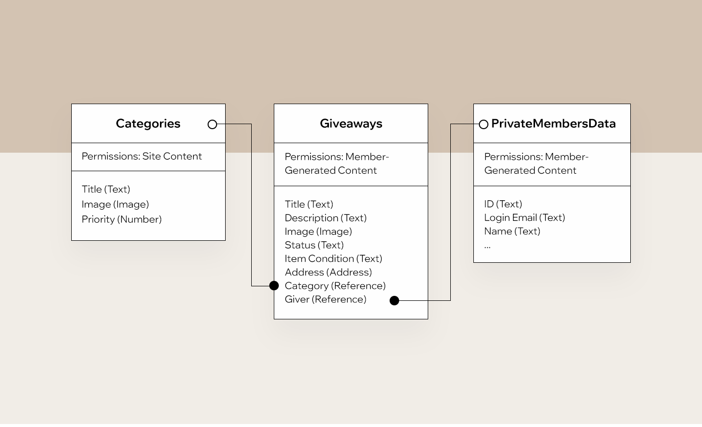
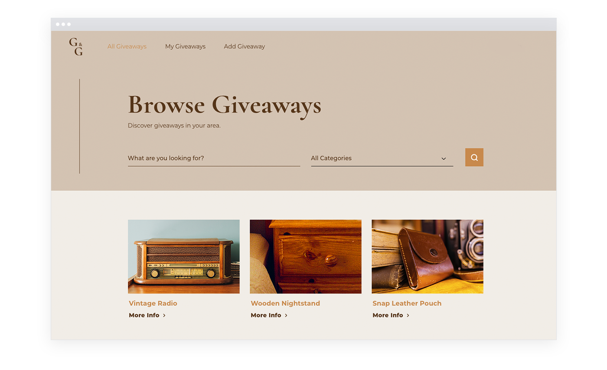
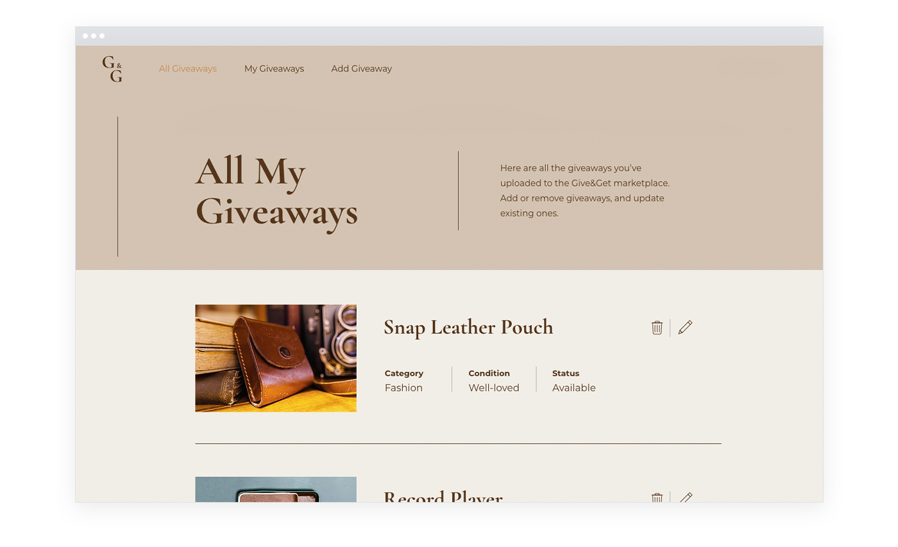
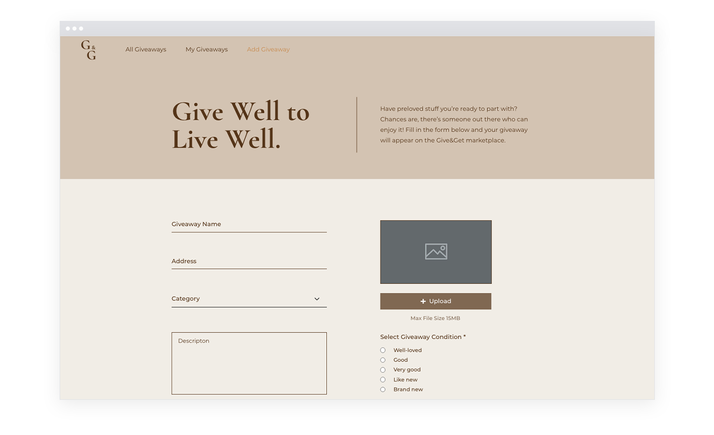
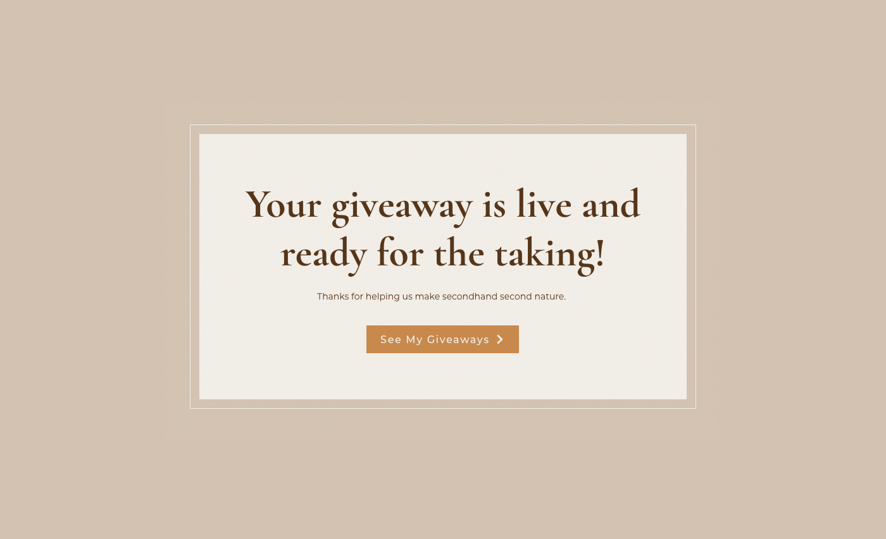
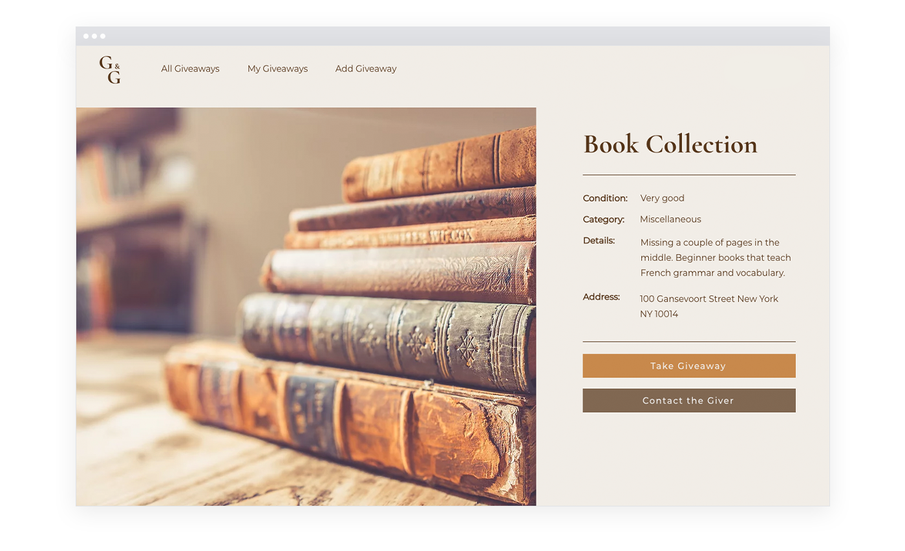
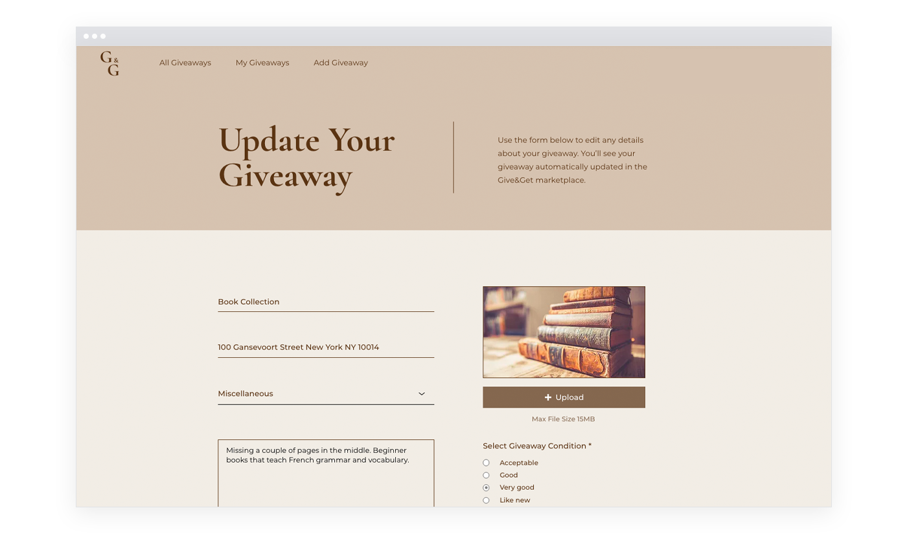
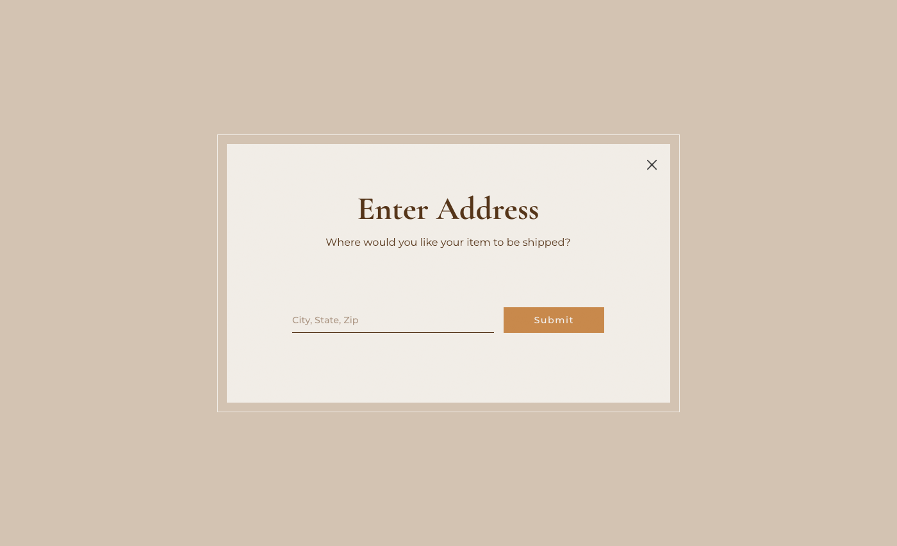
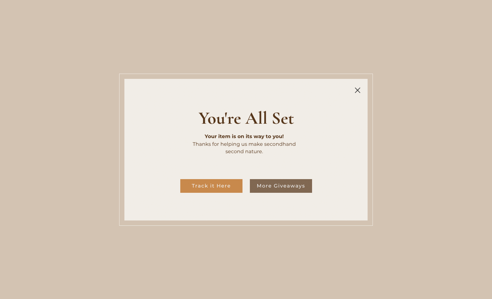
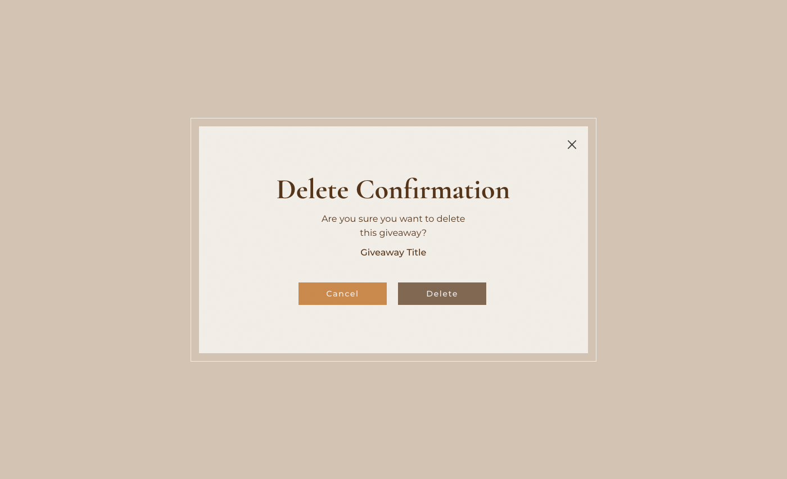

Throughout this guide we will use two types of examples to demonstrate the concepts that you're learning. 

-   While explaining the concept, we include a stand-alone example that illustrates the concept in a clear, concise fashion. 
-   After the concept has been fully explained, we present examples from a fully functioning site so you can see how the concept is used in context.

## Story

The site we created, [Give&Get](https://www.wix.com/velo-dev/giveandget), is a give and take marketplace for passing on used items to a new owner. You can explore and work on your own version of this site using [this template](https://editor.wix.com/html/editor/web/renderer/new?siteId=bc57d791-a42d-4f8c-b74e-bd51b6dd0095&metaSiteId=398bcfa9-b93e-435a-95ea-9a0c15d56d36&autoDevMode=true). 

The Give&Get site allows logged-in members to post giveaways that they want to give away. Visitors to the site can request those giveaways and have them delivered. 

We used Velo in conjunction with the [Content Manager](https://learn.wix.com/en/) to build the following features into the site:

-   Search and filter: Visitors can find giveaways by keywords and by category and then get a giveaway.
-   Member generated content: Members can upload giveaways and can see and edit all the giveaways they've uploaded.
-   Integration with a 3rd-party service: Integration with a (fictitious) delivery service to delivery giveaways from the giver to the taker.

As we discuss the Velo topics covered in this guide, we'll point out how they are used to build the functionality of the site.

## Components

Here's a bit more detail about the components that make up the site. Feel free to read about them here or just poke around the site to get a better feel for what it does and how it was built.

### Apps

Our site only allows logged-in members to upload giveaways, so we've added the [Members Area](https://support.wix.com/en/article/about-members-area) app.

### Data

The data for our site is stored in the Content Manager.

The data is stored in the following collections with the permissions listed here:

### Pages, Lightboxes, and Their Code

Now let's explore our site's pages and lightboxes.

#### Regular Pages

-   **Home**: Allows visitors to search for giveaways by keyword or select a category of items to view. Also contains a list of recently added items. 

-   **All Giveaways**: Shows a searchable and filterable list of giveaways. Also displays results from a search or category selection on the Home page.

-   **My Giveaways**: Shows logged-in members all of their giveaways. Members can delete giveaways on this page.

-   **Add Giveaway**: Contains a form that logged-in users can use to add a new giveaway. 

-   **Karma**: Thanks logged-in users for adding a new giveaway.

#### Dynamic Pages

-   **Giveaways (Title)**: Shows a detailed view of a giveaway. Also allows visitors to contact the giveaway's giver or get the giveaway.

-   **Update Giveaways (Title)**: Contains a form that logged-in users can use to edit a giveaway they uploaded.

#### Lightboxes

-   **Subscribe to Mailing List**: Allows visitors to subscribe to a mailing list. Visitors are presented with this lightbox the first time they visit the site.

-   **Enter Address**: Allows visitors to enter an address when they get an item.

-   **Tracking Link**: Contains a link to the delivery service where takers can track the delivery of the item they are getting.

-   **Delete Confirmation**: Confirms that logged-in users want to delete one of their giveaways.

### Code

Besides the code on the site's pages, there are some other code files:

-   **Global (Site)**
    -   **masterPage.js**: Contains code for showing the **Subscribe to Mailing List** lightbox the first time visitors visit the site, no matter which page they visit.
-   **Public**
    -   **common.js**: Contains code for getting a visitors location, which is used on several pages.
    -   **geo.js**: Contains code for calculating the geographical distance between two locations.
-   **Backend**
    -   **deliveries.jsw**: Contains code for interfacing with the 3rd party delivery service.
    -   **giveawaysModule.jsw**: Contains code for all of the data operations involving the **Giveaways** and **Categories** collections.
    -   **http-functions.js**: Contains the API we expose. The API is used by the delivery service to update us when an item has been delivered.
    -   **jobs.config**: Contains the configuration of a daily job that removes old giveaways from the database.
-   **Packages**
    -   **jsonwebtoken**: A package from npm that is used to encrypt and decrypt the IDs of giveaways we send to the delivery service.