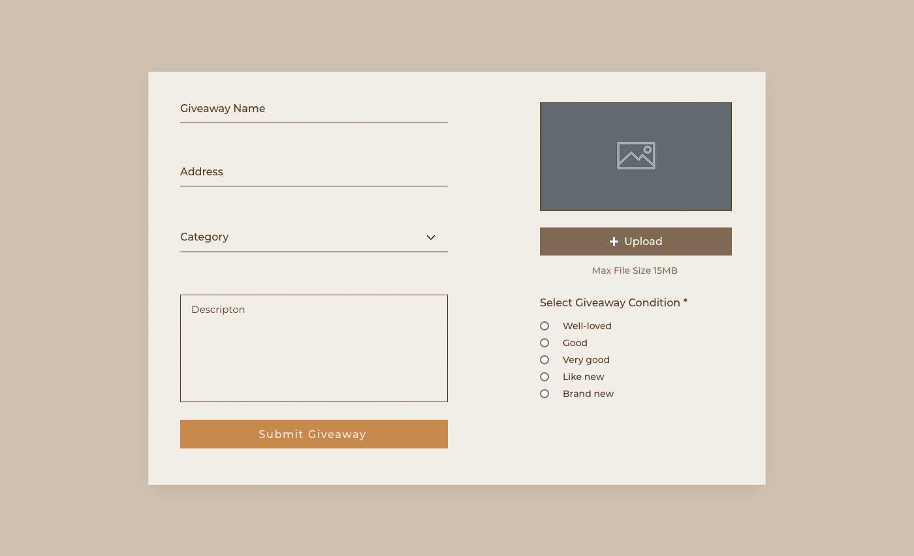
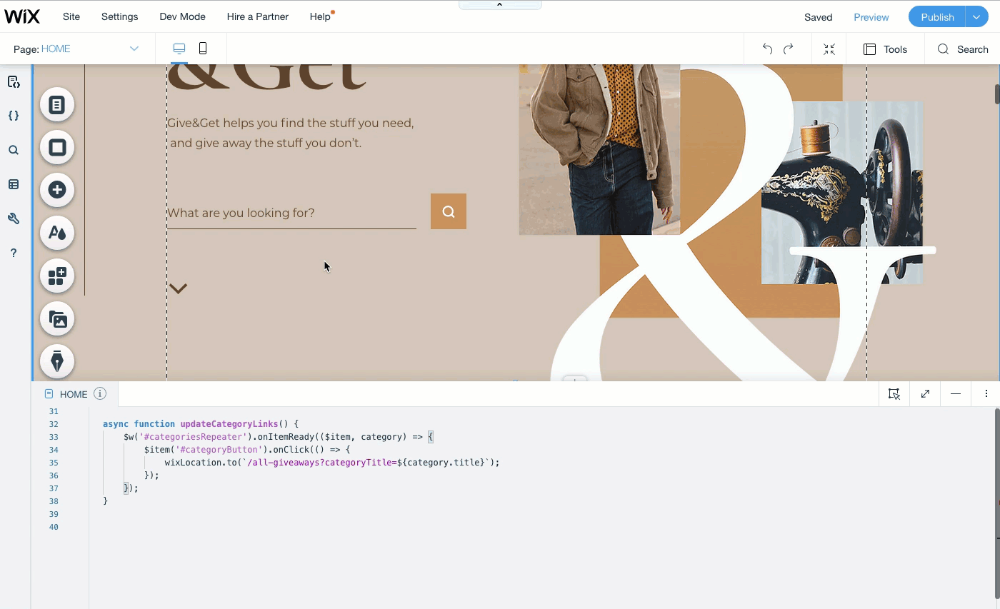

# Working with Page Elements

Let's start our Velo coding journey by looking out how you write page code. Page code is any code that runs on the client when a site visitor visits a page on your site. Usually, page code interacts with the elements on the current page.

You write code for a specific page in that page's tab in the **Code Panel**. You can also write code that applies to all the pages in your site by using the **masterPage.js** file. Remember, you navigate to a specific page's code or to the **masterPage.js** file from the **Page Code** tab in the **Velo Sidebar**.

## Page Elements

When creating a site with Velo, you can take advantage of the multitude of page elements the Wix Editor has to offer. In addition to the standard elements, such as text elements, images, and buttons, there are also a number of elements that are only available after Velo is enabled on your site. These include input elements, multi-state boxes, and progress bars.



Each of these elements has their own properties and functions that you can use to change their state and perform actions on them. For example, most visual elements have functions that you can use to hide or show them. Elements used in forms have a property that you can use to get or set their values.

Working with most page elements is pretty straightforward. You can look up an element's functionality in the [API Reference](https://www.wix.com/velo/reference/$w) and get a pretty good idea of how to work with it right away.

There are some elements that require a little more understanding, before you can take full advantage of what they have to offer. One such example is the repeater element. [Later in this guide](https://learn-code.wix.com/en/article/working-with-repeaters), we'll discuss repeaters and how you can use them effectively.

In the meantime, let's focus on the basics that you need to know when working with any element using Velo.

## Design vs. Functionality

When working with Velo, it's important to understand what you use code for and what you don't use it for.

Velo is built to take full advantage of Wix's powerful design platform. That means the main look and feel of your site comes from what you, or someone on your team, creates using one of drag and drop site editors.

So, with a few exceptions, you generally don't use code to alter the design of your site. Consequently, you don't need to deal with the DOM, HTML, or CSS when working in Velo. We take care of all that for you.

> **Note: Exceptions to the rule**
> + Some elements allow you to use HTML and CSS. These include the text element, HtmlComponent, and CustomElement.
> + A number of elements expose some style properties that you can manipulate using code.
> + You can hide, show, expand, collapse, and animate elements with code. 

When it comes to your site's functionality, the story is flipped. Although there is some functionality you can add using the regular site editor, you mostly add custom functionality to your site by writing code.

## The $w Mindset

The way you write code that interacts with the elements on a page in Velo is a bit different than what you're probably used to. So, before you start writing page code, you'll need to get into the $w mindset.

As you've already learned, you don't deal with the DOM, HTML, or CSS when writing page code. If that's the case, then how do you go about populating a page with data or adding functionality and interactivity to its elements?

## Element Selection

Instead of accessing elements directly from the DOM, in Velo you use the $w API to work with page elements.

You start by selecting an element, or multiple elements, using the `$w()` selector function and a selector string. The selector function returns the element you've specified using the selector string. Then you use the returned element's properties and functions to change its state or perform actions on it.

```javascript
// Select an element
const myTextElement = $w('#myTextElementID');

// Assign a value to one of the element's properties
myTextElement.text = 'New Text';

// Call one of the element's functions
myTextElement.show();
```

> Note
>
> You can see all the editor elements, their properties, and their functions in the [API Reference](https://www.wix.com/velo/reference).

Let's take a look at a simple example to see how this works.

Suppose you have a page with a text label and a button. When you click the button, you want the text in the label to change.

Using HTML and vanilla JavaScript, you might create the elements on the page like this:

```html
<h1 id="message">Hello World</h1>

<button onclick="changeMessage()">Change Text</button>
```

And then add the functionality to the page like this:

```javascript
function changeMessage() {
    document.getElementById("message").innerHTML = "Hello from vanilla JavaScript!";
}
```

In Velo, the page setup would be done by dragging and dropping the elements on the page and styling them however you want. You wouldn't need to write any code yet.

Then, you would set the element IDs in the **Properties & Events Panel**. This enables you to select the elements in code using the IDs you give them.



Lastly, you would add code to define the functionality of the elements on the page. In this case, that would be a text element changing its contents when a button is clicked.

The code to do that would look something like this:

```javascript
$w.onReady(function () {            
    $w('#button').onClick(() => {
        $w('#message').text = 'Hello from Velo!';
    });
});
```

For now, let's just look at the code on line 3 above.

It starts by using the `$w()` function to select the `message` element using its ID. Then it uses the element's `text` property to assign it a new value that changes the text displayed in the element.

### Selection Syntax

At this point you might be wondering why we added a hashtag (`#`) to the element ID when selecting it.

We did this because there are two ways to select elements using the `$w()` function. You can select elements by ID or by type of element. When selecting by ID, you use a hashtag, and when selecting by type, you don't.

```javascript
// Select the element with the ID message
let messageText = $w('#message');
```

```javascript
// Select all image elements on the page
let imageElements = $w('Image');
```

You can also select multiple elements at the same time using a comma-separated string, mixing and matching between IDs and types if you like.

```javascript
// Select elements with the IDs message1 and message2 and all the images
let selectedElements = $w('#message1, #message2, Image');

// Hide all of the selected elements
selectedElements.hide();
```

## IDs

In light of what you've just learned about selecting elements, do your future self a favor and give your page elements meaningful IDs. They'll be a lot more memorable than the default IDs elements get when you add them to a page.

Just like you use meaningful variable names in your code, you should do the same with element IDs.

Remember, you change element IDs in the **Properties & Events Panel**.

## Page Loading (Initialization)

On most pages that you write code, you need to run some initialization code before the page is displayed to site visitors. This usually includes things like retrieving data, populating elements, and setting custom functionality.

In vanilla JavaScript, you might use something like `window.onload` to make sure your code runs when the page is ready. In Velo, you use the `$w.onReady()` function for similar purposes.

The `$w.onReady()` function takes in an event handler as a parameter. That handler runs when the page's elements are ready, but before the page is rendered to site visitors.

So, any code that deals with page elements, basically anything that uses the $w API, can't be called before the `onReady` event handler runs. That's because the page elements are not ready yet.

```javascript
$w.onReady(() => {
    // Code in here runs when the page elements are ready 
    // but the page is not yet displayed to the visitor
});
```

For example, let's say you want to display a message when a page loads. You also want the message to change depending on whether the current site visitor is logged into your site or not. Since the message is dynamic, you have to populate it using code.

As you already know, you need to use the `$w()` function to select the element where you display the message. That means you need to wait for the page elements to be ready before running the code that will set the proper message. So, you need to put the message logic in the `onReady` event handler or in a function called by the `onReady` event handler.

Your code might look something like this:

```javascript
import wixUsers from 'wix-users';

$w.onReady(() => {
    if(wixUsers.currentUser.loggedIn) {
        $w('#message').text = "Welcome back!";
    }
    else {
        $w('#message').text = "Become a member";
    }
});
```

This code defines an `onReady` event handler. Inside the event handler, the code checks to see if the current user is logged in. Then it selects the `message` element and sets its `text` property to an appropriate message.

The `onReady` event handler will run during the page loading process when the elements on the page are ready to be used, but before they are displayed to the site visitor. So the correct message will be set before the page is displayed. When the `onReady` event handler is finished running, the page will be displayed and site visitors will see the proper message.

> **Note: Waiting for data before loading a page**
> You can also use the `onReady( )` function to block the page from loading until some process has finished. This approach is most often used when retrieving data from an internal or external source to populate elements on the page. Since retrieving data takes some time, you might want to wait until that process finishes before displaying the page or rendering it for search engine bots. To wait, you return a Promise from the `onReady` event handler. The page will wait (a reasonable amount of time) until the Promise has resolved before displaying.
>
> For example, suppose you have a `getSomeData( )` function that returns a Promise that resolves to some data. When the Promise resolves, you populate that data into a page element.
>
> If you don't wait for the Promise to resolve, the element's placeholder content may show for a moment because the page may finish loading while the data is still being retrieved. Also, you may want to wait so that search engine bots that crawl your page see the page after the data is populated.
>
> To force that page to wait until the data is retrieved, return a Promise from the Promise that `getSomeData( )` returns. If the Promise resolves in a reasonable amount of time, the page will wait for that resolution before displaying itself.
>
> Be sure to weigh the costs before using this approach since it delays the loading of your page. If you do choose to delay a page from loading until certain data is retrieved, be sure to follow the [best practices for improving performance when using data](https://support.wix.com/en/article/velo-best-practices-for-improving-performance-in-wix-sites-with-data).