# Getting Oriented

Let's begin by getting familiar with the Velo development environment. The environment contains the tools you need to develop a Velo app.

<iframe width="560" height="315" src="https://www.youtube.com/embed/rzReCvkI4gg" title="YouTube video player" frameborder="0" allow="accelerometer; autoplay; clipboard-write; encrypted-media; gyroscope; picture-in-picture" allowfullscreen></iframe>

## Enabling Velo

Before beginning with Velo, you need to turn Dev Mode on. To do so, go to **Dev Mode** in the Editor's top bar and click **Turn on Dev Mode** in the popup box.

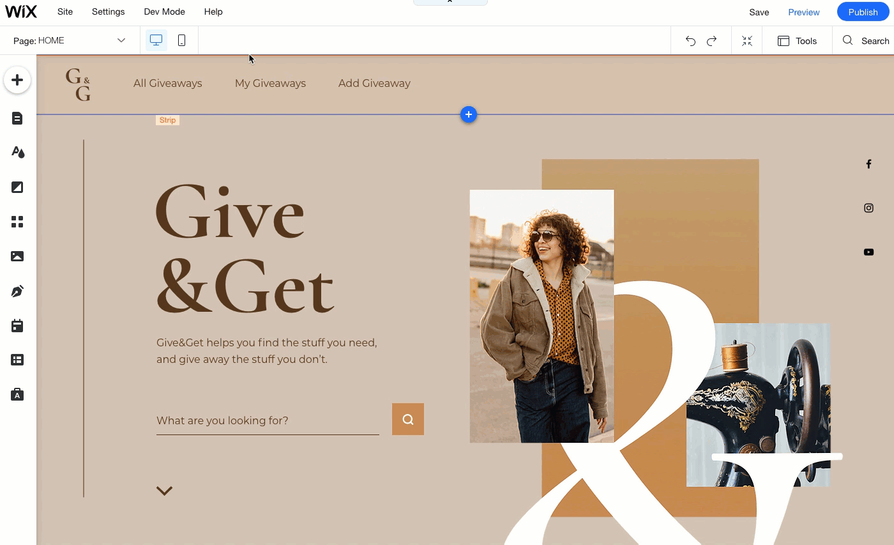

Once you enable Velo, you see some additional panels appear in the Editor. Let's take a look at what these panels are and what you do with them.

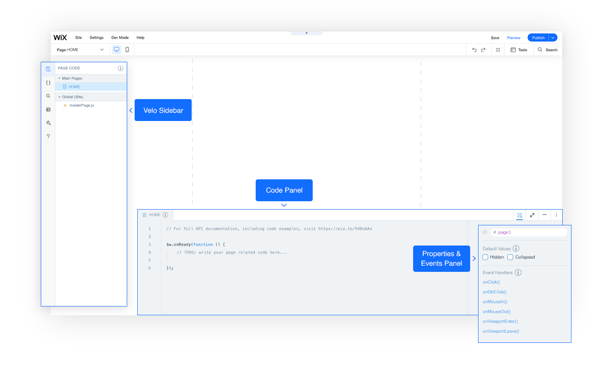

## Code Panel

The **Code Panel** appears at the bottom of the page. This is where you do most of your work in Velo. You write all the code for your site, whether it be frontend or backend code, in this panel. 

The **Code Panel** is a fully-functional code editor that's packed with features, such as autocomplete and error checking, to help you write Velo code as quickly and efficiently as possible.

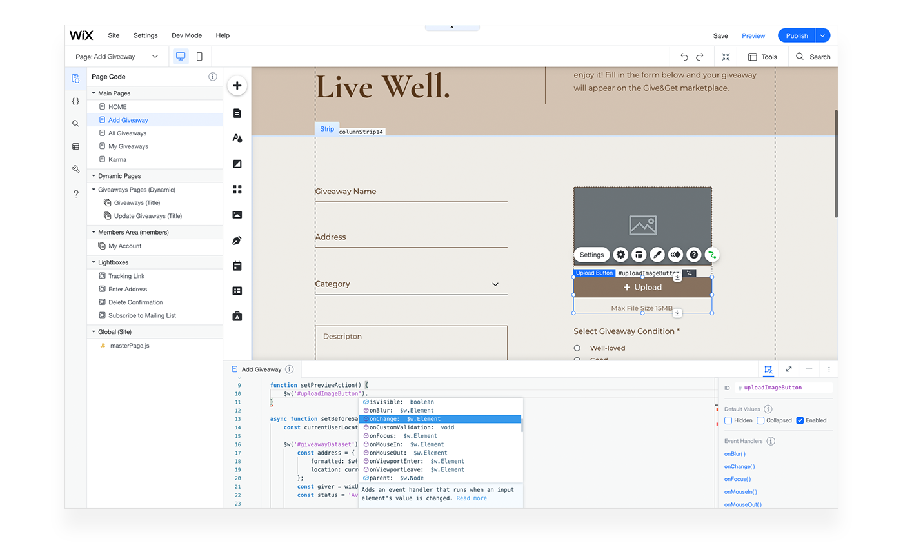

In the **Code Panel**, you can have multiple code files open in tabs. The left-most tab is always the page code for the current page showing in the Editor. As you change pages in the Editor, the code in this tab will change accordingly. You cannot close this tab. 

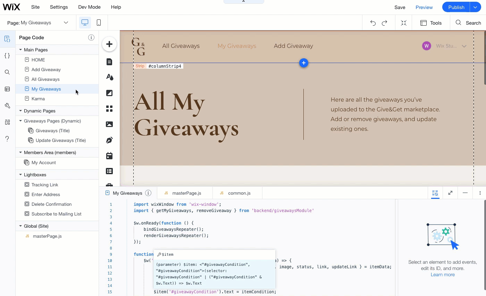

You can open additional tabs that can contain site code, public code, and backend code.

## Properties & Events Panel

The **Properties & Events Panel** is docked to the right side of the **Code Panel** when shown. It contains information about the page element currently selected on the page.

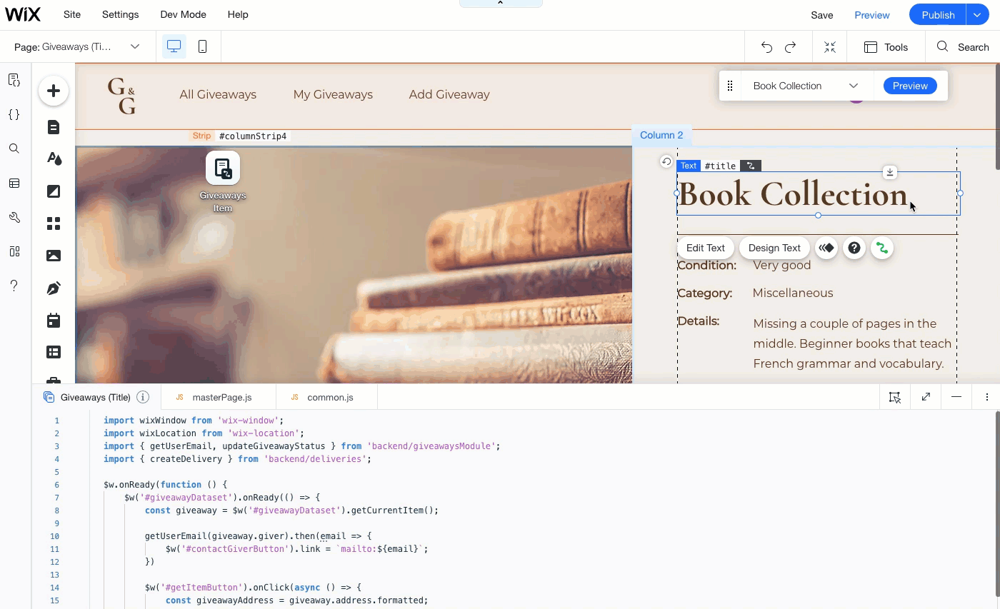

The **Properties & Events Panel** contains the following information about the selected element:

-   **ID**: A unique element identifier. Use the ID in code to refer to the element.
-   **Default Values** (when applicable): Several values that determine the state of the element when the page loads. For example, whether the element is hidden.
-   **Event Handlers**: Wiring to functions that handle events that occur to the element.

## Velo Sidebar

The **Velo Sidebar** is where you navigate to all the code files and database collections in your site. You can also use the sidebar to access production tools.

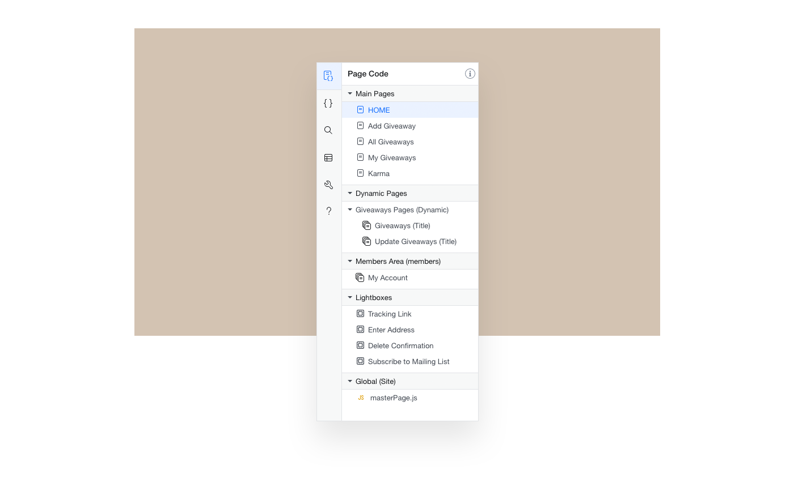

The **Velo Sidebar** contains the following tabs, described in detail below:

-   **Page Code**
-   **Code Files**
-   **Search Your Code**
-   **Databases**
-   **Velo Tools**
-   **Velo Help**

### Page Code

The **Page Code** tab lists all of your site's pages as well as your site's global code. You can use the **Page Code** tab to navigate to your site's pages in the Editor and open their corresponding code files.

The **Page Code** tab includes all of the following that are relevant to your site:

-   **Main Pages**: Regular pages and their corresponding code files. 
-   **Dynamic Pages**: Dynamic pages and their corresponding code files.
-   **Router Pages**: Router pages and their corresponding code files. The code for a router's routing logic is contained in the **Backend** section of the **Code Files** tab. We will not discuss routers in this guide.
-   **Members Area**: [Members area pages](https://support.wix.com/en/article/adding-and-managing-your-member-pages) and their corresponding code files for your site's member area, if you've added one. These pages may also include pages added by Wix Apps that use the members area, such as the Stores and Blog apps.
-   **Lightboxes**: Lightboxes and their corresponding code files.
-   **Global**: Code that runs on all of your site's pages. The code is written in the **masterPage.js** file. It can include general global code and code that works with [page elements set to show on all of your site's pages](https://support.wix.com/en/article/wix-editor-showing-an-element-on-all-pages).

### Code Files

The **Code Files** tab contains all of your site's non-page code files.

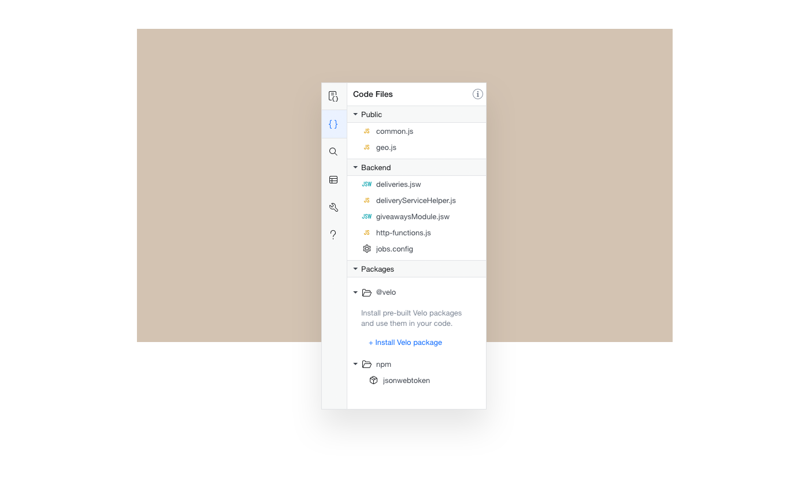

The **Code Files** tab includes all of the following that are relevant to your site:

-   **Public files**: Public code that can be accessed by your frontend and backend code.
-   **Backend files**: Backend code, including:
    -   Regular backend JavaScript files.
    -   Backend JavaScript [web modules](https://learn-code.wix.com/en/article/writing-backend-code), whose code can be called from the frontend. Web module files end with the **.jsw** extension.
    -   JavaScript files with special meaning in Velo, such as:
        -   **data.js**: Contains data hooks. We will not discuss [data hooks](https://support.wix.com/en/article/velo-about-data-hooks) in this guide.
        -   **http-functions.js**: Contains functions your site [exposes as an API](https://learn-code.wix.com/en/article/expose-an-api).
        -   **routers.js**: Contains routing logic for any site routers. We will not discuss [routers](https://support.wix.com/en/article/velo-about-routers) in this guide.
    -   Configuration files, such as:
    -    **jobs.config**: Contains configuration information for the [job scheduler](https://learn-code.wix.com/en/article/schedule-jobs).
-   **Packages:**
    -   **npm**:The [npm packages](https://learn-code.wix.com/en/article/packages) installed on your site
    -   **Velo**: The [Velo packages](https://learn-code.wix.com/en/article/packages) installed on your site

### Search Your Code

The **Search Your Code** tab contains a search mechanism that allows you to perform a global search on all of your code files. Package code is not searched.

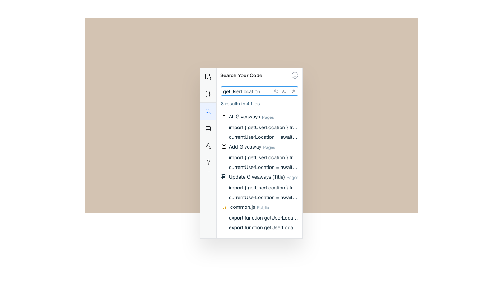

### Databases

The **Databases** tab contains all of your site's database collections.

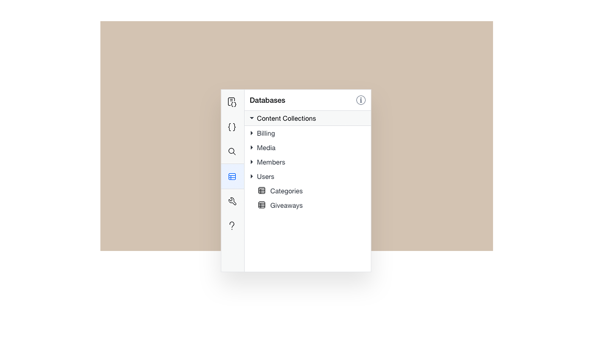

It includes all of the following that are relevant to your site:

-   Collections that you've created.
-   Collections that belong to Wix Apps you've added to your site.

### Velo Tools

The **Velo Tools** tab allows you to access several production tools that help you increase the security, debug, and roll out your site.

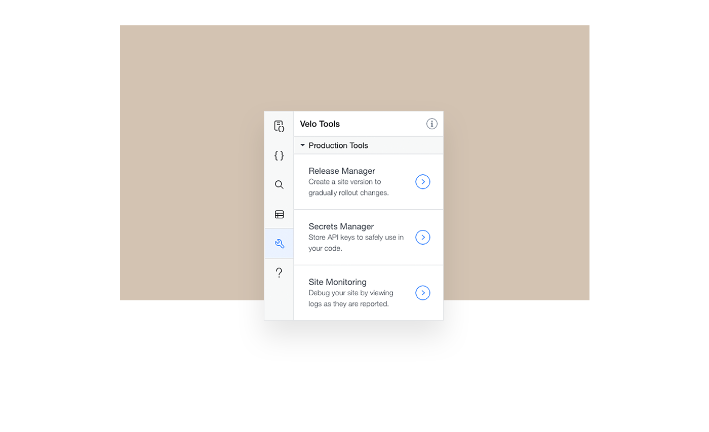

The following production tools are available:

-   **Release Manager**: Allows you to create versions of your site to gradually rollout changes you've made. 
-   **Secrets Manager**: Stores API keys and other sensitive information so you can use them safely in your code.
-   **Site Monitoring**: Helps you debug your code by viewing live logs or by connecting your logs to a third party monitoring tool.

### Velo Help

The Velo Help tab allows you to access a number of Velo resources to learn more or get some help.

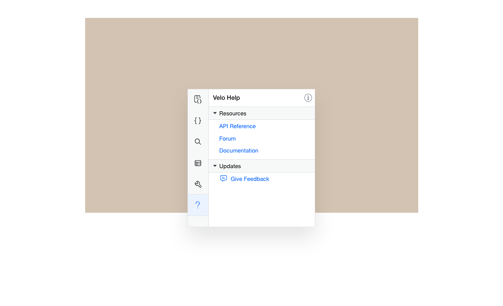

The following resources are available:

-   **API Reference**: The authoritative resource for learning about Velo APIs.
-   **Forum**: A growing community of Velo developers where you can ask questions, answer questions, or learn from previous discussions.
-   **Documentation**: The documentation portal where you can discover articles, examples, videos, and more.
-   **Give Feedback**: A place for you to share feedback with us.

## Page Editor

When Velo is enabled, the section of the Editor where you design your page doesn't change much, except for a few minor differences. The main ones that concern us now are the additions to the **Tools** panel.

Under the **Developer Tools** section, there are two additional tools when Velo is enabled:

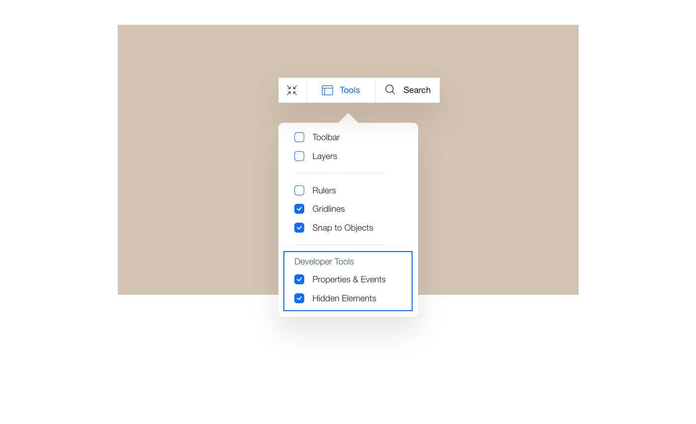

-   The **Properties & Events Panel**, which we discussed above. 
-   A **Hidden Elements** setting, which determines whether elements that are set to be hidden are shown while editing.
    
    Sometimes, while editing your site, you want to see hidden elements so you can design them and place them where you want them to be on the page. Other times, while editing your site, you don't want to see hidden elements because they get in the way of other page elements.
    
    Of course, in preview and on your live site, hidden elements are not shown until you show them with code. 
    

## Developer Console

When you preview your site with Velo enabled, the **Developer Console** shows at the bottom of the screen. The console displays information that is useful for debugging your code, such as errors, logs, and other messages.

You can set exactly which types of messages are displayed in the **Developer Console**.

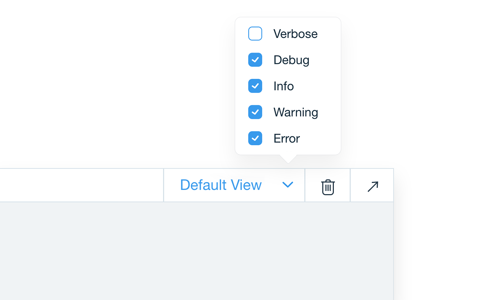

The following types of messages can be toggled on or off:

-   **Verbose**: System log messages detailing what is happening behind the scenes.
-   **Debug**: Messages you have logged to the console.
-   **Info**: Informational messages that require no action.
-   **Warning**: Messages about potential problems in your code. These are highlighted in yellow.
-   **Error**: Messages about actual errors in your code. These are highlighted in red.