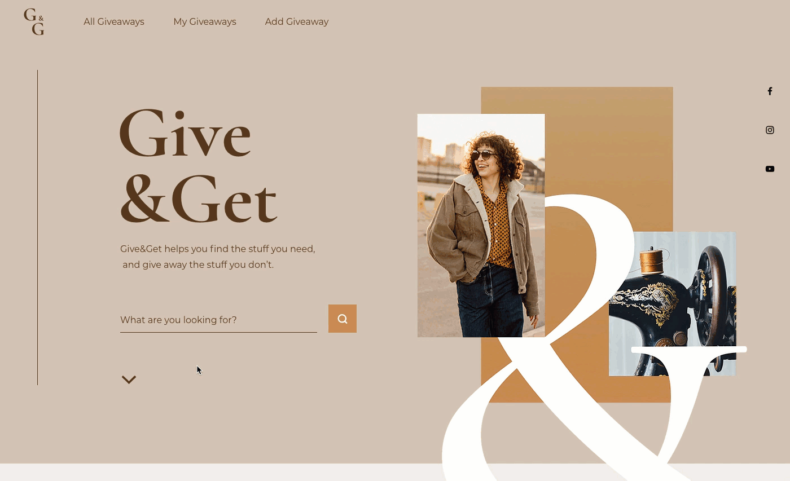

# Give & Get Example - Location API

Let's take a look at an example of how the Location API is used in our [Give & Get site](https://www.wix.com/velo-dev/giveandget) ([template](https://editor.wix.com/html/editor/web/renderer/new?siteId=bc57d791-a42d-4f8c-b74e-bd51b6dd0095&metaSiteId=398bcfa9-b93e-435a-95ea-9a0c15d56d36&autoDevMode=true)).

On our site, there are a couple of ways a visitor can reach the **All Giveaways** page from the **Home** page:

-   By using the search box.



-   By selecting one of the categories in the categories repeater.


In both situations, when reaching the **All Giveaways** page, the input elements on the **All Giveaways** page need to reflect the way the visitor reached the page. The list of giveaways displayed also needs to be filtered accordingly.

For example, if the visitor clicked the "Electronics" category on the **Home** page, the category dropdown should show "Electronics" when the **All Giveaways** page loads. Or if a visitor searched for "Shirt" on the **Home** page, the search term input should be populated with the word "Shirt" when the **All Giveaways** page loads.

So we need to perform the following steps when navigating from the **Home** page to the **All Giveaways** page:

1.  On the **Home** page, construct a URL with a query parameter that encodes either a search term or category.
2.  Use the constructed URL to navigate the visitor to the **All Giveaways** page by calling the `to()` function.
3.  On the **All Giveaways** page, extract the search term or category from the URL's query parameters.
4.  Populate the search term input and category dropdown with the information retrieved from the query parameters.
5.  Filter the giveaways shown in the repeater based on the information retrieved from the query parameters.

Note that we set the giveaways repeater to be hidden when the page loads. We do this because the repeater loads with data before we have a chance to filter it and we don't want people to see that data.

We also need to do some work each time a visitor performs a search on the **All Giveaways** page:

1.  Filter the giveaways shown in the repeater based on the search.
2.  Update the **All Giveaways** page URL with query parameters to reflect the most recent search.

As mentioned above, to populate the **All Giveaways** page when navigating the visitor from the **Home** page, information about how the user reached the **All Giveaways** page is sent in the URL.

When a search is performed by clicking the search button, the search term is retrieved from the search term input on the **Home** page. Then, we construct a URL with the `searchTerm` query parameter and use the `to()` function to navigate the visitor to the **All Giveaways** page.

```javascript
$w('#searchButton').onClick(() => {
    const searchTerm = $w('#searchTermInput').value;
    wixLocation.to(`/all-giveaways?searchTerm=${searchTerm}`);
});
```

When a category is selected, we construct a URL with the `categoryTitle` query parameter and use the `to()` function to navigate the visitor to the **All Giveaways** page.

To implement the correct category being sent, an `onClick` event handler is created for the button in each repeater item when the item is created. To do so, we use the `onItemReady` event handler.

```javascript
$w('#categoriesRepeater').onItemReady(($item, category) => {
    $item('#categoryButton').onClick(() => {
        wixLocation.to(`/all-giveaways?categoryTitle=${category.title}`);
    });
});
```

So when the `to()` function is called, the target URL looks like one of these:

```
'/all-giveaways?searchTerm=Shirt' 
```

```
'/all-giveaways?categoryTitle=Electronics'
```

Now let's take a look at what happens on the other side when the **All Giveaways** page starts loading.

The `onReady` code on the **All Giveaways** page needs to populate the page's search and filtering input elements to reflect the way the visitor reached the page. We do that in the `renderSearch()` function.

We also need to filter the list of giveaways that are displayed on the page. We do that in the `filterInitialSearchGiveaways()` function.

Both these functions begin with the same line:

```javascript
const { searchTerm, categoryTitle } = wixLocation.query;
```

This line of code uses the query property to retrieve the query string from the URL. The returned object is [destructured](https://developer.mozilla.org/en-US/docs/Web/JavaScript/Reference/Operators/Destructuring_assignment) into the `searchTerm` and `categoryTitle` variables.

From there, the `renderSearch()` function uses the retrieved search term and category title to populate the search term input and the category dropdown on the page. We've already examined this function in a previous lesson.

Now let's see how the `filterInitialSearchGiveaways()` function works.

```javascript
async function filterInitialSearchGiveaways(categories) {
    const { searchTerm, categoryTitle } = wixLocation.query;

    const selectedCategory = categories.find(category => category.title === categoryTitle);
    const categoryID = selectedCategory && selectedCategory._id;

    await filterGiveaways(searchTerm, categoryID);

    $w('#giveawaysRepeater').show();
}
```

The function takes in a list of all the categories that were retrieved from the **Categories** database collection earlier in the page loading process.

```javascript
async function filterInitialSearchGiveaways(categories) {}
```

The body of the function begins by retrieving the query parameters as explained above.

```javascript
const { searchTerm, categoryTitle } = wixLocation.query;
```

Since we filter the items based on their category IDs and not their category titles, we need to convert the category ID into its corresponding category title. We do this by searching to see if we can find a category that matches the category title from the query string.

```javascript
const selectedCategory = categories.find(category => category.title === categoryTitle);
```

If a matching category is not found, `selectedCategory` will be `undefined` at this point. So, we check if the selected category was found. If it was found, we get its ID. If it wasn't found we set the ID to be `undefined`. When we do the actual filtering, we'll know not to include the category in the filter criteria if it is `undefined`.

```javascript
const categoryID = selectedCategory && selectedCategory._id;
```

Finally, the function ends by filtering the dataset and then showing the giveaways repeater.

We filter the dataset by calling the `filterGiveaways()` function and thereby also filter the items shown in the giveaways repeater that's connected to the dataset. We've seen how the `filterGiveaways()` function works in a previous lesson.

Once the dataset is filtered and the repeater has the correct data, we show the repeater that was previously hidden.

```javascript
await filterGiveaways(searchTerm, categoryID);

$w('#giveawaysRepeater').show();
```

The final piece in the URL puzzle on the **All Giveaways** page is to update the query parameters in the URL each time a site visitor performs a search on the page. This keeps the URL up-to-date with the giveaways displayed on the page.

The URL is updated in the `updateFiltersInURL()` function. This function is called from the `onClick` event handler of the search button.

```javascript
function updateFiltersInURL(categories, searchTerm, categoryID) {
    const searchCategoryItem = categories.find(category => category._id === categoryID);
    const categoryTitle = searchCategoryItem ? searchCategoryItem.title : 'all';

    wixLocation.queryParams.add({ searchTerm, categoryTitle });
}
```

You're already familiar with all of the parameters that are passed to the function. It receives a list of all the categories from the **Categories** database collection, the current search term, and the selected category ID.

```javascript
function updateFiltersInURL(categories, searchTerm, categoryID) {}
```

The next two lines are very similar to what we've seen previously in the `filterInitialSearchGiveaways()` function, except this time in the opposite direction. Here we use a category ID to find a category title. If we can't find a category title, we use `'all'` instead.

```javascript
const searchCategoryItem = categories.find(category => category._id === categoryID);
const categoryTitle = searchCategoryItem ? searchCategoryItem.title : 'all';
```

Even though all of this converting back and forth could have been avoided by just using the ID in the URL, we use the title in the URLs because it is more SEO-friendly. It's worth the effort.

The function finishes by using the `add()` function to add the search term and category title to the URL's query string. Of course, if a search term or category title already exists in the search term the `add()` function replaces them instead of adding new ones.

```javascript
wixLocation.queryParams.add({ searchTerm, categoryTitle });
```

So, an updated query string after calling the `add()` function might look something like this:

```
www.mysite.com/all-giveaways?searchTerm=socks&categoryTitle=Apparel
```