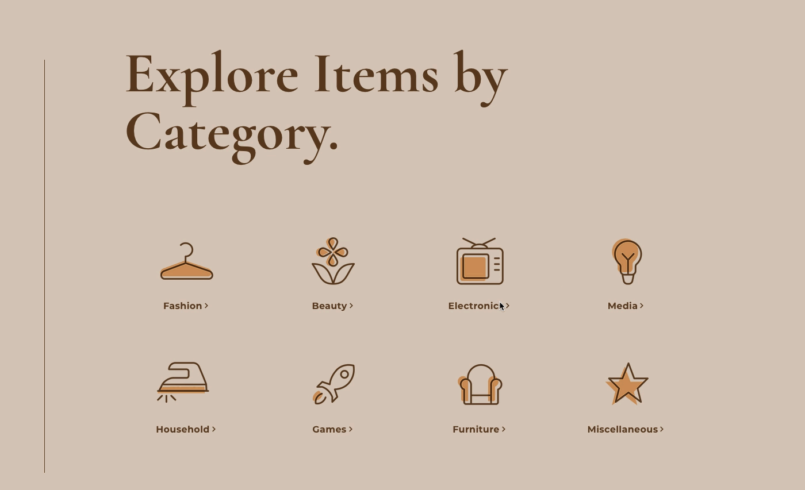

# Give&Get Example - Populating Elements During Page Loading

Let's take a look at an example of populating elements during the page loading process from our [Give&Get site](https://www.wix.com/velo-dev/giveandget) ([template](https://editor.wix.com/html/editor/web/renderer/new?siteId=bc57d791-a42d-4f8c-b74e-bd51b6dd0095&metaSiteId=398bcfa9-b93e-435a-95ea-9a0c15d56d36&autoDevMode=true)).

On our site, the **All Giveaways** page is used to display a searchable and filterable list of the available giveaways. The page has the following elements that are used to perform searching and filtering:

-   Text input (**#searchTermInput**) - for entering a search term
-   Dropdown (**#categoryDropdown**) - for choosing a category

There are several ways site visitors can reach this page. The list of giveaways that are displayed reflect the way the user reached the page.

The visitor can reach the page in any of the following ways:

-   By clicking the **All Giveaways** item in the site menu.
    
    In this case the **All Giveaways** page should show an unfiltered list of giveaways.
    
    The URL will look something like:  
    **.../giveandget/all-giveaways**.
    


-   By searching using the search box on the **Home** page.
    
    In this case the All Giveaways page should show a list of giveaways that match the search term. We pass the search term information from the Home page to All Giveaways by using query parameters in the URL.
    
    The URL will look something like:  
    **.../giveandget/all-giveaways?searchTerm=Shirt**
    


-   By clicking on a category in the list of categories on the **Home** page.
    
    In this case the **All Giveaways** page should show a list of giveaways that match the selected category. We pass the category information from the **Home** page to **All Giveaways** by using query parameters in the URL.
    
    The URL will look something like:  
    **.../giveandget/all-giveaways?category=Electronics**.
    



-   By entering a URL into the browser address bar.
    
    In this case the **All Giveaways** page should show a list of giveaways that match the search term and category query parameters in the URL if they exist.
    
    The URL will look something like:  
    **.../giveandget/all-giveaways?searchTerm=TV&category=Electronics**
    


In all of the situations listed above, when the page loads, the input elements on the **All Giveaways** page need to reflect the way the visitor reached the page. 

For example, if the visitor clicked the "Electronics" category on the **Home** page, the category dropdown should show "Electronics" when the page loads. Or if a visitor searched for "Shirt" on the Home page, the search term input should be populated with the word "Shirt" when the page loads.

We've defined the following function, named `renderSearch()`, to populate the elements as discussed above. The `renderSearch()` function is called from the `onReady` event handler, so it runs when the elements on the page are ready, but before the page is displayed to visitors.

```javascript
async function renderSearch(categories) {
    const { searchTerm, categoryTitle } = wixLocation.query;

    $w('#searchTermInput').value = searchTerm;

    const defaultOption = { label: 'All Categories', value: 'all' };
    const categoryOptions = [defaultOption].concat(mapItemsToOptions(categories));
    $w('#categoryDropdown').options = categoryOptions;

    const selectedCategory = categories.find(category => category.title === categoryTitle);
    const selectedCategoryID = selectedCategory ? selectedCategory._id : defaultOption.value;

    $w('#categoryDropdown').value = selectedCategoryID;
}
```

The function receives a list of categories that was retrieved from the **Categories** database collection.

```javascript
async function renderSearch(categories) {}
```

Then, it retrieves information about how the visitor got to the page. This information is passed to the page using query parameters in the URL.

We'll use these values to populate the search term input and the category dropdown.

Don't worry about the details of how we get the information from the query parameters. We'll discuss the usage of query parameters in a [later lesson](./location-api.md).

```javascript
const { searchTerm, categoryTitle } = wixLocation.query;
```

Next, we populate the search term input with the search term retrieved from the query parameters. We use the `$w()` selector function to select the input and then set its `value` property.

```javascript
$w('#searchTermInput').value = searchTerm;
```

The next section of code populates the options that appear in the category dropdown.

The options of a dropdown element are structured as an array of objects. Each object contains a label that is displayed to visitors and a value that is used behind the scenes. 

In our case, the labels are the category titles and the values are the IDs of the categories as found in the **Categories** database collection. 

We also want to add an option that will allow visitors to see giveaways from all of the categories at once.

So, we start by creating the default option.

```javascript
const defaultOption = { label: 'All Categories', value: 'all' };
```

Then, we add it to the list of categories retrieved from the **Categories** database collection. Since the category items we receive from the collection do not have `label` and `value` properties, we use the `mapItemsToOptions()` function to transform them into the format the dropdown requires.

```javascript
const categoryOptions = [defaultOption].concat(mapItemsToOptions(categories));
```

Now that we have all our options in the right format, we can set them as the dropdown options.

Again, we use the `$w()` selector function. This time, we use it to select the dropdown and set its `options` property.

```javascript
$w('#categoryDropdown').options = categoryOptions;
```

The last step is to make sure the correct option is selected in the dropdown. 

To do so, we look through the categories retrieved from the **Categories** database collection. We try to find a category item whose title matches the category title retrieved from the query parameters.

If we find a match, we set its ID as the selected ID. If we don't find a match, we use the default option's ID as the selected ID.

```javascript
const selectedCategory = categories.find(category => category.title === categoryTitle);
const selectedCategoryID = selectedCategory ? selectedCategory._id : defaultOption.value;
```

Finally, we use the `$w()` selector function to select the dropdown and set its value property to the `selectedCategoryID`. This will set the option that currently shows in the dropdown to the one whose ID matches the `selectedCategoryID`.

```javascript
$w('#categoryDropdown').value = selectedCategoryID;
```