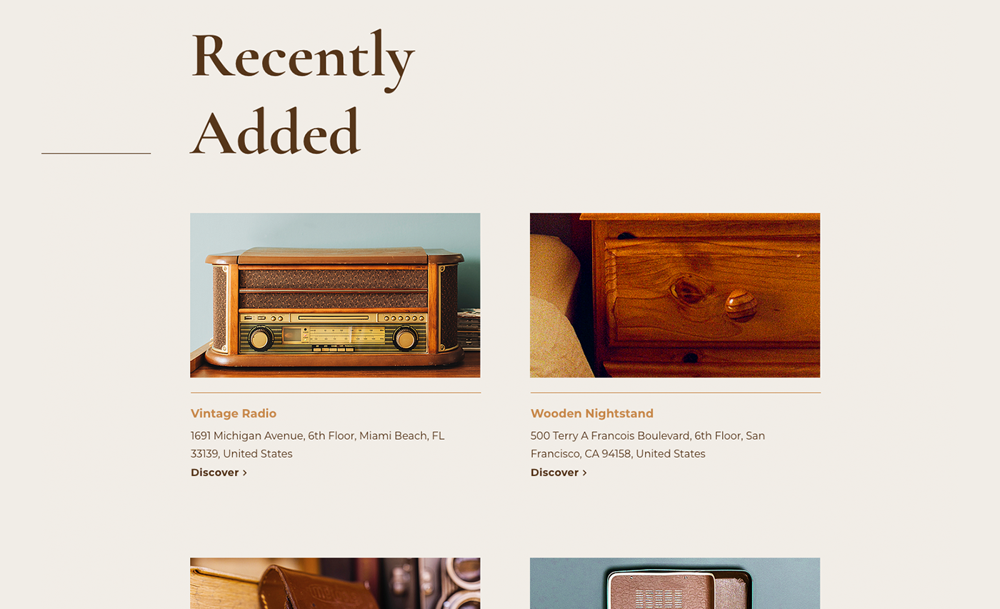
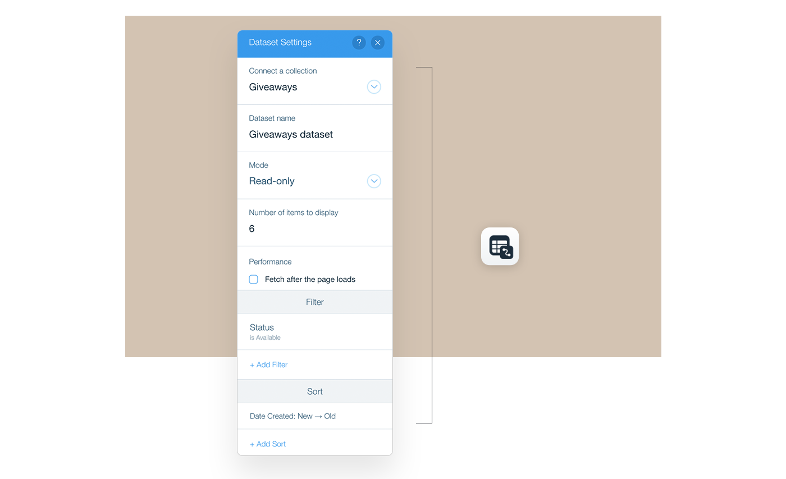
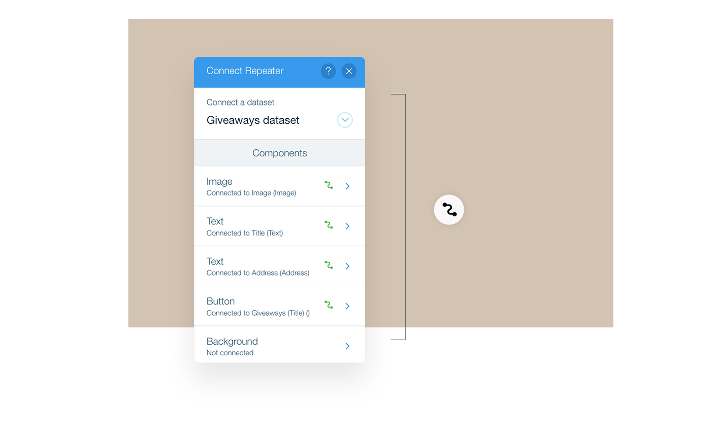
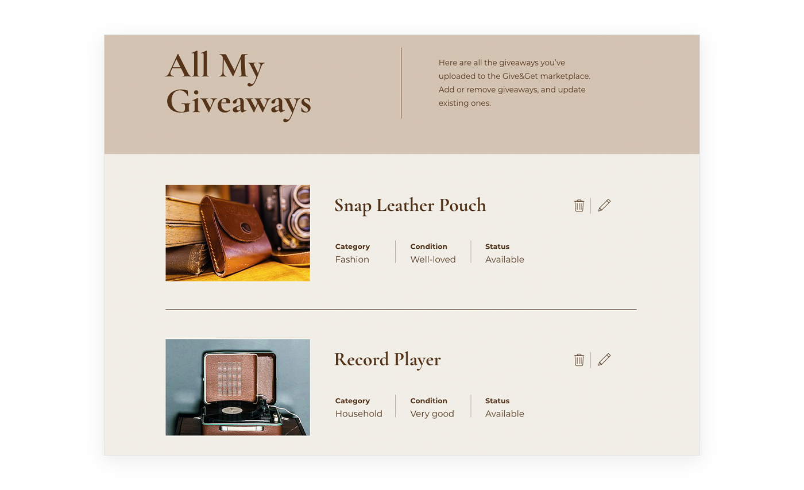
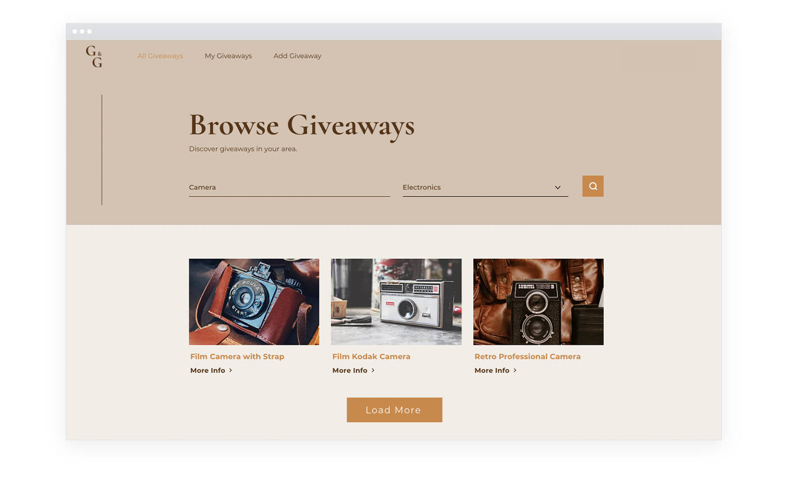

# Give & Get Example - Repeaters

There are four repeaters on our site. Let's examine some of them to demonstrate the three approaches to populating repeaters with data from a database collection and for adding functionality to repeaters.

We use the following three approaches:

-   Data Connections - This is a no-code approach that uses a dataset to connect a repeater and its elements to a database collection and its fields. This is the easiest approach, but it has some limitations with what you can do.
-   Code - This approach uses the Repeater API to populate a repeater's elements and add functionality. This approach requires the most work, but it is also the most flexible.
-   Hybrid - This approach uses a dataset to connect the repeater to a collection and code to add whatever can't be done with a dataset.

## Populate a Repeater Using a Dataset

Let's take a look at the repeater on the Home page that shows a list of recently added giveaways.



The repeater is connected to the **Giveaways** collection using the **Giveaways dataset**. We use the dataset settings to fine tune which giveaways are displayed.



> **Tip**
>
> Not familiar with datasets? See the [Content Manager Learning Center](https://learn.wix.com/en/article/displaying-site-content-144739#connecting-content-to-page-elements).

We set the following settings:

-   **Mode**: **Read-only** - To display giveaways from the collection.
-   **Number of items to display**: 6 - To show only six giveaways.
-   **Filter**: **Status is Available** - To only show giveaways that are still available.
-   **Sort**: **Date Created: New → Old** - To show the most recently added giveaways.

Then we connect the repeater to the dataset and choose the collection fields that populate into the repeater elements:



-   **Image**: Image source connected to the **Image** field.
-   **Text**: Connected to **Title** field.
-   **Text**: Connected to **Address** field.
-   **Button**: Click action connected to **Giveaways (Title)** dynamic page.

That's all we need to do. When the page loads, the dataset retrieves the relevant data from the collection and populates the repeater and its elements.

## Populate a Repeater Using Code

Now let's take a look at the repeater on the **My Giveaways** page. This repeater displays all the giveaways that the currently logged-in member has uploaded to the site.



In this case, we decided to use code to work with the repeater. This choice gives us the freedom to do a few things that we wouldn't be able to do if we used a dataset.

By using code we are able to:

-   Retrieve only the data we need from the relevant database collection, thereby improving performance.
-   Toggle an indicator image depending on whether a giveaway is available, requested or delivered.
-   Create a delete button that pops up a confirmation box before deleting a giveaway.

We've split the code for working with the repeater into two functions which we call in succession in the `onReady` event handler:

-   The `bindGiveawaysRepeater()` function defines how the data is bound to the repeater items and adds the custom functionality.
-   The `renderGiveawaysRepeater()` function retrieves the repeater data and then assigns it to the repeater.

```javascript
$w.onReady(function () {
    bindGiveawaysRepeater();
    renderGiveawaysRepeater();
});
```

Let's examine these functions one at a time. First, let's see what's going on in the `bindGiveawaysRepeater()` function.

```javascript
function bindGiveawaysRepeater() {
    $w('#giveawaysRepeater').onItemReady(($item, itemData) => {
        const { _id, title, categoryTitle, itemCondition, image, status, link, updateLink } = itemData;

        $item('#giveawayTitle').text = title;
        $item('#giveawayCategory').text = categoryTitle;
        $item('#giveawayCondition').text = itemCondition;
        $item('#giveawayStatus').text = status;
        $item('#giveawayImage').src = image;
        $item('#giveawayImage').link = link;
        $item('#editGiveawayButton').link = updateLink;

        $item('#deleteGiveawayButton').onClick(async () => {
            const shouldDeleteGiveaway = await wixWindow.openLightbox('Delete Confirmation', title);

            if (shouldDeleteGiveaway) {
                await removeGiveaway(_id);
                const giveaways = $w('#giveawaysRepeater').data;
                const updatedGiveaways = giveaways.filter(giveaway => giveaway._id !== _id);
                $w('#giveawaysRepeater').data = updatedGiveaways;
            }
        });
    });
}
```

The code begins by selecting the repeater on the page and creating an `onItemReady` event handler. This event handler runs each time a new item is added to the repeater's data.

```javascript
$w('#giveawaysRepeater').onItemReady(($item, itemData) => {
    // initialize repeater item
}
```

Inside the event handler, the code begins by [destructuring](https://developer.mozilla.org/en-US/docs/Web/JavaScript/Reference/Operators/Destructuring_assignment) the current item's data.

```javascript
const { _id, title, categoryTitle, itemCondition, image, status, link, updateLink } = itemData;
```

Then, it uses the `$item` scoped selector to select the elements in the current repeater item and populate them with the current item's data.

```javascript
$item('#giveawayTitle').text = title;
$item('#giveawayCategory').text = categoryTitle;
$item('#giveawayCondition').text = itemCondition;
$item('#giveawayStatus').text = status;
$item('#giveawayImage').src = image;
$item('#giveawayImage').link = link;
$item('#editGiveawayButton').link = updateLink;
```

The last section of code creates an event handler to define what happens when the delete button is clicked.

```javascript
$item('#deleteGiveawayButton').onClick(async () => {
    // handle delete button click
}
```

When the delete button is clicked, a lightbox with a confirmation message opens. If the visitor confirms the deletion, the `openLightbox()` function returns `true`.

> **Learn more**
>
> Want to read more about lightboxes and see what happens in the lightbox code? See the lesson on the [Window API](./window-api.md).

```javascript
const shouldDeleteGiveaway = await wixWindow.openLightbox('Delete Confirmation', title);
```

So, if the user doesn't confirm the deletion, nothing happens. But if the user does confirm the deletion, the giveaway needs to be deleted from the collection and from the repeater.

```javascript
if (shouldDeleteGiveaway) {
    // remove the giveaway from the collection and repeater
}
```

The giveaway gets deleted from the **Giveaways** collection by calling the `removeGiveaway()` function that is imported from the backend.

```javascript
await removeGiveaway(_id);
```

The giveaway gets deleted from the repeater by resetting the repeater’s data.

First, the code gets the repeater's current data, with the item that needs to be deleted. Then, it creates an updated version of the data by filtering out the deleted item. Finally, it resets the repeater's data to the updated version of the data.

The repeater will see that an item is missing from the data and remove it. Since the remaining items have the same IDs they had before, nothing will happen to those items. The `onItemReady` event handler will not run again.

```javascript
const giveaways = $w('#giveawaysRepeater').data;
const updatedGiveaways = giveaways.filter(giveaway => giveaway._id !== _id);
$w('#giveawaysRepeater').data = updatedGiveaways;
```

## Populate a Repeater Using the Hybrid Approach

Now that we've seen examples of populating a repeater strictly with a dataset or with code, let's take a look at an example that combines both approaches.

To demonstrate the hybrid approach, let's examine the repeater on the **All Giveaways** page. The repeater is used to display a searchable and filterable list of the available giveaways. The giveaways in the repeater reflect the search term and category selection if they exist.



A lot of the functionality of this repeater comes from connecting it to a dataset:

-   Most of the repeater's elements are populated through connections to the dataset.
-   The loading of additional items is implemented using a button connected to the dataset.

Achieving this functionality with a dataset is fairly straightforward:

-   Connect the repeater to the dataset and choose the collection fields that populate into the repeater elements, except the distance text element.
-   Connect the Load More button's click action to the **Load more**, found in **Dataset Actions**. 

Some additional functionality is added using code:

-   Add the current visitor's distance from the giveaways in the repeater.
-   Filter the items that display based on the search term, category selection, and availability.

Let's start by examining the code used to add the distances. This code is found in the `bindGiveawaysRepeater()` function.

```javascript
async function bindGiveawaysRepeater() {
    const currentUserLocation = await getUserLocation();

    $w('#giveawaysRepeater').onItemReady(($item, itemData) => {
        const giveawayLocation = itemData.address.location;

        if (currentUserLocation && giveawayLocation) {
            const distanceInKM = getDistance(currentUserLocation, giveawayLocation);
            $item('#giveawayDistance').text = `${distanceInKM} km`;
            $item('#distanceContainer').expand();
        }
    });
}
```

The function starts by getting the current user's location. The location is retrieved from the browser using a function imported from a **Public** file. Keep in mind that browsers will most likely pop up a message asking visitors if they're willing to share their location with the site.

> **Learn more**
> 
> Want to read more about getting a visitor's location? See the lesson on the [Window API](./window-api.md).

```javascript
const currentUserLocation = await getUserLocation();
```

The function continues by selecting the repeater on the page and creating an `onItemReady` event handler. This event handler runs each time a new item is added to the repeater's data.

```javascript
$w('#giveawaysRepeater').onItemReady(($item, itemData) => {
    // initialize repeater item
}
```

Inside the `onItemReady` event handler, we get the location of the current giveway.

```javascript
const giveawayLocation = itemData.address.location;
```

Next, we check to see if we have the current user's location and the item location. Remember, visitors may have refused the requests to retrieve their locations.

If the visitor's location was retrieved and we have the giveaway's location, we calculate the distance using the imported `getDistance()` function, populate the calculated distance into the distance text element, and expand the text element.

Now let's take a look at how the items in the repeater change to reflect the current search term and category selection. Although the approach here uses code, it differs from what we saw previously. It does not directly set the repeater's data using the Repeater API. Instead, here the Dataset API is used.

The code for changing the items shown in the dataset is found in the `filterGiveaways()` function. The function gets called when the page loads and every time the **Search** button is clicked.

```javascript
function filterGiveaways(searchTerm = '', categoryID) {
    let filter = wixData.filter()
        .eq('status', 'Available');

    filter = filter.contains('title', searchTerm)
        .or(filter.contains('description', searchTerm));

    if (categoryID) {
        filter = filter.eq('category', categoryID);
    }

    return $w('#giveawaysDataset').setFilter(filter);
}
```

The function receives a search term and category ID that are used for filtering the dataset. If no value for the search term is passed in, an empty string is used for the filter. Since the filter will use the `contains()` function, an empty string will match all the items.

```javascript
function filterGiveaways(searchTerm = '', categoryID) {}
```

Inside the function, we start by creating a filter. Although we're using the Dataset API to filter the dataset, the filter is actually created using the Data API. The filter starts off by checking for items that are still available.

```javascript
let filter = wixData.filter()
    .eq('status', 'Available');
```

Then we begin to build the filter so that it checks if the search term is contained in the title or description.

```javascript
filter = filter.contains('title', searchTerm)
    .or(filter.contains('description', searchTerm));
```

Next, we check to see if a category ID was provided. If a specific category was not selected, the `categoryID` parameter will have a [falsy](https://developer.mozilla.org/en-US/docs/Glossary/Falsy) value and no additional conditions are added to the filter. If a specific category was selected the filter is built to check for that category.

```javascript
if (categoryID) {
    filter = filter.eq('category', categoryID);
}
```

Finally, with the filter built, it is applied to the dataset. With the filter applied, the dataset takes care of showing the correct giveaways in the repeater.

We return the `setFilter()` Promise for the case where the function is called as the page loads. Initially, the giveaways repeater is hidden on the page so visitors don't see it before it is properly filtered. The return allows the calling function to wait until the filtering is finished before showing the repeater, which will then have the correct data.

```javascript
return $w('#giveawaysDataset').setFilter(filter);
```