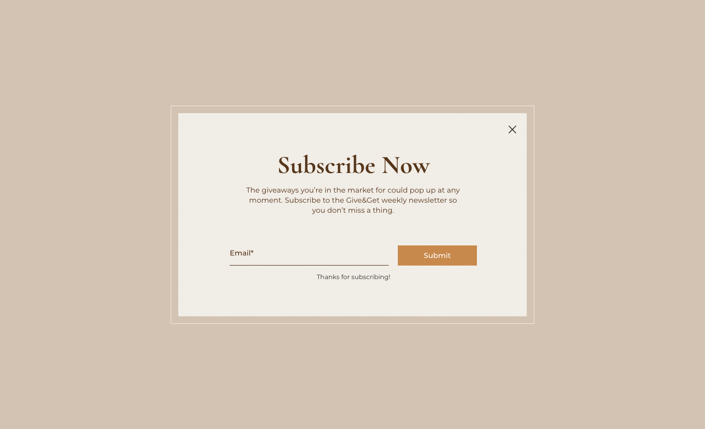

# Give&Get Example - Storage API

Let's take a look at an example of using the Storage API from our [Give&Get site](https://www.wix.com/velo-dev/giveandget) ([template](https://editor.wix.com/html/editor/web/renderer/new?siteId=bc57d791-a42d-4f8c-b74e-bd51b6dd0095&metaSiteId=398bcfa9-b93e-435a-95ea-9a0c15d56d36&autoDevMode=true)).

On our site, we want to pop up a lightbox the first time a visitor visits our site. The lightbox prompts the visitor to subscribe to our mailing list. We can implement this functionality using the storage API.



The general idea is to set a flag in storage the first time a visitor visits the site. We check for the flag each time a visitor visits our site to see if the current visit is from a new or returning visitor.

You can add this code to a specific page so that the popup only shows when visitors visit that page. Or you can add this code to **masterPage.js**, as we've chosen to do, so the popup shows no matter what page a visitor visits.

```javascript
// In masterPage.js
import {local as storage} from 'wix-storage';
import wixWindow from 'wix-window';

$w.onReady(function () {
    const returningVisitor = storage.getItem('returningVisitor');

    if(returningVisitor !== 'yes') {
        wixWindow.openLightbox('Subscribe to Mailing List');       
        storage.setItem('returningVisitor', 'yes'); 
    }
});
```

The code begins by importing the local storage module. We import it with an alias just in case we ever want to change the storage type. If we do decide to switch it, all we need to do is change the type in this line.

We also import the Window API, which is used to open the lightbox.

```javascript
import {local as storage} from 'wix-storage';
import wixWindow from 'wix-window';
```

Then, we have an `onReady` event handler that we use to run our code while the page loads. Although we can read and write to storage before the `onReady` event, we can't open the lightbox any earlier than that.

```javascript
$w.onReady(function () {
    // Implement popup here
});
```

Inside the `onReady`, we start by getting the value of our flag from storage.

If the visitor is a returning visitor, the value will be `'yes'`. Remember, we can't use booleans here. We need to use strings when working with storage.

If this is the first time the visitor is visiting our site, the retrieved value will be `null` because the `returningVisitor` key doesn't exist yet in storage.

```javascript
const returningVisitor = storage.getItem('returningVisitor');
```

Now we check the flag. If this is not the first time the visitor is visiting the site, we open the lightbox that serves as our popup. 

> **Learn more**
>
> To read more about lightboxes, see the lesson on the [Window API](https://learn-code.wix.com/en/article/window-api).

Then we set the flag for future page views. Now that the flag is set, the next time this code runs, the flag will be found and nothing will happen.

```javascript
if(returningVisitor !== 'yes') {
    wixWindow.openLightbox('Subscribe to Mailing List');
    storage.setItem('returningVisitor', 'yes'); 
}
```

In our case, since we're using local storage, the flag will persist between visits to the site. If we change to session storage, the storage will be cleared when visitors end their browser sessions. 

In that case, each time visitors reach our site in a new session, they'll be presented with the popup again.

This is probably not what you want to do with a contact form popup, but you might want this in other cases, such as showing seasonal promotions.

Since we used an alias when importing the local storage module, it's really easy to change the type of storage we use. All we need to do is change the type of storage in the import statement from `local` to `session`. Since both types of storage expose the exact same interface, there's no need to change anything else.

```javascript
import {session as storage} from 'wix-storage';
```