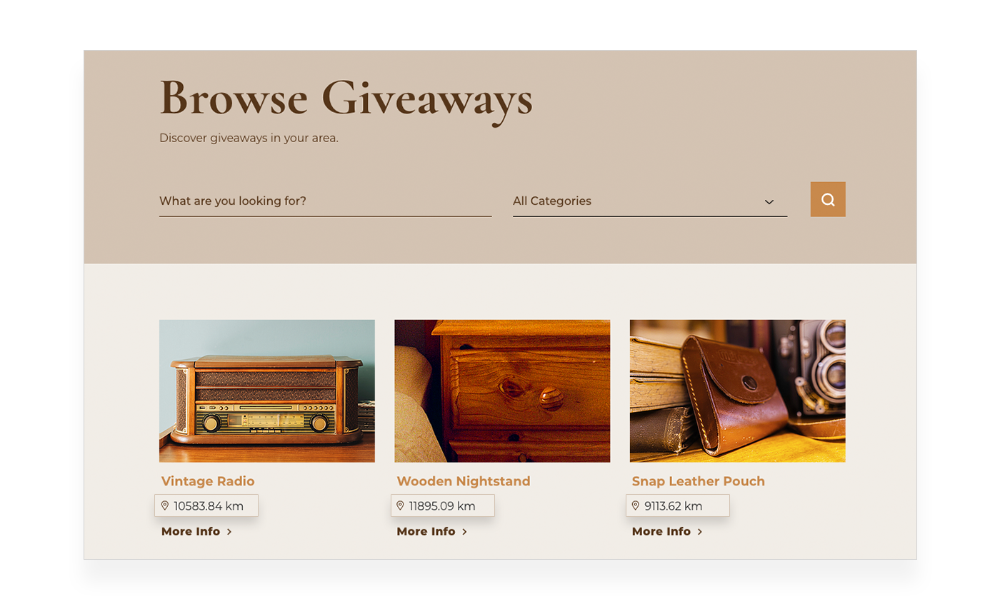
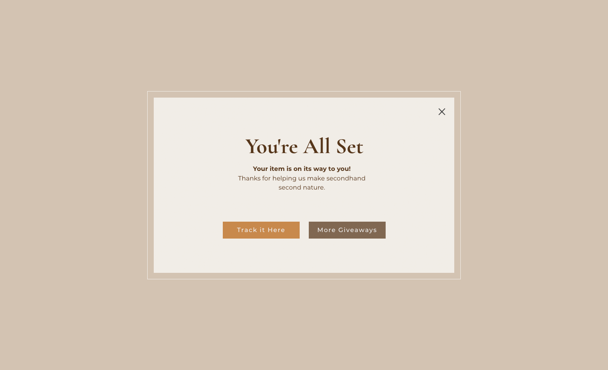
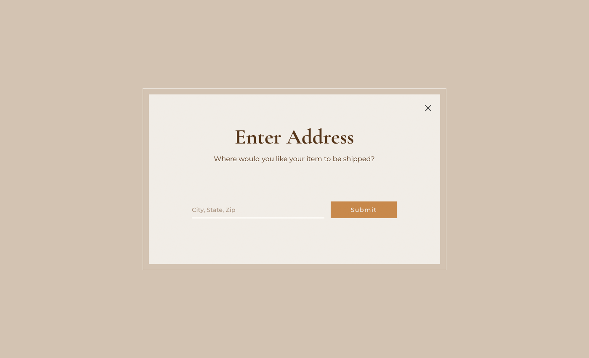
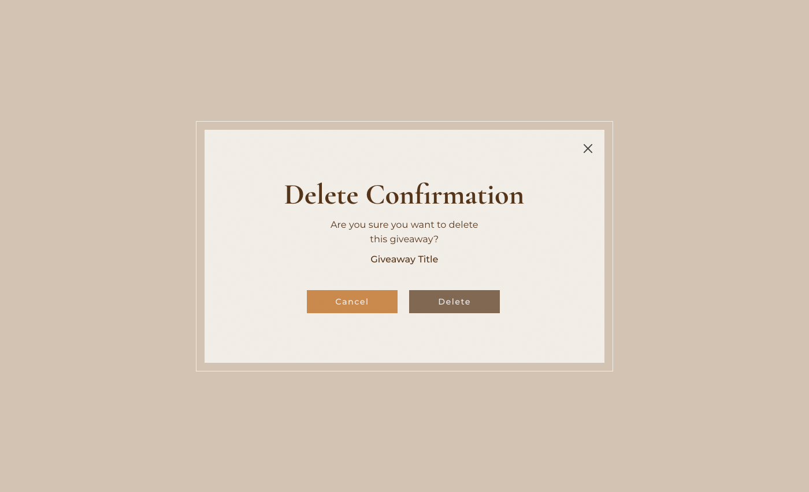

# Give & Get Example - Window API

Let's take a look at a couple of examples of using the Window API from our [Give & Get site](https://www.wix.com/velo-dev/giveandget) ([template](https://editor.wix.com/html/editor/web/renderer/new?siteId=bc57d791-a42d-4f8c-b74e-bd51b6dd0095&metaSiteId=398bcfa9-b93e-435a-95ea-9a0c15d56d36&autoDevMode=true)).

## Location

First, let's take a look at using the current visitor's location. 

We use a visitor's location in a number of places in the site:

-   The repeater on the **All Giveaways** page shows information about all the giveaways or a subset of them. One of the pieces of information about the giveaways that is displayed is the current visitor's distance from each giveaway.



-   When a member adds a new giveaway on the **Add Giveaway** page or updates a giveaway on the **Update Giveaway** page, we add the uploader's location to the rest of the giveaway data that we save in the **Giveaways** database collection.

In all the places listed, we only need the visitor's latitude and longitude coordinates. However, the `getCurrentGeolocation()` function may return a lot more information.

Instead of repeating the code to get the visitor's location data and extract the coordinates each time we need them, we create a function in a **Public** file that can be called anywhere in our code. We can reuse the public function whenever we need it.

Remember, we need to handle the cases where the location data is not available.

```javascript
// In public/common.js
import wixWindow from 'wix-window';

export function getUserLocation() {
    return wixWindow.getCurrentGeolocation().then(({ coords }) => {
        const { latitude, longitude } = coords;

        return { latitude, longitude };
    }).catch(() => {
        return null;
    });
}
```

Here we begin by importing the Window API and then creating an exported function that can be called from anywhere in the rest of the site's code.

```javascript
import wixWindow from 'wix-window';

export function getUserLocation() {
    // Get the location and return the coordinates
}
```

Next, we call the `getCurrentGeoLocation()` function. If the Promise resolves we [destructure](https://developer.mozilla.org/en-US/docs/Web/JavaScript/Reference/Operators/Destructuring_assignment) the location data and only save the location coordinate data.

```javascript
return wixWindow.getCurrentGeolocation().then(({ coords }) => {
    // Return the latitude and longitude coordinates
}).catch(() => {
    // Return something that signals we couldn't get the coordinates
});
```

Then, we further destructure the returned location data so that we are left with only the latitude and longitude coordinates. Then we return them.

```javascript
const { latitude, longitude } = coords;
      
return { latitude, longitude };
```

If the Promise rejects, we return `null`, to signify that we were unable to retrieve the visitor's location data.

## Lightbox

We use lightboxes in a number of places:

-   A lightbox pops up the first time a visitor visits the site. It prompts the visitor to join a mailing list. The lightbox is opened from code in the global **masterPage.js** file.


-   After a visitor enters an address in the **Giveaway (Title)** dynamic page, a lightbox opens with a link to the giveaway's tracking information.



-   When a visitor gets a giveaway from the **Giveaway (Title)** dynamic page, a lightbox opens for the visitor to enter an address.



-   When a visitor deletes an uploaded giveaway from the **My Giveaways** page, a delete confirmation is opened in a lightbox.



Let's take a closer look at the delete confirmation lightbox.

The **My Giveaways** page displays all the giveaways the current visitor has uploaded using a repeater. In each repeater item, there is a button to delete that item's uploaded giveaway.

The code for the delete button's functionality is in the repeater's `onItemReady` event handler.

```javascript
import wixWindow from 'wix-window';

// ...

$w('#giveawaysRepeater').onItemReady(($item, itemData) => {
    const { _id, title, categoryTitle, itemCondition, 
            image, status, link, updateLink } = itemData;

    // Populate elements with item data

    $item('#deleteGiveawayButton').onClick(async () => {
        const shouldDeleteGiveaway = await wixWindow.openLightbox(
            'Delete Confirmation', 
            title
        );

        if (shouldDeleteGiveaway) {
            await removeGiveaway(_id);
            const giveaways = $w('#giveawaysRepeater').data
            const updatedGiveaways = giveaways.filter(giveaway => giveaway._id !== _id);
            $w('#giveawaysRepeater').data = updatedGiveaways;
        }
    });
});
```

Here you can see that when the delete button is clicked. The **Delete Confirmation** lightbox is opened and we send the item's title to the lightbox. The page now waits until the lightbox is closed.

```javascript
$item('#deleteGiveawayButton').onClick(async () => {
    const shouldDeleteGiveaway = await wixWindow.openLightbox('Delete Confirmation', title);

    // ...
});
```

We'll see what happens in the lightbox code in a moment. In the meantime, let's just say that when the lightbox is closed, it sends the message `true` if the deletion has been confirmed.

So we continue the delete button's `onClick` event handler by checking if the deletion was confirmed.

If it was confirmed, we remove the deleted giveaway from the Giveaways collection and update the repeater accordingly. If it was not confirmed, we do nothing.

```javascript
if (shouldDeleteGiveaway) {
    await removeGiveaway(_id);
    const giveaways = $w('#giveawaysRepeater').data
    const updatedGiveaways = giveaways.filter(giveaway => giveaway._id !== _id);
    $w('#giveawaysRepeater').data = updatedGiveaways;
}
```

Now let's take a look at the code in the lightbox.

```javascript
import wixWindow from 'wix-window';

$w.onReady(function () {
    const giveawayTitle = wixWindow.lightbox.getContext();
    $w('#giveawayTitle').text = giveawayTitle;
  
    $w('#deleteButton').onClick(() => {
        wixWindow.lightbox.close(true);
    });
});
```

Here, in the **Delete Confirmation** lightbox, we start by retrieving the data sent from the **My Giveaways** page. Remember, the page sends the title of the giveaway that is being deleted.

We take that title and display it in a text element.

```javascript
const giveawayTitle = wixWindow.lightbox.getContext();
$w('#giveawayTitle').text = giveawayTitle;
```

Then, we add an `onClick` event handler to the button that confirms the deletion. The event handler closes the lightbox and sends a message back to the page signifying that the deletion has been confirmed.

If the visitor closes the lightbox using any other method, no message will be sent back to the page and the page will know that the deletion has not been confirmed.

```javascript
$w('#deleteButton').onClick(() => {
    wixWindow.lightbox.close(true);
});
```