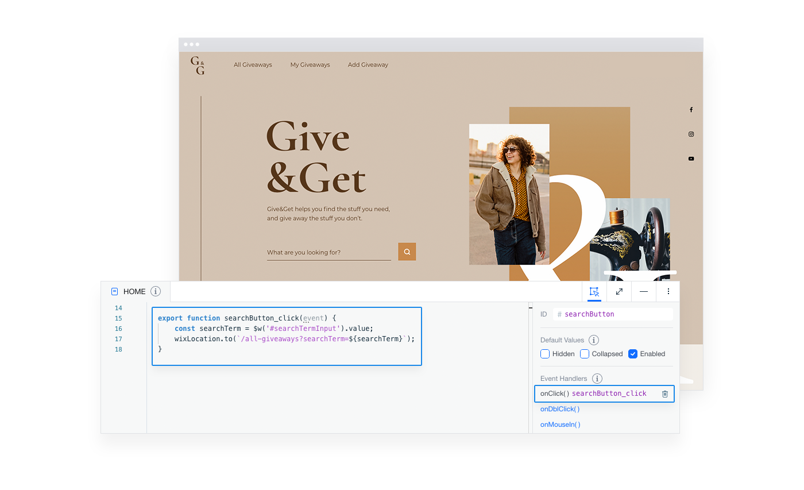

# Handling Element-based Events

Almost all of the page code that a Velo site runs is in response to some sort of event that occurs. We've just seen how you run code to respond to the `onReady` event. But what about other events like button clicks or mouse hovers?

There are two ways to create element-based events in Velo. The way you choose is sometimes up to personal preference and other times up to what you're using the event for.

## Static Event Handlers

A static event handler is one that gets bound while the page is loading. You can use this type of event handler when you already know before the page loads how you want to handle a specific event. This type of event requires wiring in the **Properties & Events Panel**.



The name of the function wired in the **Properties & Events Panel** needs to match the name of an exported function in your page code. When the specified event occurs, the function you wired it to runs.

For example, let's say you want to show some text when a visitor hovers over a certain image with the ID **myImage**. You can select the image in the Editor and use the **Properties & Events Panel** to add an `onMouseIn` event. A function stub will be added to the **Code Panel**.

Then you can define the body of the event handler so it looks something like this:

```javascript
export function myImage_mouseIn(event) {
    $w('myText').show();
}
```

Because static event handlers are wired, you need to be mindful when copying and pasting them to another page. Just copying the code will **not** work. If you do copy a static event handler function, remember to recreate the wiring on the page you paste it in.

## Dynamic Event Handlers

A dynamic event handler is one that you can bind whenever you choose. You can always use this type of event handler instead of a static event handler if you want to. In addition, you can also use it when you don't know how you want to handle a specific event until the page is displayed or even after.

You add a dynamic handler to an element by calling a function on the element. So, to add an `onMouseIn` event handler to an image dynamically, in comparison to we did above statically, you would write some code like this:

```javascript
$w('myImage').onMouseIn(event => {
    $w('myText').show();
});
```

Note that when you add a dynamic event handler to an element that already has a handler for that event, the new handler doesn't replace the original one. Instead, it adds another event handler. When the event occurs, all handlers set for the event run.