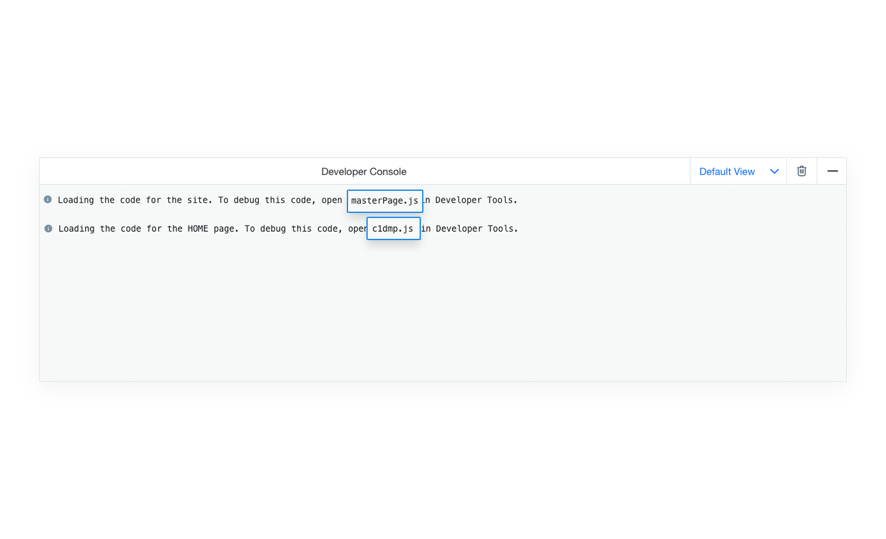
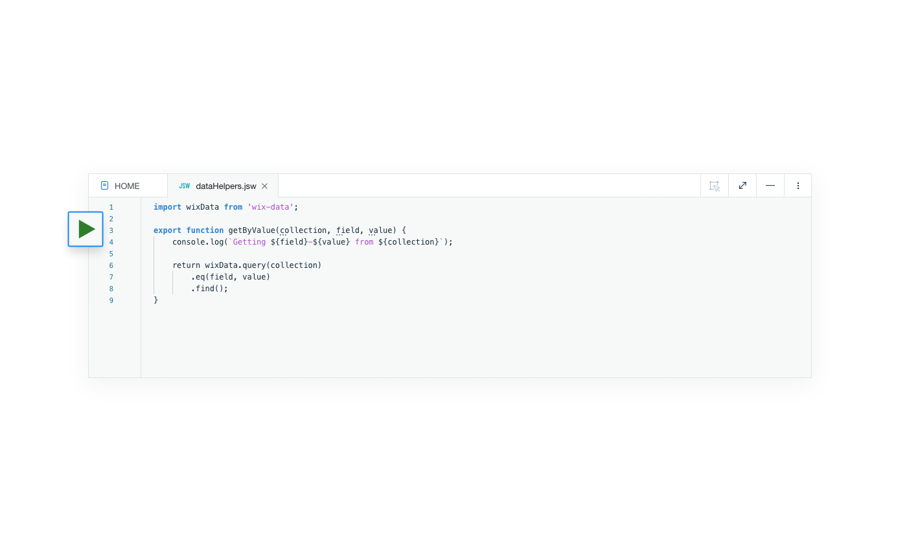
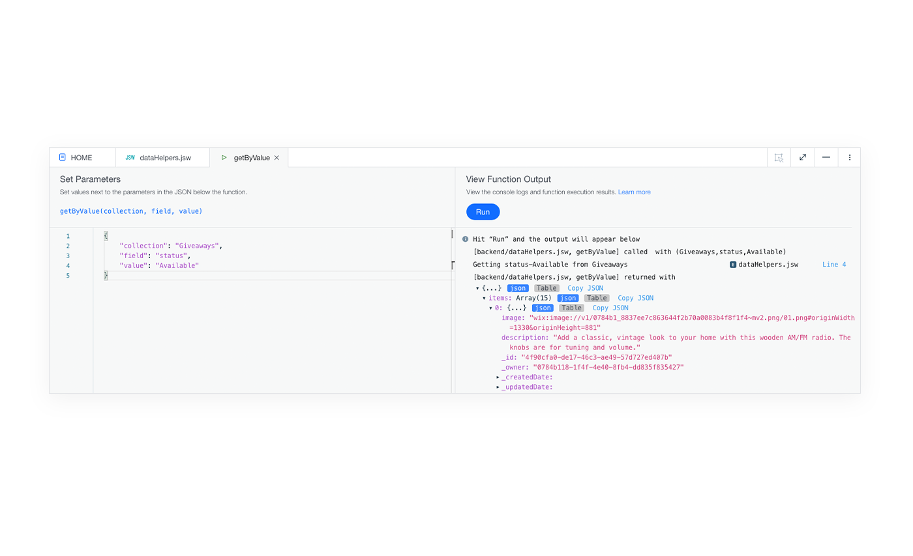
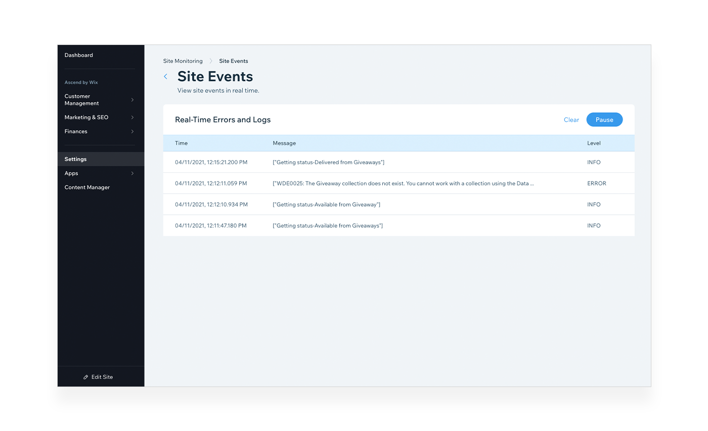

# Testing and Debugging

In general, testing and debugging in Velo is not any different from testing and debugging any other type of application. But there are a few things you should know that will help you get your code in tip-top shape.

The following tools, described in greater detail below, are available to aid you in the process of writing and maintaining your code:

-   **Developer Console**: A console that appears when previewing your site.
-   **Browser Developer Tools**: The standard tools of your favorite browser.
-   **Functional Testing**: Trigger backend functions to run from the Code Panel.
-   **Site Monitoring**: View, collect, and analyze logs generated by your site.
-   **Release Manager**: Create versions of your site to test and gradually rollout.

## Developer Console

To test and debug your code, preview your site. In preview, you can use the **Developer Console** at the bottom of the page to see messages you log from your code, system messages, and errors. You can also change the verbosity settings in the console to see additional information about what is happening behind the scenes on your page.

### Preview Limitations

In general, previewing your site is the first stop when testing and debugging. For most things it can also be the last stop. However, there are a number of features that cannot be tested in preview.

Here are several examples:

-   Events that occur in the backend, such as many events fired by Wix Apps, do not fire when previewing your site.
-   If you have your sandbox collections enabled, preview works with your sandbox data. That means you won't be able test your live data when previewing your site.
-   When you preview your site, you are assigned the Admin role. That means any code or permissions that are for non-Admin site visitors cannot be tested when previewing your site.

So, what do you do if you need to test things that don't work in preview? Testing on your published site is not ideal and sometimes not even possible. Use the **Release Manager** instead as described below.

## Browser Developer Tools

In some cases, you'll also want to use your browser's developer tools to debug your code. Use the browser's console to see errors that are not caught by the Velo console or to use the browser's debugger. 

Most messages you see in the Velo console are also logged to the browser's console. However, due to security concerns, when viewing the published version of your site, messages logged from the backend are not displayed in the browser console. To see such messages, use **Site Monitoring** as described below.

To use the browser's debugger, you first need to find the correct source code in the browser. When you preview a page, a message with the name of the file you need to locate is automatically logged in the **Developer Console**. Use your browser's developer tools to open that file. Once you have it open, you can set breakpoints, watches, and anything else your browser's debugger provides. You can also view the state of your code at any [debugger](https://developer.mozilla.org/en-US/docs/Web/JavaScript/Reference/Statements/debugger) statements you may have added.

## Functional Testing

You can test backend functions by triggering them in the code panel. You can test regular backend functions, functions in web modules, http functions, and anything else in the backend.

Test the backend function by clicking the green arrow to the left of the function header.

When you trigger a backend function you specify the values for any parameters that the function expects. You can see the value the function returns and any messages the function logs in the dedicated testing console.

Keep in mind that when you test a backend function it runs in the preview context. So the same limitations you have when previewing your site apply here as well.

## Site Monitoring

The **Site Monitoring** tool allows you to see events that occur, messages you've logged from code, system messages, and errors. 

You can examine live site logs and logs that occur when previewing your site in real time. You can also connect your logs to an external monitoring tool, such as [Google Operations](https://cloud.google.com/products/operations), to generate event metrics and perform log analysis. 

You can find the **Site Monitoring** in the **Settings** section of your site's dashboard.

## Release Manager

The **Release Manager** allows you to create and publish a test version of your site, called a release candidate, and choose what percentage of traffic is directed to that version of the site. 

If you want, you can create a release candidate and set its exposure to 0%. This effectively gives you a published version of your site that nobody but you sees. This "hidden" version is a safe place to test features that do not work in preview. Remember to be careful when using this approach. A release candidate works with the same live data as the main version of your site. So anything you do to the data from the release candidate also effects the main version of your site.