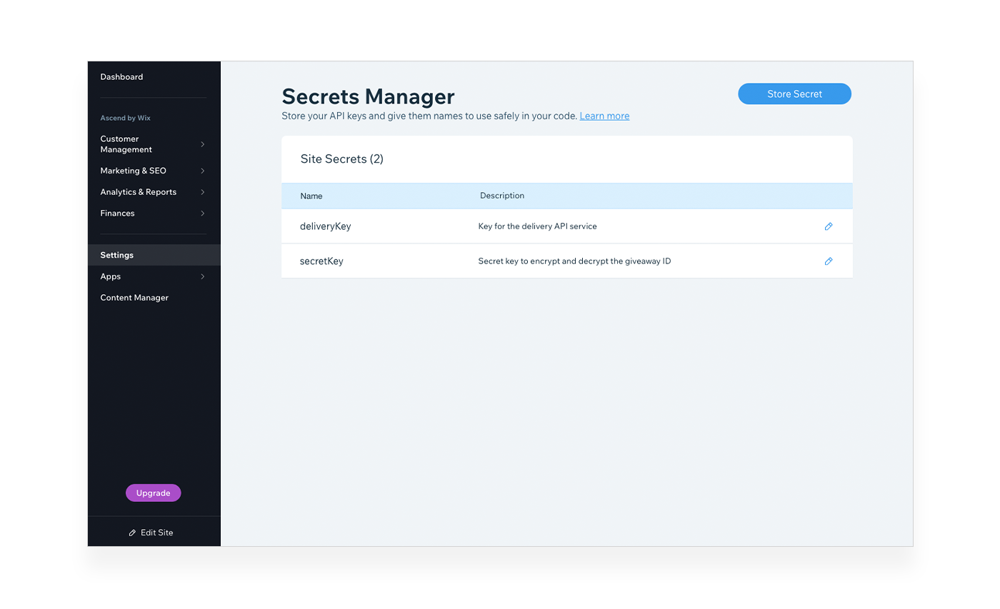

# Integration With Third Party Services

Want to integrate your site with a 3rd party service? No problem. Velo has a Fetch API you can use on either the frontend or backend. The Fetch API is an implementation of the standard JavaScript Fetch API, so you may already be familiar with it.

> **Tip**
>
> You can also use npm and Velo packages to integrate with 3rd party services. Learn more about integrating with third party services using packages in the [Packages](./packages.md) lesson.

## Fetch

Although you can use the Fetch API on the frontend, it's usually best to make your calls to external APIs from the backend for a few reasons:

-   Calling `fetch()` from the backend avoids any [CORS](https://developer.mozilla.org/en-US/docs/Web/HTTP/CORS) issues you might have when making certain types of calls from the frontend.
-   Many APIs require a key or some other form of authentication. For security reasons, you should make such calls in the backend. Also, be sure to use the **Secrets Manager** to securely store your API keys.
-   Retrieving data from the backend allows you to improve the performance of the data retrieval.
    -   The API call from the backend is guaranteed to happen over a fast network, where a call from a visitor's browser could be over a slower connection.
    -   If the API you call returns a lot of data that you don't need on the frontend, you can selectively just return the data you need.

Let's take a look at a simple example of hitting an external endpoint. Here we'll use an API that returns interesting quotes. The API returns a JSON response in the following format:

```javascript
{"quote": "This is the quote text."}
```

The code to retrieve the text of the quote looks like this:

```javascript
// In a backend web module

import { fetch } from 'wix-fetch';

export async function getQuote() {
   const response = await fetch('https://somequotesapi');
   const json = await response.json();

   return json.quote;
}
```

We begin by importing the `fetch()` function. Use this same import statement whether you're using fetch on the frontend or the backend.

```javascript
import { fetch } from 'wix-fetch';
```

In this example, we're calling fetch from the backend and we want to return the fetched data to the frontend so we create an exported function. 

```javascript
export async function getQuote() {
    // Fetch data from an external API
}
```

Inside the exported function, we call `fetch()` and pass the URL of the endpoint we want to reach.

```javascript
const response = await fetch('https://somequotesapi');
```

The `fetch()` function returns a Promise that resolves to an HTTP response object. The API we use in this example returns a JSON payload. To get the JSON data we need to call the `json()` function which also returns a Promise.

```javascript
const json = await response.json();
```

Finally, we can `return` the data we want from the JSON payload. In this case, we want to return the value of the `quote` property.

```javascript
return json.quote;
```

### Fetching JSON Data

If you're fetching JSON data using the GET method, there is a convenience `getJSON()` function that allows you to do away with the double set of Promises. The function returns a Promise that resolves directly to the JSON data without going through the HTTP response first.

So the same API call we made above can be simplified to:

```javascript
import { getJSON } from 'wix-fetch';

export async function getQuote() {
    const json = await getJSON('https://somequotesapi');
    return json.quote;
}
```

### Fetching With Options

Although the `getJSON()` function is convenient, it only works for some API calls. If you need to make an API call using any HTTP method other than GET or if the API returns anything other than JSON data, you need to use the `fetch()` function.

In addition to the URL of the endpoint you're trying to reach, you can pass an options object to specify the HTTP method to use, request headers, a request body, and more.

For example, a POST call might look something like this:

```javascript
import {fetch} from 'wix-fetch';

export async function postSomeData() {
    const response = await fetch('https://someapi.com/api/someendpoint', {
        method: 'post',
        headers: {
            'Content-Type': 'application/json'
        },
        body: JSON.stringify(someObject)
    });

    if(response.ok){
        return response.json();  
    }
}
```

As we've seen already, you can use the response returned by `fetch()` to retrieve the body of the APIs response. The response object also contains information about the response status, headers, and more.

> **Learn more**
> 
> Want to read more about the Fetch API? See [wix-fetch](https://www.wix.com/velo/reference/wix-fetch) in the API Reference.

## Secrets Manager

Lots of APIs require you to authenticate when using them. The Secrets Manager is a secure place to store all of your API keys and any other sensitive information.



You can find the **Secrets Manager** in the **Settings** section of your site's dashboard.

When you need to use any of the secrets you store in the **Secrets Manager**, use the Secrets API. Because secrets are sensitive information, you can only work with them on the backend and you should never send them to the frontend.

Use the `getSecret()` function to retrieve a key from the **Secrets Manager** by name.

For example to call an external API that requires you to use an API key in a query parameter you would write some code like this:

```javascript
import { getJSON } from 'wix-fetch';
import { getSecret } from 'wix-secrets-backend';

// …

export function callApi() {
    const apiKey = await getSecret('apiKey');

    return getJSON(`https://someapi?key=${apiKey}`);
}
```

> **Learn more**
> 
> Want to read more about the Secrets Manager? See About the [Secrets Manager](https://support.wix.com/en/article/velo-about-the-secrets-manager) in the Help Center.