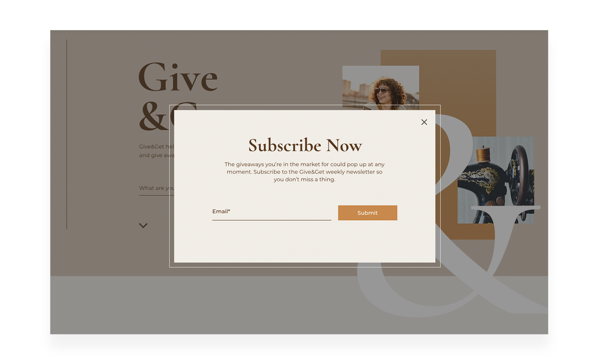

# Window API

The Window API contains functionality for working with the current browser window. 

Some of the functionality in the Window API includes:

-   Retrieving information about the current visitor's physical location and browser locale settings.
-   Determining what type of device the current visitor is using to view your site.
-   Working with lightboxes and modal windows.
-   Working with the multilingual capabilities of your site.
-   Copying text to the visitor's clipboard.
-   Scrolling the current page by a certain amount or to a certain location.
-   Sending tracking information to external analytics tools.

Let's take a closer look at a couple of these.

## Location

Sometimes, you want to know the physical location of your visitors. For example, you might want to show them some location-based information, such as nearby restaurants or other attractions.

You can retrieve a visitor's physical location using the `getCurrentGeoLocation()` function. Of course, the accuracy of the location data you get depends on the type of device used to view your site as well as other factors. So keep that in mind when making use of this location data.

Another issue to keep in mind when retrieving location data is that the environment you are trying to retrieve the location data from can affect how you get that data, if you get it at all.

Some browsers require visitors to explicitly agree to sharing their location data with you. This usually takes the form of a popup asking visitors if they want to allow your site to retrieve their location data. If they do not agree, the Promise returned by the `getCurrentGeoLocation()` function rejects.

These protections on the sharing of visitor location data mean you always have to be aware of the possibility that you won't be able to retrieve the visitor's location data and handle it accordingly.

Let's take a look at a simple example that uses the site visitor's location data to show a map of where the visitor is currently located. We display the visitor's location using a GoogleMap element that we've given the ID **googleMap**. We've set the map to be hidden when the page loads in case we can't retrieve the visitor's location.

```javascript
import wixWindow from 'wix-window';

$w.onReady(function () {
    wixWindow.getCurrentGeolocation()
        .then(location => {
            $w('#googleMap').location = {
                'latitude': location.coords.latitude,
                'longitude': location.coords.longitude,
                'description': 'You are here'
            };
            $w('#googleMap').show();
        });
});
```

Here you can see that we call the `getCurrentGeoLocation()` function. If the returned Promise resolves, we set the map element's location to the current visitor's location using latitude and longitude coordinates and show the map.

If the Promise rejects or if it doesn't resolve, the map will remain hidden.

## Lightbox

Lightboxes are great for grabbing the attention of your site's visitors. Lightboxes are often used for popping up promotional material, encouraging visitors to join a mailing list, or for action confirmation, such as confirming the deletion of some data.



You can open a lightbox on your site using the `openLightbox()` function from page code. You choose which lightbox to open by passing the lightbox's name when calling the function.

> **Tip**
>
> Remember to use the lightbox's name, and not its ID. 

When you open a lightbox, it opens on top of the page and runs its own code, which is not connected to the code of the page that opened it. 

When a visitor closes a lightbox that you opened in code, the Promise returned from the `openLightbox()` function is resolved and you can then handle the closure of the lightbox.

```javascript
import wixWindow from 'wix-window';

// ...

wixWindow.openLightbox("LightboxName")
    .then(() => {
        // Code here runs when the lightbox is closed
    });
```

You can also pass data from your page to the lightbox when calling the `openLightbox()` function by passing the data to the function.

You can only pass data to a lightbox if you open it using code. So, if you're passing data to a lightbox, you need to make sure there are no other triggers for opening the lightbox. You need to make sure the lightbox is not set to open automatically and there are no links set to open it. 

Once a lightbox is open, you can retrieve any data you sent to it from your page using the `getContext()` function.

If you want to send information back to the page that opened a lightbox, use the `close()` function to close the lightbox and return the visitor to the page. If you're passing information with the closing of the lightbox, you might have to disable all the other ways the lightbox can be closed.

The code below demonstrates the passing of data from a page to a lightbox and from a lightbox back to the page.

```javascript
//Page Code

import wixWindow from 'wix-window';

// ...

const dataToLightbox = 'Message from the page';

wixWindow.openLightbox('LightboxName', dataToLightbox)
    .then(dataFromLightbox => {
        $w('pageMessage').text = `This is what the lightbox sent: ${dataFromLightbox}`;
    });
```

```javascript
// Lightbox Code

import wixWindow from 'wix-window';

$w.onReady(function () {
    const dataFromPage = wixWindow.lightbox.getContext();
    $w('lightboxMessage').text = `This is what the page sent: ${dataFromPage}`;
  
    $w('#closeButton').onClick(() => {
        const dataToPage = 'Message from the lightbox';
        wixWindow.lightbox.close(dataToPage);
    });
});
```

The page code creates a message and opens a lightbox. It sends the message when opening the lightbox.

```javascript
// Page Code
const dataToLightbox = 'Message from the page';

wixWindow.openLightbox('LightboxName', dataToLightbox);
```

On the other end, the lightbox retrieves the message that was sent from the page and displays it in a text element.

```javascript
// Lightbox Code
const dataFromPage = wixWindow.lightbox.getContext();
$w('lightboxMessage').text = `This is what the page sent: ${dataFromPage}`;
```

Then, the code creates an `onClick` event handler for the lightbox's close button. When the close button is clicked, a message is created and sent back to the page when closing the lightbox.

```javascript
// Lightbox Code
$w('#closeButton').onClick(() => {
    const dataToPage = 'Message from the lightbox';
    wixWindow.lightbox.close(dataToPage);
});
```

Finally, back on the page, the message sent from the lightbox is retrieved and displayed in a text element.

```javascript
// Page Code
.then(dataFromLightbox => {
    $w('pageMessage').text = `This is what the lightbox sent: ${dataFromLightbox}`;
});
```

> **Learn more**
>
> Want to read more about the Window API? See [wix-window](https://www.wix.com/velo/reference/wix-window) in the API Reference.