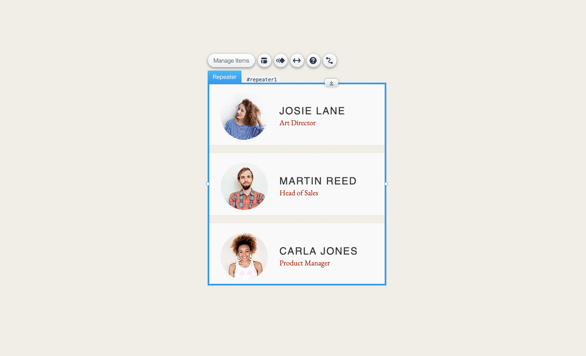
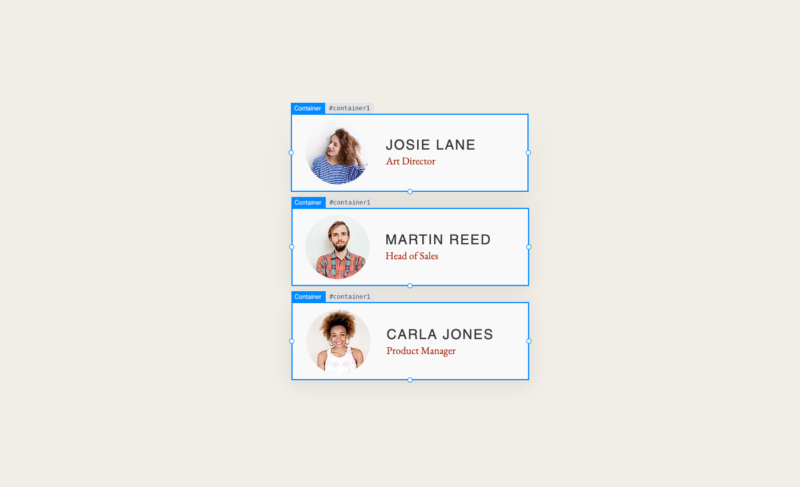
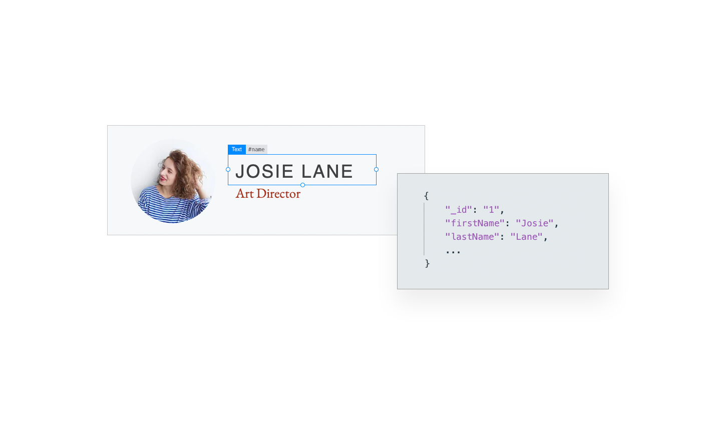

# Working With Repeaters

Let's take a look at one of these more complex elements - the **repeater**. Actually, a repeater isn't just a single element. It's an element that contains other elements. So, we also need to talk about the relationship between the elements contained in the repeater and the repeater itself.

## About Repeaters

A repeater is a set of items that contain page elements, like text and images. Each repeater item has the same design and layout, but different data. Although the layout of a repeater's items stays the same, the number of repeater items and the contents of those items can change dynamically.

Repeaters are great for displaying multiple items of structured data in a neat, organized fashion.

For example, here's a repeater with three items. As you can see, all the items in the repeater are laid out the same, and contain the same types of information, but the content shown in each item is different.



## Repeating Elements and Their IDs

Because all the items in a repeater share the same design and layout, they all contain the same elements. Not only do they contain the same elements, but those elements also have the same IDs across all of the repeater's items.


Also, all the elements in each repeater item are enclosed inside a container element.



In other words, a repeater is made up of multiple containers. Each of those containers can contain multiple elements. The elements in all of the containers are the same types of elements with different contents.

## Populating Repeaters

There are several way to populate a repeater with data:

-   Static Data: Repeaters are a great layout tool. You can manually enter static data into a repeater in the Editor to display data organized in a consistent way. Working with repeaters in this manner is pretty straightforward. We won't discuss this approach here.

-   Data Connections: You can use a dataset to connect data from a database collection to a repeater without using any code. A repeater changes its size and contents dynamically based on the settings of the dataset you connect it to. You can read more about this approach in the [Content Manager Learning Center](https://learn.wix.com/en/article/displaying-site-content-144739#displaying-multiple-items-together). 

-   Code: You can use a repeater's properties and functions to dynamically populate a repeater with any data you want by writing some code. You can bind static data, data you retrieve from a database collection, or data you get from anywhere else to a repeater's elements. You can also use code to define the behavior of the elements in a repeater.
    
    This approach gives you the most flexibility to do whatever you want. We will mostly focus on this approach for the rest of this lesson.
    
-   Hybrid: Sometimes, you may want to connect a repeater using a dataset to populate it with content from a database collection, but still use code to add custom functionality. 
    
    This hybrid approach uses a dataset plus some of the functions and properties that are used when working with repeaters using code.
    

## Working With Repeaters Using Code

Populating and controlling a repeater using code is a two-part process.

1.  You need to define _what_ data the repeater displays and uses.
2.  You need to define _how_ the repeater displays and uses that data.

You define _what_ data you want to associate with a repeater using the repeater's `data` property. This assigns an array of data objects to the repeater. Each data object in the array corresponds to the data of a single repeater item.

You define _how_ a repeater applies its data to its elements using a number of functions that allow you to implement what happens when repeater items are created, removed, or when you want to update them.

### Repeater Data

As mentioned above, you set the data associated with a repeater using the repeater's `data` property. The repeater grows and shrinks dynamically based on the number of data items you assign to it. There is always one repeater item for each data item you assign to it.

The data you assign to a repeater must follow a few simple rules:

-   The data must be an array of objects, where each object will be represented by an item in the repeater.
-   Each object in the array must contain an `_id` property with a unique string value consisting of alphanumeric characters (`A-Z`, `a-z`, `0-9`) and hyphens (`-`).
-   The rest of the properties in the objects can be anything you want, but their keys should be uniform across all the objects. (This last "rule" is not strictly required, but is most often the case and makes working with the data a lot easier.)

#### Static Data

For example, a simple array of static repeater data may look like this:

```javascript
const repeaterData = [
    {
        _id: '1', 
        name: 'Amy Allen', 
        title: 'CEO', 
        image: 'https://static.wixstatic.com/media/4e87e18894e24c238e5724b887362eeb.jpg'
    },
    {    
        _id: '2', 
        name: 'Ben Bailey',
        title: 'CTO', 
        image: 'https://static.wixstatic.com/media/5244d44737af4b19b360f11a1afa17c9.jpg'
    }
];
```

As you can see, this array meets the criteria listed above:

-   It's an array of objects.
-   Each object contains an `_id` property with a unique string value.
-   The rest of the properties in the objects are `name`, `title`, and `image` for all the objects in the array.

You can set the above static data to a repeater like this:

```javascript
$w('#myRepeater').data = repeaterData;
```

#### Database Collection Data

Repeater's are often populated by the results of queries to your site's database collections. Unsurprisingly, repeaters and query results were designed to make this as simple as possible. The data in query results is already in the format that a repeater requires, meeting all of the criteria mentioned above. All you have to do is set the query results to the repeater's data.

> **Learn more**
>
> Want to read more about queries? See the [Wix Data API](https://www.wix.com/velo/reference/wix-data/query).

For example you might perform a query like this:

```javascript
let results = await wixData.query('Team').find();
```

Which would return some data like this in the `items` property of the `results`:

```javascript
[
    {
        _id: '01fc2f47-f4ef-486a-be2e-6c9825d885ba', 
        name: 'Amy Allen', 
        title: 'CEO', 
        image: 'https://static.wixstatic.com/media/4e87e18894e24c238e5724b887362eeb.jpg'
    },
    {    
        _id: '27a7846a-da6d-4947-98c4-4224743a14e1', 
        name: 'Ben Bailey',
        title: 'CTO', 
        image: 'https://static.wixstatic.com/media/5244d44737af4b19b360f11a1afa17c9.jpg'
    }
] 
```

As you can see, this data already conforms to the rules required for repeater data. So you can simply assign it to the repeater using the `data` property.

```javascript
$w('#myRepeater').data = results.items;
```

#### Third Party Data

When you retrieve third party data, you often have to do a bit of work to transform the data into something that conforms to the rules mentioned above. The work usually centers around the IDs that the repeater expects. Remember, IDs have to be in a property named `_id` and they must be strings consisting of alphanumeric characters (`A-Z`, `a-z`, `0-9`) and hyphens (`-`).

If the data you retrieve from a third party doesn't have the correct type of IDs, you need to generate them from some unique value in the retrieved data or just make them up. Depending on the situation, this could mean any of a number of things:

-   If a property already exists in the data with a valid ID, duplicate the value of that property into a new property named `_id`.
-   If there is no property with a valid ID, create an `_id` property and set it to values you create by transforming an existing property value or multiple property values into valid IDs.
-   If all else fails, generate random valid ID values and add them to the retrieved data in an `_id` property.

For example, suppose you retrieve some data from a third-party API.

```javascript
import {getJSON} from 'wix-fetch';

// ...

const retrievedData = await getJSON('https://someservice.com/api/abc');
```

Let's say the API returns data that contains numerical IDs in an `id` property.

```javascript
[{"id": 1, "value": "a"}, {"id": 2, "value": "b"}, {"id": 3, "value": "c"}] 
```

Since the IDs are not valid for repeater data, you need to generate new ones. You can do this fairly easily by mapping the existing numerical IDs to their string equivalents and store them in an `_id` property.

```javascript
const repeaterData = retrievedData.map(item => item._id = item.id.toString());
```

Then all you need to do is assign the data to the repeater using the `data` property.

```javascript
$w('#myRepeater').data = repeaterData;
```

### Item Lifecycle

Now that you know how to assign data to a repeater, we need to see how that data is used.

Simply assigning data to a repeater doesn't cause too much to happen. The repeater grows or shrinks by adding or removing items so that it matches the size of the data you assign to it. But that's about it.

There's no way for the repeater to know how you want to apply its data. It doesn't know which properties in your data should be mapped to which elements in the repeater items. That part is up to you to define in code.

For example, let's say your data contains `firstName` and `lastName` properties. You might want the values of those properties to populate into a text element with the ID `name`. How is the repeater supposed to know that?



It can't know that. So you have to tell it what to do.

You define how a repeater uses its data at the following points in the lifecycle of the repeater's items:

-   Item creation: Typically, you populate an item's elements and set their behavior when an item is created and added to a repeater. 
-   Item removal: Usually, nothing needs to be done when an item is removed from a repeater. But if you have any cleanup tasks or similar operations to perform, this is the time to do them.
-   Other times: Between an item's addition to and removal from a repeater, you can choose to revisit it to change the contents or behavior of its elements. This is most often done after an item's data has been updated.

#### Creating New Repeater Items

You don't explicitly create new items and add them to a repeater. They are created and added for you based on the data you assign to the repeater. So, before we see how you handle the creation of new repeater items, it's important to understand the rules that govern when a new item is created. 

When you set a repeater's data, it checks the IDs of the items in the data array you assign to it. The repeater creates a new item for each new ID it finds. If your repeater was empty before you set its data, all the IDs are new and a repeater item is created for each item in your data array.

```javascript
let repeaterData = [
    {_id: '1', name: 'Amy Allen'},
    {_id: '2', name: 'Ben Bailey'}
];

// Initial setting of data property
// All IDs are new - two items are created
$w('#myRepeater').data = repeaterData;
```

However, if the repeater already contains data and you reset the `data` property, it could be that only some of the IDs are new.

Any data items containing IDs that already exist in the repeater do not trigger the creation of a new repeater item. This is the case even if other properties of the item have changed values. It's all about the ID when it comes to creating new repeater items.

```javascript
const repeaterData1 = [
    {_id: '1', name: 'Amy Allen'},
    {_id: '2', name: 'Ben Bailey'}
];

// Initial setting of data property
// All IDs are new - two items are created
$w('#myRepeater').data = repeaterData1;

const repeaterData2 = [
    {_id: '1', name: 'Carly Collins'},
    {_id: '2', name: 'Dave Dixon'},
    {_id: '3', name: 'Eva Ellis'}
];

// Resetting of data property
// One ID is new, two are old - one item is created
$w('#myRepeater').data = repeaterData2;
```

#### Handling the Creation of Repeater Items

Now that you know when new items are created and added to a repeater, we can see how you define what the repeater should do when a new item is created. Remember, this is when you define how the item's data is applied to its elements. 

You probably want to populate the elements in a newly created repeater item with values from the data object that corresponds to it. You could also use the opportunity to add functionality to the item's elements.

When a new item is created based on the data assigned to a repeater, an `onItemReady` event fires. Use the repeater's `onItemReady()` function to set an event handler that handles the creation of the new item.

The basic syntax for adding an `onItemReady` event handler looks like this:

```javascript
$w('#myRepeater').onItemReady(($item, itemData, index) => {
    // This runs each time a new repeater item is created
    // You initialize a repeater item here.
});
```

The event handler takes three parameters:

-   `$item`: A selector function scoped to the repeater item being created.
    
    When selecting elements in a repeater, you can't use the regular `$w()` selector function. (Well, actually you can. But it probably won't do what you want.) Remember that the page elements in a repeater have the same IDs across multiple repeater items. When you're applying data to an element in a specific repeater item, you need to select the specific instance of that element in the current repeater item.
    
    For example, suppose you have an element in a repeater with the ID `name`. To populate that element in the first repeater item, you need to select the specific instance of the `name` element that appears in the first item. But remember, the name elements in all the repeater items have the exact same ID so you can't just select it using `$w()`.
    
    To select a specific instance of a repeated element, you need a selector whose scope is the specific repeater item you're in. That's exactly what the `$item` selector is. Each time the `onItemReady` event handler is fired, it receives a selector function that is scoped to the specific item that is being created.
    
    So the following selection selects the current item's instance of the `name` element:
    
    `$item('#name')`
    

-   `itemData`: The data object that is associated with the repeater item being created.
    
    Now that you know how to select a specific instance of an element in a repeater, you need to populate it with the right data.
    
    For example, when the first repeated `name` element is selected, you want to populate it with the first `name` value from the repeater's data. And when the second repeated `name` element is selected, you want to populate it with the second `name` value from the repeater's data.
    
    To do so, you need the data that corresponds to the specific repeater item you're in. That's exactly what the `itemData` is. Each time the `onItemReady` event handler is fired, it receives the data that corresponds to the specific item that is being created.
    
    So the following assignment assigns the current item's **name** data to its specific instance of the **name** element:
    
    `$item('#name') = itemData.name;`
    

-   `index`: The index of the repeater item being created.
    
    The index parameter lets you know where the current repeater item fits within the larger set of all the repeater items.
    

Elements in the repeater that you don't populate using the `onItemReady()` function get their values from the repeater's item template. In most cases this will be the value of the element in the first repeater item as it appears in the Editor.

This is useful if you have elements that should have the same value across all your repeater items. You can set that value in the Editor and the element will have that value in all new items that are created.

For example, let's say you have a button that you use to take visitors to a page with details about the items represented in a repeater. 

You probably need to set the button's `link` property or `onClick` event handler when the repeater item is created. That way, each button in the repeater will take the visitor to the appropriate details page.

But you might want all of the buttons in all the repeater items to have the same label. Maybe something like "Learn More". In that case, there's no reason to set the button's label each time a new repeater item is created. Just set it in the Editor and new items that are created will have a button with the proper label by default.

> **Learn more**
>
> Want to read more about repeater item templates? See About Repeater Item Templates in the Help Center.

#### Example - Element Creation

Now that you know how the `onItemReady()` function works and what it's used for, let's take a look at it in action.

Let's start by assuming we have the following repeater data and we assign it to a repeater using the `data` property. (In our example, we also use an animation, so we import the Animation API).

```javascript
import { timeline } from 'wix-animations';

$w.onReady(function () {
    const repeaterData = [
        {
            _id: '01fc2f47-f4ef-486a-be2e-6c9825d885ba',
            name: 'Amy Allen',
            title: 'CEO',
            image: 'https://static.wixstatic.com/media/4e87e18894e24c238e5724b887362eeb.jpg'
        },
        {
            _id: '27a7846a-da6d-4947-98c4-4224743a14e1',
            name: 'Ben Bailey',
            title: 'CTO',
            image: 'https://static.wixstatic.com/media/5244d44737af4b19b360f11a1afa17c9.jpg'
        }
    ];

    // Add the onItemReady event handler here

    $w('#myRepeater').data = repeaterData;
});
```

Then we could add this code to set the `onItemReady` event handler.

```javascript
$w('#myRepeater').onItemReady( ($item, itemData, index) => {
  
    // Apply item data to page elements
    $item('#name').text = itemData.name;
    $item('#title').text = itemData.title;
    $item('#image').src = itemData.image;
  
    // Add element functionality
    $item('#itemContainer').onMouseIn( () => {
      let animationTarget = $item('#image');

      timeline()
        .add(animationTarget, {scale: 1.1, duration: 500})
        .add(animationTarget, {scale: 1.0, duration: 500})
        .play();
      });
});
```

Here you can see that the `$item` selector is used to select the name, title and image elements. With each of those elements selected, we use the `itemData` to populate them with data.

We also use the `$item` selector to select the current repeater item's container. Using that selection, we add an `onMouseIn` event handler which animates the image in the item the visitor has hovered over.

Then we use the `index` to determine whether the current item is an even or odd item and set the item's background accordingly.

#### Removing Existing Repeater Items

So, when you set a repeater's data and there are new IDs, new items are added to the repeater. What happens when you set the data and IDs that used to be there are now missing?

```javascript
const repeaterData = [
    {_id: '1', name: 'Amy Allen'},
    {_id: '2', name: 'Ben Bailey'},
    {_id: '3', name: 'Carly Collins'}
];

// Initial setting of data property
$w('#myRepeater').data = repeaterData;

repeaterData.pop();

// Resetting of data property
// One ID is removed
$w('#myRepeater').data = repeaterData;
```

In this case, the repeater items whose corresponding IDs no longer exist are removed from the repeater.

#### Handling Repeater Item Removal

If you want, you can do something each time an item is removed using the `onItemRemoved()` function. Use the `onItemRemoved()` function to set an event handler that runs when old items are removed from the repeater.

```javascript
$w('#myRepeater').onItemRemoved( (itemData) => {
    // Here is where you handle the removal of a repeater item.
    // This code will run for each ID that no longer exists after the data property is set.
});
```

#### Updating Repeater Items

You now know when items are added to and removed from a repeater. It's all about the IDs. If you set the repeater's data with a new ID, a new repeater item is created. If you set the repeater's data with an ID removed, an existing repeater item is removed.

So how do you update an existing repeater item? Let's say the value of a certain property in the data array has changed. How do you reflect that change in the displayed repeater?

First, just like when adding or removing an item, you need to set the repeater's `data` property with the updated data.

You've been paying close attention, so you already know the story can't end there. When you set a repeater's data property, only the IDs are checked, not the contents of the items. Because you're only changing the values of certain properties, and not the IDs, no repeater items are created and no items are removed. That means the `onItemReady` and `onItemRemoved` event handlers do not fire.

> **Note**
>
> You cannot modify a repeater's data array in-place. To add, change, or remove objects from an existing repeater's data array:
>
> 1.  Store the value of the data property in a variable.
> 2.  Make changes to the objects of the data array.
> 3.  Reset the data property with the modified array.

```javascript
let repeaterData = [
    {_id: '1', name: 'Amy Allen'},
    {_id: '2', name: 'Ben Bailey'}
];

// Initial setting of data property
$w('#myRepeater').data = repeaterData;

repeaterData = [
    {_id: '1', name: 'Carly Collins'},
    {_id: '2', name: 'Dave Dixon'}
];

// Resetting of data property with updated names
// IDs are unchanged, but other values have changed
$w('#myRepeater').data = repeaterData;
```

Once the data is updated, you can call either the `forEachItem()` or `forItems()` function to apply your data updates to the elements in the repeater.

These functions work similarly to the `onItemReady()` function. You can use them to apply the repeater data to the elements in the repeater.

However, there is an important difference here. The `onItemReady()` event handler gets called automatically when new items are added to the repeater. The `forEachItem()` and `forItems()` callbacks on the other hand, are never called on their own. You explicitly trigger the callbacks to run.

Use the `forEachItem()` function when you want to update all the items in a repeater.

```javascript
$w('#myRepeater').forEachItem(($item, itemData, index) => {
    // Update name elements with new names
    $item('#name').text = itemData.name;
});
```

Use the `forItems()` function when you want to update specific repeater items by ID.

```javascript
$w('#myRepeater').forItems(['1', '2'], ($item, itemData, index) => {
    // Update specific instances of the name elements with new names
    $item('#name').text = itemData.name;
});
```

### Creating Scoped Selectors

We've seen that a number of repeater functions pass a `$item` scoped selector to their callback functions so that you can select the specific instance of a repeated element. But what if you need a scoped selector elsewhere? This need sometimes arises when defining event handlers for repeated elements.

In the `onItemReady()` code above, we created an `onMouseIn` event handler for the repeater item containers. Since we were within a repeater function, we were able to use the `$item` scoped selector that was passed in.

```javascript
$w('#myRepeater').onItemReady(($item, itemData, index) => {
  
    // ...

    $item('#itemContainer').onMouseIn(() => {
        let animationTarget = $item('#image');

        timeline()
            .add(animationTarget, {scale: 1.1, duration: 500})
            .add(animationTarget, {scale: 1.0, duration: 500})
            .play();
    });

    // ...

});
```

We could achieve the same effect by creating the `onMouseIn` event handler on its own, outside of the `onItemReady()` handler.

Before we see the correct way to do that, let's look at what someone might try without knowing the correct way to do it. This will help us understand the difference between a global and a scoped selector function.

Consider the following code, which is intended to create an animation on a specific image in a repeater when an item container is hovered over. Notice, we are now in the `onReady` event handler instead of the `onItemReady` event handler.

```javascript
$w.onReady(() => {

    // ...

    $w('#itemContainer').onMouseIn(() => {
        let animationTarget = $w('#image');

        timeline()
            .add(animationTarget, {scale: 1.1, duration: 500})
            .add(animationTarget, {scale: 1, duration: 500})
            .play();
        });

    // ...

});
```

In this code, there are two selections. The first selection selects the container so we can create an event handler for it. The second is the selection of an element that we want to animate. Both selections are global selections, since they use the `$w()` function.

Remember that the elements that repeat in a repeater have the same IDs in all the repeater items. So, when you select a repeated element by ID using a global selector, it selects all the elements across all the repeater items with that ID. (It also selects the element in the repeater's item template.)

Using a global selector to select the container is fine because we want to add an `onMouseIn` event handler to all the item containers in the repeater.

The problems start when we want to select the element that we want to animate. In the above code, we select it using the `$w()` global selector function. That means we're selecting all instances of the element we want to animate across all the repeater items. So when someone hovers over any item container, the selected image element animates in all the repeater items, not just the one the visitor is hovering over.

To fix this issue, you need a scoped selector that will select the specific instance of the image element that's in the repeater item the visitor's mouse has entered.

When using `onItemReady` to add event handlers to repeated elements, the callback function receives a scoped selector. However, when you add event handlers outside the context of `onItemReady`, you don't get a scoped selector. If you need one, you need to create it yourself.

The way to do that is using the `$w.at()` function. The function takes in an event context and returns a selector that is scoped to the specific repeater item associated with that context.

So, to achieve the animation effect we want, the code above needs to change to: 

```javascript
$w.onReady( () => {
  
    // ...

    $w('#itemContainer').onMouseIn(() => {
        let $item = $w.at(event.context);
        let animationTarget = $item('#image');

        timeline()
            .add(animationTarget, {scale: 1.1, duration: 500})
            .add(animationTarget, {scale: 1, duration: 500})
            .play();
       });

    // ...

});
```

Here, to start the event handler function, we create a scoped selector by passing the `event.context` to the `$w.at()` function. Now we have a selector scoped to the specific repeater item the visitor's mouse has entered when this event handler fires. Then we select the element we want to animate using that scoped selector function.

Now when a visitor hovers over a repeater item container, the event handler will fire, and a selector function will be created with the scope of the specific repeater item that was hovered over. Since the element to be animated is selected using that scoped selector function, it will select the specific instance of the element that is in the repeater item being hovered over.

> **Learn more**
>
> Want to read more about global and scoped selectors? See Understanding the Scope of Selector Functions in the Help Center.

You've learned enough about repeaters to start working with them. But, believe it or not, there's still a lot more to know. Want to take a deeper dive? See [Wix Repeaters with Velo](https://support.wix.com/en/velo-by-wix/wix-repeaters-with-velo) in the Help Center and the [Repeater](https://www.wix.com/velo/reference/$w/repeater/introduction) element in the API Reference.