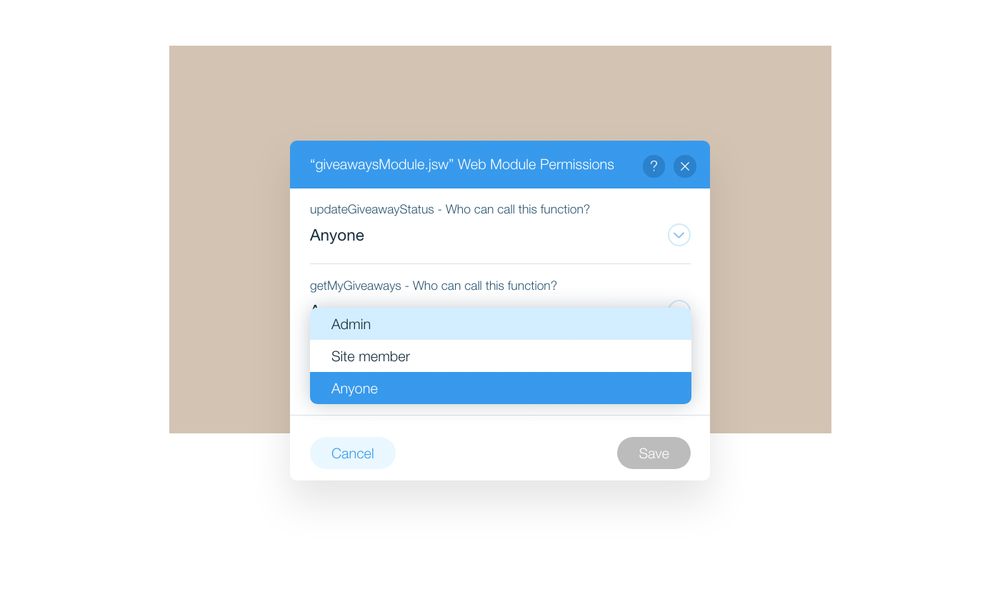

# Writing Backend Code

Once upon a time, you had to jump through a whole bunch of hoops just to call backend code from the frontend. Not with Velo! Now, you can easily and securely call backend functions from your frontend code using web modules.

There are lots of reasons you might want to use a backend web module. Some of these are:

-   To keep sensitive code private on the server.
-   To use Velo APIs that are only available on the backend.
-   To boost performance by minimizing the amount of data you send to the frontend.
-   To avoid [CORS](https://developer.mozilla.org/en-US/docs/Web/HTTP/CORS) complications when using the Fetch API.

> **Other uses for backend code**
>
> Besides web modules, you can also write code in the backend that is not accessible from the frontend.
>
> Some of these will be discussed later, such as:
>
> -   Code that will run as a [scheduled job](./schedule-jobs.md).
> -   Code that you [expose as an API](./expose-an-api.md) for other services to consume.
>
> Other uses of backend code that are not discussed here include:
>
> -   Creating a [router](https://support.wix.com/en/article/velo-about-routers) to take complete control when handling incoming requests to your site.
> -   Adding [data hooks](https://support.wix.com/en/article/velo-about-data-hooks) to intercept interactions with your site's database collections immediately before or after they happen.
> -   Adding [backend event handlers](https://support.wix.com/en/article/velo-backend-events) to handle events from your site's apps.

## Creating a Web Module

Web modules are backend modules containing functions that you want to be able to call from the frontend. To create a web module, just create a new backend file with the **.jsw** extension. On the backend, code in files with the **.js** extension can only be called from other backend files. The **.jsw** extension is what makes a file a web module, allowing its functions to be called from the frontend.

Any function that you export from a web module can then be imported and called from the frontend. It's as simple as that.

For example, let's say you add a backend file named **myModule.jsw**. A simple function for pulling some data from a database collection would then look like this:

```javascript
// In myModule.jsw
import wixData from 'wix-data';

export async function getTeamNames() {
    let{items} = await wixData.query('Team').find();

    return items.map(item => {
        return {
            id: item._id, 
            name: item.name, 
        }
    });
}
```

## Calling Functions From Web Modules

The first thing you need to do if you want to use a web module function on the frontend is to import the function. You import a function using its name and the path of the module you are importing it from.

```javascript
// In some page code

import {getTeamNames} from 'backend/myModule';
```

Obviously, calling a web module backend function from the frontend is a remote call over the network. Because the call is remote, it happens asynchronously. That means, all calls to backend functions from the frontend return a Promise.

Even if your backend function doesn't explicitly return a Promise, a Promise will be returned anyhow. If your backend function returns a value that is not a Promise, that return value is wrapped in a Promise. If your backend function doesn't return anything, a Promise is still returned when it's called from the frontend.

So, when you call a function from a web module on the frontend you need to remember to treat it as an asynchronous function.

For example, let's say you want to call the `getTeamNames()` function we wrote above. Your function call will look something like this:

```javascript
getTeamNames()
    .then( (names) => {
        $w('#namesRepeater').data = names;
    } );
```

Notice how the `getTeamNames()` function is called using a `then()` to handle the returned Promise.

## Testing Functions in Web Modules

You can easily test your web module functions right from the code panel. Click the green arrow to the left of the function header to open the testing environment. Read more about testing backend functions in the [Testing and Debugging](./testing-and-debugging.md) lesson.

## Security & Permissions

The code in your backend web modules is not visible to users. However, any code that can be called from the frontend can be called by anyone. So, even though malicious visitors can't see what exported backend functions do, they can still call them with any arguments they want, and examine their return values.

With that in mind, you need to be careful when you export a backend function that performs potentially harmful operations or returns sensitive information. In such cases, the backend function should contain some sort of validation mechanism that prevents malicious visitors from causing damage to your site and its data. 

Backend web modules also have permissions built right into them. You can set specific permissions on a per function basis.

By default, functions can be called from the frontend by anyone, but you can restrict them to only logged-in site members or just the site admin.



> **Learn more**
>
> Want to read more about backend web modules? See Web Modules: Calling Server-Side Code from the Front-End in the Help Center.