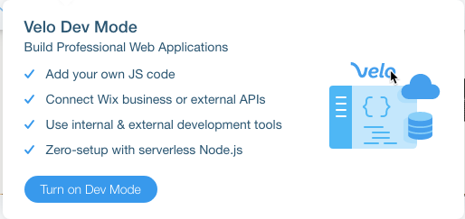

# Getting Started with Velo by Wix

Velo by Wix is an innovative product that lets you build robust web applications with zero setup. Work in Wix's Editor, add custom functionality and interactions using Velo APIs, and enjoy serverless coding in both the front-end and backend. With Velo, your web app can be up and running in a fraction of the time it would normally take you.

To introduce you to Velo, we created our own version of a "Hello, World!" example: a simple currency converter site that uses the [wix-fetch API](https://www.wix.com/velo/reference/wix-fetch.html) to connect to a 3rd service. Site visitors choose source and target currencies from dropdowns and enter an amount to convert. The results are displayed in a text box.


Follow the steps below to get familiar with the basic structure and syntax of Velo. You can also scroll to the bottom to see the [complete code](#example-code) for this exercise.

## Step 1: Create a New Wix Site

1.  Sign into your Wix account or [sign up for a Wix account](https://users.wix.com/signin?overrideLocale=en&loginDialogContext=signup) if you don’t already have one.
2.   [Open a blank template](https://editor.wix.com/html/editor/web/renderer/new?siteId=cbf36d3a-49d0-41c2-9482-1bb58d5fdda3&metaSiteId=a573279f-ae6f-46d1-8556-7c93ae9b2c84&editorSessionId=799795e9-07c2-4e7e-8a17-33dab829f776) in the Editor.


## Step 2: Enable Velo

Enable Velo in the Wix Editor to let you work with code in your site.




## Step 3: Add Elements to the Page

Add page elements in the Wix Editor: 


1.   On the left side of the Editor, click **Add**.
2.   Add the page elements illustrated below to your site.
    *   When you add each element, set its ID in the [Properties](https://support.wix.com/en/article/velo-working-with-the-properties-panel) panel that appears on the right side of the Code panel. Use the name shown below for each element, minus the hashtag. See the table below for a full list of the elements and where to find them in the Add menu.


|Element|Location in Add Menu|Description|ID|
|-------|--------------------|-----------|--|
|Dropdown|Input|For selecting the source currency|sourceCurrency|
|Dropdown|Input|For selecting the target currency|targetCurrency|
|Text Input|Input|For entering the amount to convert|sourceAmount|
|Text Box|Input|To display the converted amount|targetAmount|
|Button|Button|To trigger the currency conversion when clicked|calculateButton|
  
## Step 4: Add Code

> Note:
>
> All the code for this example is added to a single page on the site. In this section we divided the code into short blocks followed by explanations. To see the complete code for this example without comments, [scroll down](#example-code) to the end of the tutorial. 

To add the code:

1.   Double-click **Home Page Code** at the bottom of the Editor to open the [code panel](https://support.wix.com/en/article/velo-working-in-the-code-panel).
2.   Add the following code to the top of the [Page tab](https://support.wix.com/en/article/velo-working-in-the-code-panel#page-and-site-tabs-1) before the [onReady](https://support.wix.com/en/article/velo-working-in-the-code-panel#making-sure-the-element-has-loaded-before-you-reference-it) function:


```javascript
// The getJSON function in wix-fetch lets you retrieve a
// JSON resource from the network using HTTPS.
import {getJSON} from 'wix-fetch';

// Set the URL of the 3rd-party service.
const url = "https://api.exchangerate.host/convert";

// Define the currency option values and text for the dropdowns.
let currencyOptions = [
  { "value": "USD",  "label": "US Dollars"},
  { "value": "EUR",  "label": "Euros"},
  { "value": "JPY",  "label": "Japanese Yen"},
];
```

3.   Add the code below to the [onReady](https://support.wix.com/en/article/velo-working-in-the-code-panel#making-sure-the-element-has-loaded-before-you-reference-it) function. Code inside the onReady function runs when the page loads.

```javascript
$w.onReady(function () {
  // Set the currency options for the dropdowns.
  populateDropdowns();

  // Set the onClick event handler for calculateButton to calculate the target amount.
  $w('#calculateButton').onClick((event) => {
    calculateCurrency();
  })
});
```

The <code>[$w]($w)</code> function can select elements on a page by ID or by type, allowing us to run functions and define the properties of the elements. Use this syntax to select an element by ID, <code>$w("#myElementId")</code>, and this syntax to select by type, <code>$w("ElementType")</code>.

Here we select the button and define an `onClick` [event handler](https://support.wix.com/en/article/velo-reacting-to-user-actions-using-events#about-events-event-handlers-and-wiring) to calculate the target amount.

4.  Add code to define the functions:

**populateDropdowns( )**


```javascript
// Populate the dropdowns.
function populateDropdowns() {
  //Set the dropdown options.
  $w("Dropdown").options = currencyOptions;
  // Set the first dropdown option as the initial option.
  $w("Dropdown").selectedIndex = 0;
}
```

Here we select all the dropdowns by type. By calling <code>[$w]($w)</code> with the element type "Dropdown", we select all dropdowns on the page.

**calculateCurrency( )**

```javascript
// Calculate the target amount.

function calculateCurrency() {
  // Initial amount 
  let initialAmount = $w("#sourceAmount").value;
  // Original currency
  let sourceSymbol = $w("#sourceCurrency").value;
  // Target currency
  let targetSymbol = $w("#targetCurrency").value;
  // Define the full url.
  let fullUrl = `${url}?from=${sourceSymbol}&to=${targetSymbol}`;

  // Call the wix-fetch API function to retrieve the JSON resource.
  getJSON(fullUrl)
    .then(json => {
      // Set the target amount as the initial amount multiplied by
      // the conversion rate.
      $w("#targetAmount").value = initialAmount * json.info.rate;
    })
}
```

We use [template literals](https://developer.mozilla.org/en-US/docs/Web/JavaScript/Reference/Template_literals) to define the full URL, which includes the source and target currencies.

The wix-fetch API <code>[getJSON](wix-fetch/getjson)</code> function retrieves the JSON resource using the full URL. <code>getJSON</code> returns a [promise](https://support.wix.com/en/article/velo-working-with-promises), which resolves to a JSON object.

We multiply the retrieved rate by the initial amount and assign it to the `targetAmount` text box.

## Step 5: See It in Action

Now it's time to test your site:

1.  Click **Preview** at the top right of the Editor.
2.  Enter an amount in the source currency input.
3.  Select a target currency from the dropdown.
3.  Click the calculate button and see the converted currency result in the target amount text box.
4.  [Publish](https://support.wix.com/en/article/publishing-your-site-6980885) your site to make it live and in production. 

That's it! In just a few minutes, you created a web application in Velo! No setup, no managing server infrastructure, just integrating Velo APIs with the Wix visual builder.

## Next Steps

Now that you've had a taste of Velo, check out what else you can do:

*   Easily call backend code from the frontend using [web modules](https://support.wix.com/en/article/Velo-web-modules-calling-server-side-code-from-the-front-end). 
*   Work with Wix's [Editor](https://support.wix.com/en/article/getting-started-with-the-wix-editor).
*   Add features and customize your site using [Velo APIs](https://www.wix.com/velo/reference/). Here are some examples of what you can do:
    *   [Collect](https://support.wix.com/en/article/velo-tutorial-using-the-velo-pay-api-to-collect-payments-for-a-single-product) payments.
    *   [Create](https://support.wix.com/en/article/velo-tutorial-expand-text-with-a-read-more-link) a Read More link.
    *   [Use](https://www.wix.com/velo/example/create-a-custom-chart) an HTML component to embed a chart on your page.
    *   Work with the data from [other Wix Apps](https://support.wix.com/en/article/working-with-wix-app-collections-6077060) like [Stores](https://support.wix.com/en/velo-by-wix/wix-stores-with-velo), [Bookings](https://support.wix.com/en/velo-by-wix/wix-bookings-with-velo), and [Events](https://support.wix.com/en/velo-by-wix/wix-events-with-velo).
*   Visit the [Velo by Wix website](https://www.wix.com/velo) to onboard and continue learning. Check out Velo's [documentation](https://support.wix.com/en/velo-by-wix/basics) and the [API Reference](https://www.wix.com/velo/reference).

## Example Code

Here is the complete code for this example, without comments:

```javascript
import { getJSON } from 'wix-fetch';

const url = "https://api.exchangerate.host/convert";

let currencyOptions = [
  { "value": "USD", "label": "US Dollars" },
  { "value": "EUR", "label": "Euros" },
  { "value": "JPY", "label": "Japanese Yen" },
];

$w.onReady(function () {
  populateDropdowns();

  $w('#calculateButton').onClick((event) => {
    calculateCurrency();
  })
});

function populateDropdowns() {
  $w('Dropdown').options = currencyOptions;
  $w('Dropdown').selectedIndex = 0;
}

function calculateCurrency() {
  let initialAmount = $w("#sourceAmount").value;
  let sourceSymbol = $w("#sourceCurrency").value;
  let targetSymbol = $w("#targetCurrency").value;
  let fullUrl = `${url}?from=${sourceSymbol}&to=${targetSymbol}`;

  getJSON(fullUrl)
    .then(json => {
      $w("#targetAmount").value = initialAmount * json.info.rate;
    })
}
```
