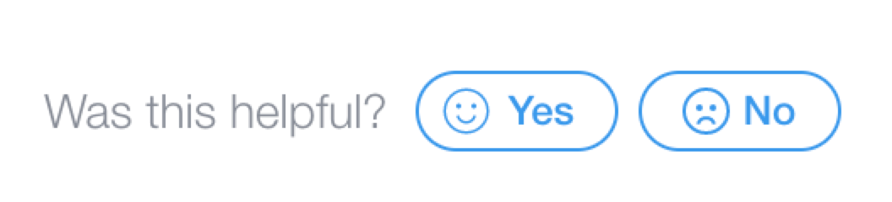

# Release Notes

We're always adding and updating the Velo APIs, and we want you to have one place to find all of our latest changes and cool additions.

We love hearing your feedback! You can help us improve the docs by reporting any issues that you notice. You can report bugs and other feedback through the following link found at the bottom of each section.

---

### New API: Lottie

`Wix Editor Elements ($w)`

With the new [Lottie API]($w/lottie), you can now [add a Lottie element to your site](https://support.wix.com/en/article/wix-editor-importing-lottie-animations-to-your-site) and customize it. You can [`play()`]($w/lottie/play), [`pause()`]($w/lottie/pause), and [`stop()`]($w/lottie/stop) your animation. You can also set the [`speed`]($w/lottie/speed) of your Lottie animation and whether it plays in a loop.
(June 22, 2022)

### New API: Check whether a member is logged in

`wix-members`

You can now check whether the current site visitor is a logged-in member
by calling the new wix-members
[`loggedIn()`](wix-members/authentication/loggedin) function.
This allows you to quickly confirm a member is logged in
before calling another function that requires a logged-in member.
(June 21, 2022)

### New API: Refine search fields

`wix-search`

You can now use the [`searchFields()`](https://www.wix.com/velo/reference/wix-search/wixsearchbuilder/searchfields) function to refine a `WixSearchBuilder` to search only in specified collection fields. (May 30, 2022)

### New API: Retrieve package configuration data

`wix-configs-backend`

When building a [Velo package](https://support.wix.com/en/article/creating-a-velo-package-3964385) in Wix Blocks, you can use the [`getPackageConfig()`](https://www.wix.com/velo/reference/wix-configs-backend/getpackageconfig) function in your backend code to retrieve data from the package's `config.json` file. (April 14, 2022)

### New API: Date Picker onViewChange() 

`Wix Editor Elements ($w)`

You can now use the [`onViewChange()`](https://www.wix.com/velo/reference/$w/datepicker/onviewchange) function to add an event handler that triggers when the date picker's view changes. (April 10, 2022)

### New API: sendSetPasswordEmail() from the frontend

`wix-members`

You can now use the [`sendSetPasswordEmail()`](https://www.wix.com/velo/reference/wix-members/authentication/sendsetpasswordemail) function from the frontend code to send a site member an email with a link to set, or reset, their password. (April 1, 2022)

### New API: Button Icon

`Wix Editor Elements ($w)`

You can now [set/get](https://www.wix.com/velo/reference/$w/button/icon), [expand](https://www.wix.com/velo/reference/$w/button/expandicon), and [collapse](https://www.wix.com/velo/reference/$w/button/collapseicon) a button's icon in your code. The [`iconCollapsed`](https://www.wix.com/velo/reference/$w/button/iconcollapsed) property allows you to check if an icon is currently collapsed. (March 29, 2022)

### New Feature: Show/Hide number spinner on textInput elements

`Wix Editor Elements ($w)`

You can now show and hide the number spinner on a textInput element when the element is for numeric input.  

A new [numberSpinnerHidden](https://www.wix.com/velo/reference/$w/textinput/numberspinnerhidden) property has been added.  
2 new functions have been added:
+ [hideNumberSpinner()](https://www.wix.com/velo/reference/$w/textinput/hidenumberspinner)
+ [showNumberSpinner()](https://www.wix.com/velo/reference/$w/textinput/shownumberspinner)  

(March 23, 2022)

### New Event: Contact Merged

`wix-crm-backend`

You can now handle events when one or more source contacts are
[merged](wix-crm-backend/events/oncontactmerged) into a target contact.

A new `originatedFrom` property has also been introduced to the existing
[`onContactUpdated()`](wix-crm-backend/events/oncontactupdated) and
[`onContactDeleted()`](wix-crm-backend/events/oncontactdeleted) events.
When an update or delete event is triggered by a merge,
`metadata.originatedFrom` is sent as `"merge"`,
allowing you to ignore redundant events.
(February 3, 2022)

### New API: Delete files and folder from Media Manager

`wix-media-backend`

You can now use the Media Manager API to move [files](https://www.wix.com/velo/reference/wix-media-backend/mediamanager-obj/movefilestotrash) and [folders](https://www.wix.com/velo/reference/wix-media-backend/mediamanager-obj/movefolderstotrash) to the Media Manager's trash bin. (January 12, 2022)

<!-- ### New API: Pricing Plan Orders

`wix-pricing-plans`, `wix-pricing-plans-backend`

We added new APIs for order management of pricing plans. The additions include order management functions both on the [frontend](https://www.wix.com/velo/reference/wix-pricing-plans) and the [backend](https://www.wix.com/velo/reference/wix-pricing-plans-backend), and more [backend events](https://www.wix.com/velo/reference/wix-pricing-plans-backend/events).

The newly supported activities include:
* Creating and updating both [online](https://www.wix.com/velo/reference/wix-pricing-plans-backend/checkout/createonlineorder) and [offline](https://www.wix.com/velo/reference/wix-pricing-plans-backend/checkout/createofflineorder) orders
* [Purchasing orders](https://www.wix.com/velo/reference/wix-pricing-plans/checkout/startonlinepurchase)
* [Canceling orders](https://www.wix.com/velo/reference/wix-pricing-plans-backend/orders/cancelorder)
* [Getting](https://www.wix.com/velo/reference/wix-pricing-plans-backend/orders/getorder) and [listing](https://www.wix.com/velo/reference/wix-pricing-plans-backend/orders/listorders) orders
* [Postponing](https://www.wix.com/velo/reference/wix-pricing-plans-backend/orders/postponeenddate), [pausing](https://www.wix.com/velo/reference/wix-pricing-plans-backend/orders/pauseorder), and [resuming](https://www.wix.com/velo/reference/wix-pricing-plans-backend/orders/resumeorder) orders
* [Marking offline orders as paid](https://www.wix.com/velo/reference/wix-pricing-plans-backend/orders/markaspaid)

Please note the deprecation and migration instructions we added to the [Paid Plans](https://www.wix.com/velo/reference/wix-paid-plans) documentation. (January 12, 2022) -->

### New API: Date Picker API improvements

`Wix Editor Elements ($w)`

You can now use the Date Picker API to set date ranges. Use the [enabledDateRanges](https://www.wix.com/velo/reference/$w/datepicker/enableddateranges) property to set which dates a user can select. Use the [disabledDateRanges](https://www.wix.com/velo/reference/$w/datepicker/disableddateranges) property to set which dates users can't select. (January 12, 2022)

### New API: Set enabledTimes for Time Picker

`Wix Editor Elements ($w)`

You can now set the enabled times for a time slot using the [enabledTimes](wix.com/velo/reference/$w/timepicker/enabledtimes) property of the Time Picker API. (December 29, 2021)

### Update: Using forEachItem() with repeater data from a dataset

`Wix Editor Elements ($w)`

We noted that when using [`forEachItem()`](https://www.wix.com/velo/reference/$w/repeater/foreachitem) with repeater data populated by a dataset, you should call it within the dataset's `onReady()` function. (December 28, 2021)

### Update: Upload Button file types

`Wix Editor Elements ($w)`

The reference now lists the [file types](https://www.wix.com/velo/reference/$w/uploadbutton/filetype) supported by the Upload Button element. (December 20, 2021)

### New API: Generate download URLs with the Media Manager

`wix-media-backend`

The Media Manager API now includes 2 new backend functions, [downloadFiles](https://www.wix.com/velo/reference/wix-media-backend/mediamanager-obj/downloadfiles) and [downloadFolder](https://www.wix.com/velo/reference/wix-media-backend/mediamanager-obj/downloadfolder), that generate URLs for downloading Wix media. (December 20, 2021)

### Update: formFactor doesn't return Editor X breakpoint values

`wix-window`

The [`formFactor`](https://www.wix.com/velo/reference/wix-window/formfactor) property only returns the type of a site visitor's device. This doesn't correspond to the site's [Editor X breakpoint values](https://support.wix.com/en/article/editor-x-managing-breakpoints). (December 14, 2021)

### New API: Access the site from the frontend

`wix-site`

You can access a site's name in frontend code using the new [`getSiteDisplayName()`](https://www.wix.com/velo/reference/wix-site/getsitedisplayname) function. (December 9, 2021)

### New API: Direct navigation to the cart page

`wix-stores`

The [`navigate.toCart()`](https://www.wix.com/velo/reference/wix-stores/navigate/tocart) function directs a site visitor's browser directly to their cart page without needing to supply a URL path. (December 7, 2021)

### New API: Wix Groups

`wix-groups-backend`

Use the new [Groups API](https://www.wix.com/velo/reference/wix-groups-backend) to create and manage groups on your site. Here are some things you can do:
  * Create a group
  * Join a group
  * Add members to a group
  * Assign an admin role to a group member

(December 7, 2021)

### New API: Open Quick View with code

`wix-stores`

Use the [`product.openQuickView()`](https://www.wix.com/velo/reference/wix-stores/product/openquickview) function to open a product's Quick View modal from directly within your code. (November 30, 2021)

### Update: Wix Storage items accept numbers

`wix-storage`

The `value` parameter of the [`setItem()`](https://www.wix.com/velo/reference/wix-storage/storage/setitem) function accepts numbers as well as strings. (November 15, 2021)

### New API: Wix Members and Wix Members Backend

`wix-members` , `wix-members-backend`

The `wix-users` and `wix-users-backend` APIs have been deprecated. Most of their functionality has moved to the new [`wix-members`](https://www.wix.com/velo/reference/wix-members) and [`wix-members-backend`](https://www.wix.com/velo/reference/wix-members-backend) APIs. The `emailContact()` and `emailUser()` (now `emailMember()`) functions have moved to the respective `TriggeredEmails` APIs of [`wix-crm`](https://www.wix.com/velo/reference/wix-crm/triggeredemails-obj) and [`wix-crm-backend`](https://www.wix.com/velo/reference/wix-crm-backend/triggeredemails-obj). Functions that handle consent policy have moved to the [`ConsentPolicy`](https://www.wix.com/velo/reference/wix-window/consentpolicy) API in `wix-window`. 
Finally, `wix-members` and `wix-members-backend` have several new functions: 
* [`changeLoginEmail()`](https://www.wix.com/velo/reference/wix-members-backend/authentication-obj/changeloginemail) changes a site member's login email address. 
* [`sendSetPasswordEmail()`](https://www.wix.com/velo/reference/wix-members-backend/authentication-obj/sendsetpasswordemail) sends a site member an email with a link to set their password. 
* [`makeProfilePrivate()`](https://www.wix.com/velo/reference/wix-members/currentmember-obj/makeprofileprivate) removes a logged-in member from the site community and sets their profile to private.
* [`makeProfilePublic()`](https://www.wix.com/velo/reference/wix-members/currentmember-obj/makeprofilepublic) adds a logged-in member to the site community and sets their profile to public.
* [`onLogout()`](https://www.wix.com/velo/reference/wix-members/authentication-obj/onlogout) sets the function that runs when a member logs out.

(November 2, 2021)

### New API: Optional override parameter for onCustomValidation()

`Wix Editor Elements ($w)`

The [`onCustomValidation()`](https://www.wix.com/velo/reference/$w/validatablemixin/oncustomvalidation) function now has an `override` parameter which allows you write a series of custom element validations and set which ones will run. (October 28, 2021)

### Updated: Maximum size for collection items

`wix-data`

The maximum size for collection items when running [`insert()`](https://www.wix.com/velo/reference/wix-data/insert) or [`update()`](https://www.wix.com/velo/reference/wix-data/update) is 500 KB, not 200 KB. (October 17, 2021)

### Updated: getUser() may return undefined for memberName

`wix-users-backend`

When a user is registered with an email address but no name the object returned by [`getUser()`](https://www.wix.com/velo/reference/wix-users-backend/getuser) has a value of `undefined` for `memberName`. (October 13, 2021)

### New API: Product brand field

`wix-stores-backend`

The `Product` object in [`wix-stores-backend`](https://www.wix.com/velo/reference/wix-stores-backend) now accepts a value for `brand`. Including a brand name can help improve a site's (and product's) visibility in search results. (October 12, 2021)

### Updated: Dataset functions save draft data
`wix-dataset`

When using a read-write dataset, calling the following functions saves any changes made to linked input elements: [`setFilter()`](https://www.wix.com/velo/reference/wix-dataset/dataset/setfilter), [`setSort()`](https://www.wix.com/velo/reference/wix-dataset/dataset/setsort), [`nextPage()`](https://www.wix.com/velo/reference/wix-dataset/dataset/nextpage), [`previousPage()`](https://www.wix.com/velo/reference/wix-dataset/dataset/previouspage), [`loadPage()`](https://www.wix.com/velo/reference/wix-dataset/dataset/loadpage), [`setPageSize()`](https://www.wix.com/velo/reference/wix-dataset/dataset/setpagesize), [`setCurrentItemIndex()`](https://www.wix.com/velo/reference/wix-dataset/dataset/setcurrentitemindex), [`next()`](https://www.wix.com/velo/reference/wix-dataset/dataset/next), [`previous()`](https://www.wix.com/velo/reference/wix-dataset/dataset/previous), [`save()`](https://www.wix.com/velo/reference/wix-dataset/dataset/save) (October 6, 2021)

### Updated: Premium account required to use checkoutBooking()

`wix-bookings`

You need a premium account to [checkout bookings](https://www.wix.com/velo/reference/wix-bookings/checkoutbooking) of any type. (October 5, 2021)

### Updated: Using scrollTo() with header elements

`Wix Editor Elements ($w)`

You can only use [`scrollTo()`](https://www.wix.com/velo/reference/$w/header/scrollto) with Header Elements when the [Header Scroll Setting](https://support.wix.com/en/article/wix-editor-changing-the-header-scroll-settings) is set to **Scrolls with site**. To scroll to the header with other settings, use the `wix-window` [`scrollTo()`](https://www.wix.com/velo/reference/wix-window/scrollto) function. (October 5, 2021)

### Updated: Realtime channel naming requirements

`wix-realtime-backend`

Channel names in [Wix Realtime](https://www.wix.com/velo/reference/wix-realtime-backend/introduction) cannot include spaces or special characters. (October 5, 2021)

### Updated: Security best practices for createSecret(), updateSecret(), and listSecretInfo()

`wix-secrets-backend`

Make sure not to leave information about secrets in your code when running [`createSecret()`](https://www.wix.com/velo/reference/wix-secrets-backend/createsecret) or [`updateSecret()`](https://www.wix.com/velo/reference/wix-secrets-backend/updatesecret)! Do not expose functions that call [`listSecretInfo()`](https://www.wix.com/velo/reference/wix-secrets-backend/listsecretinfo) to frontend code without setting permissions to **Admin**! See the reference for more details. (October 3, 2021)

### Updated: WixHttpFunctionRequestBody is available as binary

`wix-http-functions`

The [`WixHttpFunctionRequestBody.buffer()`](https://www.wix.com/velo/reference/wix-http-functions/wixhttpfunctionrequest-obj/wixhttpfunctionrequestbody/buffer) function returns the body of the http request in binary as a Node.js Buffer object. (September 14, 2021)

### Updated: Wix Realtime functions support both synchronous and asynchronous calls

`wix-realtime-backend`

You can call the `WixRealtimeBackend` functions [`publish()`](https://www.wix.com/velo/reference/wix-realtime-backend/publish) and [`realtime_check_permission()`](https://www.wix.com/velo/reference/wix-realtime-backend/realtime_check_permission) as well the `PermissionsRouter` functions [`add()`](https://www.wix.com/velo/reference/wix-realtime-backend/permissionsrouter-obj/add) and [`check()`](https://www.wix.com/velo/reference/wix-realtime-backend/permissionsrouter-obj/check) either synchronously or asynchronously. (August 17, 2021)

### Updated: Coupon limits unsupported in Wix Bookings

`wix-marketing-backend`

You can't set the `limitPerCustomer` parameter when using coupons in Wix Bookings. (August 11, 2021)

### Updated: Working with promptLogin() and promptForgotPassword()

`wix-users`

Resolve promises returned when calling the [`promptLogin()`](https://www.wix.com/velo/reference/wix-users/promptlogin) and [`promptForgotPassword()`](https://www.wix.com/velo/reference/wix-users/promptforgotpassword) functions within the `onReady()` block using `.then()` and `.catch()`. If you `await` or `return` the results, the page will not load. (August 11, 2021)

### Updated: SuppressAuth for WixDataAggregate

`wix-data`

[`WixData.aggregate.run()`](https://www.wix.com/velo/reference/wix-data/wixdataaggregate/run) supports supressAuth functionality. (August 10, 2021)

### Updated: VideoBox src property is read & write

`$w.VideoBox`

You can both get and set the VideoBox [`src`](https://www.wix.com/velo/reference/$w/videobox/src) property. (August 10, 2021)

### New API: Wix Events Backend

`wix-events-backend`

The new [Wix Events Backend API](https://www.wix.com/velo/reference/wix-events-backend/wixevents) provides functionality for creating, updating, deleting, canceling, and querying Wix events. For example, you can create RSVP and ticketed events whose locations and/or dates are "To Be Announced" (TBA), you can customize registration messages, and you can configure settings for online conferencing. (July 20, 2021)

### Updated: Dataset new() function replaced by add() function

`wix-dataset`

The Dataset and Dynamic Dataset [`new()`](https://www.wix.com/velo/reference/wix-dataset/dataset/new) functions were replaced by the [`add()`](https://www.wix.com/velo/reference/wix-dataset/dataset/add) function. We replaced the function to avoid confusion with the JavaScript [new](https://developer.mozilla.org/en-US/docs/Web/JavaScript/Reference/Operators/new) operator. Functionality of the `add()` and `new()` functions is identical.  (July 20, 2021)

### New API: Media Manager list files & folders

`wix-media-backend`

The [`listFiles()`](https://www.wix.com/velo/reference/wix-media-backend/mediamanager-obj/listfiles), [`listFolders()`](https://www.wix.com/velo/reference/wix-media-backend/mediamanager-obj/listfolders), and [`getFolderInfo()`](https://www.wix.com/velo/reference/wix-media-backend/mediamanager-obj/getfolderinfo) functions allow you to get information about specific files and folders in the Media Manager. (July 6, 2021)

### Updated: seoMarkup property is read & write

`$w.CustomElement`

You can both get and set the Custom Element [`seoMarkup`](https://www.wix.com/velo/reference/$w/customelement/seomarkup) property. (July 6, 2021)

### Updated: Use application/json for HTTP function response content-type in free sites

`wix-http-functions`

`text/html` is not supported for the `content-type` header in an [HTTP function response](https://www.wix.com/velo/reference/wix-http-functions/wixhttpfunctionresponse/headers). Use `application/json` instead. Premium sites support all content types. (July 6, 2021)

### Updated: listPlans() and listPublicPlans() return an array of objects

`wix-pricing-plans-backend`

The [`listPlans()`](https://www.wix.com/velo/reference/wix-pricing-plans-backend/listplans) and [`listPublicPlans()`](https://www.wix.com/velo/reference/wix-pricing-plans-backend/listpublicplans) functions return an array of objects. (July 6, 2021)

### Updated: Wix Location to() has a new option

`wix-location`

The [`disableScrollToTop`](https://www.wix.com/velo/reference/wix-location/to) option lets you decide if the page scrolls to the top when navigating to another Wix page. When true, the page remains at the same Y-axis position as the previously viewed page. (July 5, 2021)

### Added Velo Package Readmes

By popular requests we've added the [readme files](https://www.wix.com/velo/reference/velo-package-readmes/about-velo-packages) for [Velo Packages](https://support.wix.com/en/article/velo-about-packages) to the API Reference. This will allow you to keep the readme file open side by side with your code file.

### Updated: Clarified path and prefix

`wix-location`

We updated the [path](https://www.wix.com/corvid/reference/wix-location/path) graphics to show the correct path and included a statement that prefix is for dynamic pages only. (June 14, 2021)

### New API: Multi-file upload

`Wix Editor Elements ($w)`

You can now upload multiple image, video, and gallery (images and video) files at a time. This [function](https://www.wix.com/velo/reference/$w/uploadbutton/uploadfiles) replaces the now deprecated startUpload function. (June 14, 2021)

### Updated: Stores: Add "ribbon" field to product entity

`wix-stores-backend`

On the Product entity, the `ribbons` field, which took an array and was read-only, has been deprecated. The new field [`ribbon`](https://www.wix.com/velo/reference/wix-stores-backend/createproduct), which takes a string and is writable upon product creation, replaces it. (June 13, 2021)

### Updated: Fixed Bookings hasNext example

`wix-bookings`

We fixed the import statement in the examples. (June 10, 2021)

### Update: onBeforeSave returns a promise

`wix-data`

We fixed the description of [`onBeforeSave`](https://www.wix.com/velo/reference/wix-dataset/dataset/onbeforesave) to say it returns a promise that resolves to a boolean not a boolean. (June 6, 2021)

### New API: Manage Bookings resources and sessions

`wix-bookings-backend`

The bookings backend API now includes functionality to add, delete, manage, and query [resources](https://www.wix.com/velo/reference/wix-bookings-backend/resources) and [sessions](https://www.wix.com/velo/reference/wix-bookings-backend/sessions). (May 10, 2021)

### New APIs: Stores showMinicart and hideMinicart

`wix-stores`

With the new [`cart.showMiniCart()`](https://www.wix.com/velo/reference/wix-stores/cart/hideminicart) and [`cart.hideMiniCart()`](https://www.wix.com/velo/reference/wix-stores/cart/hideminicart) APIs you can easily show and hide the Mini Cart from appearing on the page. (May 10, 2021)

### New API: Stores updateLineItemQuantity

`wix-stores`
With the new [`cart.updateLineItemQuantity()`](https://www.wix.com/velo/reference/wix-stores/cart/updatelineitemquantity) function you can set the quantity of a certain line item of the store cart. (May 10, 2021)

### New API: Stores addProducts

`wix-stores`

With the new [`cart.addProducts()`](https://www.wix.com/velo/reference/wix-stores/cart/addproducts) function you can add one or more products to the store cart by passing the productId, the desired quantity, and if necessary, any specific product options. (May 10, 2021)

### Update: Stores: Migrate to wix-stores.cart/product

`wix-stores`

As part of a redesign of the Wix-Stores API, several new functions have been added and existing functions have been migrated to either the Cart or Product modules.

The API ref has been updated with migration instructions for users using the old functions.

Several new functions have been added as well: cart.addProducts(), cart.apply/removeCoupon(), cart.showMiniCart, cart.hideMiniCart(), and cart.updateLineItemQuantity().

Learn more:

* [https://www.wix.com/velo/reference/wix-stores/cart/introduction](https://www.wix.com/velo/reference/wix-stores/cart/introduction)

* [https://www.wix.com/velo/reference/wix-stores/product/introduction](https://www.wix.com/velo/reference/wix-stores/product/introduction)

(May 10, 2021)

### New API: Stores apply & remove coupon

`wix-stores`

With the new [`cart.applyCoupon()`](https://www.wix.com/velo/reference/wix-stores/cart/applycoupon) and [`cart.removeCoupon()`](https://www.wix.com/velo/reference/wix-stores/cart/applycoupon) functions you can add a coupon to the store cart by passing the coupon code, or remove a previously applied coupon. (May 10, 2021)

### Updated: Removed tip to use onInput with richTextBox

`Wix Editor Elements ($w)`

onInput is not supported for richTextBox. We removed a [tip](https://www.wix.com/velo/reference/$w/richtextbox/onkeypress) to use onInput to get the value of the latest keyboard event for a richTextBox. (May 5, 2021)

### Updated: Effect options for show and hide are optional

`Wix Editor Elements ($w)`

We updated the [show and hide functions](https://www.wix.com/velo/reference/$w/hiddenmixin) to indicate that the effectOptions are optional. (May 5, 2021)

### Updated: afterUpdate supports the currentItem property

`wix-data`

We added back information that the [`afterUpdate`](https://www.wix.com/velo/reference/wix-data/hooks/afterupdate) hook supports the currentItem property in the updateHookContext parameter. (May 5, 2021)

### Updated: isReferenced supports the wixDataOptions parameter

`wix-data`

We added information that [`isReferenced`](https://www.wix.com/velo/reference/wix-data/isreferenced) supports the wixDataOptions parameter, which enables suppressAuth and suppressHooks. (May 5, 2021)

### Updated: queryReferenced options parameter is listed as optional

`wix-data`

The options parameter of [`queryReferenced()`](https://www.wix.com/velo/reference/wix-data/queryreferenced) was mistakenly listed as required. We fixed it to be optional. (May 5, 2021)

### Updated: New env property added to WixRouterRequest object

`wix-router`

We added a new [`env`](https://www.wix.com/velo/reference/wix-router/wixrouterrequest/env) property to WixRouterRequest.

When possible, the rendering process is split in two, to improve performance. The first cycle in the process is initiated from backend rendering, and the second cycle is initiated from client-side rendering. You can use the env property to check whether the current rendering cycle is occurring on the backend or the client side. (May 5, 2021)

### Updated: Size property of File object for UploadButton is Number

`Wix Editor Elements ($w)`

We changed the type of the size property of the object that is returned by the [`value`](https://www.wix.com/velo/reference/w/uploadbutton/value) property from string to number. (May 5, 2021)

### Updated: Pricing Plans setPlanVisibility returns a complete pricing plan

`wix-pricing-plans-backend`

The [`setPlanVisibility`](https://www.wix.com/velo/reference/wix-pricing-plans-backend/setplanvisibility) function now returns a complete pricing plan object when its visibility is set. (May 5, 2021)

### New API: warmupData

`wix-window`

With the new [`warmupData`](https://www.wix.com/velo/reference/wix-window/warmupdata-obj) API, you can optimize data loading for sites that render both in the backend code and in the client-side code, allowing costly data fetching operations to be done only once. (April 13, 2021)

### Updated: insertReference() only works with multi-reference fields

`wix-data`

We added a note that [`insertReference()`](https://www.wix.com/velo/reference/wix-data/insertreference) only works with multi-reference fields. (April 13, 2021)

### Update: 512 KB limit for http functions

`wix-http-functions`

We added note that [http function requests](https://www.wix.com/velo/reference/wix-http-functions/wixhttpfunctionrequest-obj/body) have a request payload limit of 512 KB. (April 12, 2021)

### New API: Login as a popup option

`wix-users`

With the new [modal option](https://www.wix.com/velo/reference/wix-users/promptlogin) for the wix-users [`promptLogin()`](https://www.wix.com/velo/reference/wix-users/promptlogin) function, you can let visitors log in using a modal popup. (April 12, 2021)

### New API: CRM Contacts

`wix-crm-backend`

We released new [CRM Contacts APIs](https://www.wix.com/velo/reference/wix-crm-backend) allowing you to:

- Create, update, get, query, and delete contacts
- Label/unlabel contacts
- Manage labels
- Manage custom fields

This replaces most of the existing Contacts functions, and those functions have been updated with migration instructions. Existing functions are supported so you don't need to migrate immediately. (April 12,2021)

### Updated: Added the suppressAuth option to createInvoicePreviewUrl()

`wix-billing-backend`

We added suppressAuth options to [`createInvoicePreviewUrl()`](https://www.wix.com/velo/reference/wix-billing-backend/invoices-obj/createinvoicepreviewurl) to allow customers to generate the invoice preview link. (April 12, 2021)

### Updated: Added note that setFilter() on a read-write dataset saves changes in the input field

`wix-dataset`

When you call [`setFilter()`](https://www.wix.com/velo/reference/wix-dataset/dataset/setfilter) on a dataset with a connected input field, any changes made in the input field are also saved. (April 11, 2021)

### Update: Remove read-only fields from updateUserFields parameters

`wix-users-backend`

We removed the read-only fields from the list of parameters for [`updateUserFields()`](https://www.wix.com/velo/reference/wix-users-backend/updateuserfields). (April 11, 2021)

### New Wix Stores Variants Collection in the Content Manager and Velo Databases

`wix-stores`

Alongside Orders, Products, and other Stores collections, Variants are now available for access and query using Velo and the Content Manager.

Variants are combinations of product options, and until now they were only accessible per product. The new Variants collection includes all of a store's variants.

Learn more about the new [Wix Stores Variants Collection](https://support.wix.com/en/article/velo-wix-stores-variants-collection-fields). (April 1, 2021)

### Updated: Added updatedItemsIds to WixDataBulkResult

We added the `updatedItemIds` property to the `WixDataBulkResult` object,  which is returned by the [`bulkInsert()`](https://www.wix.com/velo/reference/wix-data/bulkinsert), [`bulkSave()`](https://www.wix.com/velo/reference/wix-data/bulksave), and [`bulkUpdate()`](https://www.wix.com/velo/reference/wix-data/bulkupdate) functions. (March 15, 2021)

### Updated: Added information when getItem() returns null

We added information that if an item doesn't exist, [`getItem()`](https://www.wix.com/velo/reference/wix-storage/storage/getitem) returns null. (March 15, 2021)

### New API: onAudioTranscoded

`wix-media-backend`

In addition to video files, audio files that are imported or uploaded to the Media Manager require transcoding, and are not immediately available until the transcoding has completed.

Similar to the onVideoTranscoded() API, the new [`onAudioTranscoded`](https://www.wix.com/velo/reference/wix-media-backend/events/onaudiotranscoded) API event handler runs when an uploaded audio file has finished transcoding. (March 10, 2021)

### New API Reference Feature: Show Members open by default
The table that lists the properties in a returned object used to be closed by default and would require you to click **Show Members** to view it. The expandable is now open by default. You can see an example in the **Returns** table for [`createProduct`](https://www.wix.com/velo/reference/wix-stores-backend/createproduct). (March 7, 2021)

### New Release Notes information 

We will now label the latest updates in the Release Notes with &nbsp; <svg viewBox="0 0 6 6" fill="currentColor" width="6" height="10" data-hook="changelog-pimple" class="_28uM4"><circle cx="3" cy="12" r="3" transform="translate(0 -9)" fill="#EA5F0E" fill-rule="evenodd"></circle></svg> &nbsp; in the heading to make it easier to find the latest changes. (March 7, 2021)

### Remove mention of currentItem from the context of some data hooks

`wix-data`

The `context.currentItem` parameter is only relevant for `beforeUpdate()` and `beforeRemove()` hooks. The property was removed from the documentation for all other hooks. (March 4, 2021)

### New API: Bookings Events

`wix-bookings-backend`

[Backend events](https://www.wix.com/velo/reference/wix-bookings-backend/events) have been added to Wix Bookings.
The events  are fired for the following actions:

* A new booking request is created.
* A booking request is confirmed or declined.
* A booking is canceled.
* A booking  schedule is updated.
* Booking attendance information is updated.

(March 2, 2021)

### Clarified opacity and hidden for timeline

`wix-animations`

* Updated the target parameter type to `Element` from `mixin`.  
* Clarified that only elements that mix in the `hiddenMixin` can be the target.
* Clarified that the unit for opacity is from 0.0 - 1.0.

(March 2, 2021)

### New API: Price per unit data fields added to product object

`wix-stores-backend`

Price Per Unit data fields were added to APIs returning product objects and product variant objects. These APIs mirror the Dashboard feature that allows you to display a product's base and total quantity/weight/area. Complies with requirements in the German market. (February 22, 2021)

### New API: Pricing Plans: Plan management

`wix-pricing-plans-backend`

With the new [pricing-plans-backend](https://www.wix.com/velo/reference/wix-pricing-plans-backend) APIs, you can manage your APIs in ways that before, you could only do from the Dashboard.

Now you can create, update, hide, and archive pricing plans. You can set and clear which pricing plan is the primary plan and rearrange the order in which plans are displayed on the site. And we now supply different ways for you to get information about existing plans, such as getting a single plan, getting statistics for a plan, listing public/all plans, and performing queries. (February 7, 2021)

### New API Reference Feature: Release Notes change indicator

A red dot now appears next to the **Release Notes** section in the left tree when it is updated. More enhancements on the way. (February 3, 2021)

### Updated: getSecret does not require Members Area

`wix-secret-backend`

We removed a note that said you need the Members Area on your site to work with the [`getSecret()`](https://www.wix.com/velo/reference/wix-secrets-backend/getsecret) API. (February 3, 2021)

### Updated: Slot Id parameter fixed

`wix-bookings`

We changed `slot_id` to `slotId` in [`getCheckoutOptions()`](https://www.wix.com/velo/reference/wix-bookings/getcheckoutoptions). (February 3, 2021)

### Updated: getCurrentMemberOrders returns a promise

`wix-paid-plans`

[`getCurrentMemberOrders()`](https://www.wix.com/velo/reference/wix-paid-plans/getcurrentmemberorders) returns a promise that resolves to an array. We previously stated that the function returns an array.  (February 3, 2021)

### Updated: cancelOrder throws an error

`wix-paid-plans`

We clarified that [`cancelOrder`](https://www.wix.com/velo/reference/wix-paid-plans/cancelorder) throws an error when **[Allow Plan Cancellation](https://support.wix.com/en/article/pricing-plans-allowing-clients-to-cancel-plans)** is set to False in the Dashboard. (February 3, 2021)

### Updated: Recommend using getCurrentGeolocation with setTimeout 

`wix-window`

In cases where the site visitor's browser is set to not detect locale, the promise does not resolve or reject. We added a note recommending using [`getCurrentGeoLocation()`](https://www.wix.com/velo/reference/wix-window/getcurrentgeolocation) with `setTimeout` to handle the unresolved Promise. (February 3, 2021)

### Updated: Hooks run when data is imported

`wix-data`

We added a note that the [`beforeInsert`](https://www.wix.com/velo/reference/wix-data/hooks/beforeinsert) and [`afterInsert`](https://www.wix.com/velo/reference/wix-data/hooks/afterinsert) hooks run when data is imported to either Live or Sandbox collections. (February 3, 2021)

### Updated: queryReferenced() only works with multiple-item reference fields

`wix-data`

We added a note that you can only use the [`queryReferenced()`](https://www.wix.com/velo/reference/wix-data/queryreferenced) function with multiple-item reference fields and not with single-item (regular) reference fields. (February 3, 2021)

### Updated: Use the checked property with the Switch element

`Wix Editor Elements ($w)`

The `value` property does not work with the [`Switch`](https://www.wix.com/velo/reference/w/switch) element. We added a note to use the `checked` property instead. We also added an example for using the `checked` property to set the `Switch` state. (February 3, 2021)

### Updated: RichTextBox does not support KeyboardEvent and onInput

`Wix Editor Elements ($w)`

`KeyboardEvent` doesn’t fire and `onInput` is not supported for [`RichTextBox`](https://www.wix.com/velo/reference/w/richtextbox) elements. We removed a reference to the `RichTextBox` element from the `KeyboardEvent` documentation and added a note to `onInput` that it is not supported for `RichTextBox` elements. (February 3, 2021)

### Updated: SelectionTags options property changes

`Wix Editor Elements ($w)`

Setting the [`options`](https://www.wix.com/velo/reference/$w/selectiontags/options) property no longer clears the `value` and `selectedIndices` of the selection tags. This allows users to add and reorder choices without clearing the visitor's selection. Only values that no longer match the new options are cleared.

Setting `value` no longer lets you set values that do not match any of the options. (February 3, 2021)

### Updated: formattedPrice and formattedDiscountedPrice are read-only

`wix-stores-backend`

We removed a reference to `formattedPrice` and `formattedDiscountedPrice` fields for [`updateVariantData()`](https://www.wix.com/velo/reference/wix-stores-backend/updatevariantdata) since they are read-only and can't be set. (February 3, 2021)

### Updated: SSL note in wixWindow.openModal() 

`wix-window`

It is not possible to turn SSL off with Velo. We removed a part of the note that was misleading. (January 20, 2021)

### New API: Coupons events

`wix-marketing-backend`

With the new [Coupon backend events](https://www.wix.com/velo/reference/wix-marketing-backend/events) you can write code that is triggered when a coupon is created, updated, deleted, or applied. (January 19, 2021)

### New API: Added appID to Coupons API

`wix-marketing-backend`

Added the `appID` property to the CouponEvent object. The ID of the app that created the coupon. Empty if created by the site owner. (January 19, 2021)

### Updated: update

erInfo deletes any non-updated properties

`wix-bookings-backend`

Updated an example and added a note that [`updateCustomerInfo`](https://www.wix.com/velo/reference/wix-bookings-backend/bookings/updatecustomerinfo) updates the entire object and that any properties not included in the object passed will be deleted. (January 14, 2021)

### New API: Cancel & Refund events

`wix-stores-backend`

With the new [`onOrderRefunded()`](https://www.wix.com/velo/reference/wix-stores-backend/events/onorderrefunded) & [`onOrderCanceled()`](https://www.wix.com/velo/reference/wix-stores-backend/events/onorderrefunded) backend events you can now write code that is triggered when an order is refunded and/or canceled. (January 14, 2021)

### New API: Bookings backend

`wix-bookings-backend`

Backend APIs are now available to manage Bookings. The [`wix-bookings-backend`](https://www.wix.com/velo/reference/wix-bookings-backend) API provides bookings functionality allowing you to:

- List and query booking information.
- Confirm pending booking requests.
- Decline pending booking requests.
- Cancel a booking.
- Set attendance for booked sessions.
- Mark a booking as paid.
- Update the customer's booking information.

(January 12, 2021)

### New API: Increment inventory

`wix-stores-backend`

With the new Wix Stores [`incrementInventory()`](https://www.wix.com/velo/reference/wix-stores-backend/incrementinventory) API you can increment a product variant's stock in the store's inventory. Pass a variantId and either a productID or an inventoryId, as well as the integer to increment by. (December 31, 2020)

### Updated: Added multiple locations to ServiceAvailability object

`wix-bookings`

The `ServiceAvailability` object returned by [`getServiceAvailability`](https://www.wix.com/velo/reference/wix-bookings/getserviceavailability) now includes a location property. If the service is offered in multiple locations, a slot is returned for each location. (December 30, 2020)

### Updated: Upload button now indicates if a file fails to upload

`Wix Editor Elements ($w)`

The `valid` property of [`UploadButton`](https://www.wix.com/velo/reference/$w/uploadbutton) is set to `false` when a file fails to upload. Previously this was only set if `required == TRUE`. (December 27, 2020)

### Updated: openLightbox requires onReady

`wix-window`

Even though [`openLightbox`](https://www.wix.com/velo/reference/wix-window/openlightbox) is not part of `$w` it can only be called after the `onReady` event has fired. (December 27, 2020)

### Updated: Wix Data is eventually consistent

`wix-data`

The wix-data API is [eventually consistent](https://www.wix.com/velo/reference/wix-data/introduction#wix-data_introduction_wix-data-and-eventual-consistency), meaning that sometimes updates to your database collection are not immediate. There may be a short delay until the system is up-to-date with your recent changes. During the delay, the data you get back may not reflect those changes. (December 27, 2020)

### API Updated: Added seoData field to the Product object

We added the `seoData` field to the Product object. This mirrors the SEO data added in the dashboard and allows for adding custom SEO tags when using [`createProduct()`](https://www.wix.com/velo/reference/wix-stores-backend/createproduct). (December 27, 2020)

### Updated: Editor elements ($w) progressBar.value is a get or set

`Wix Editor Elements ($w)`

We incorrectly stated that you could only “get” the `value` of the [`ProgressBar`](https://www.wix.com/velo/reference/$w/progressbar/value) element. We clarified that you can both “get” and “set” the `value` property. (December 24, 2020)

### Updated: bulkUpdate clarification

`wix-data`

We were a bit vague about how [`bulkUpdate`](https://www.wix.com/velo/reference/wix-data/bulkupdate) works. We now stress in the explanation that `bulkUpdate` replaces all properties of the existing, matching items. When specifying which properties you want to update, the values of any properties that are not specified are lost. (December 24, 2020)

### New API: privacyStatus property for register function in wix-users and wix-users-backend

`wix-users`

`wix-users-backend`

There is a new privacyStatus parameter for the [`register`](https://www.wix.com/velo/reference/wix-users/register) function. Options are `PUBLIC` and `PRIVATE`. (December 24, 2020)

### Updated: Clarified creation of routers.js file

`wix-router`

The [introduction](https://www.wix.com/velo/reference/wix-router/introduction) implied that the user needs to create the `routers.js` file. Actually, when you set up your router, the file is created for you. We clarified that you do not need to manually create the `routers.js` file.

We also reviewed the existing explanations and made some updates, including: 

- How to work with routers, based on changes made in the Editor. 
- How we explain the URL needed for [WixRouterRequest](https://www.wix.com/velo/reference/wix-router/wixrouterrequest/introduction). 
- Adding and fixing links.
- Fixing a typo in an example.

(December 24, 2020)

### New API: wix-users-backend Roles

`wix-users-backend`

We added the [`assignRole()`](https://www.wix.com/velo/reference/wix-users-backend/roles-obj/assignrole) and [`removeRole()`](https://www.wix.com/velo/reference/wix-users-backend/roles-obj/removerole) functions to the new `Roles` API in `wix-users-backend`, allowing you to manage site member access to restricted pages. (December 24, 2020)

### New API: VideoBox

`Wix Editor Elements ($w)`

Velo's APIs are now available to control how videos play in [`VideoBox`](https://www.wix.com/velo/reference/$w/videobox) elements on your site. Video boxes allow you to showcase your videos in beautifully-designed video containers. Unlike VideoPlayer elements, VideoBox elements do not have controls, text descriptions, titles and cannot be displayed in full screen mode. This gives video boxes a clean look.
You can use the APIs to manage video boxes for: 

- Videos uploaded to your site
- Transparent videos uploaded to your site
- Videos/Transparent videos from the  Wix Media library

(December 7, 2020)

### Updated: textInput.maxLength remove max length

`Wix Editor Elements ($w)`

The instructions to remove the [`maximum length`](https://www.wix.com/velo/reference/$w/textinput/maxlength) restriction incorrectly stated to set maxLength to 0. We clarified that you can format the text using the html property. (December 7, 2020)

### Updated: text styles

We listed the supported styles and formats for [`text type elements`](https://www.wix.com/velo/reference/$w/text/introduction) but did not explain how to use them. We clarified that you can format the text using the html property. (December 7, 2020)

### Updated: uploadButton.reset 

`Wix Editor Elements ($w)`

We clarified that the [`reset()`](https://www.wix.com/velo/reference/$w/uploadbutton/reset) function clears the files in the value property. (December 7, 2020)

### Updated: radioButtonGroup options 

`Wix Editor Elements ($w)`

The description incorrectly stated that [`options`](https://www.wix.com/velo/reference/$w/radiobuttongroup/options) is an object. We clarified that options is an array of option objects. (December 7, 2020)

### Updated: getCheckoutOptions slotID

`wix-bookings`

In the [`getCheckoutOptions`](https://www.wix.com/velo/reference/wix-bookings/getcheckoutoptions) parameter table, slot_ID was formatted incorrectly. The correct format is slotID. (December 7, 2020)

### Updated: wixWindow.scrollTo coordinates

`wix-window`

In the [`scrollTo`](https://www.wix.com/velo/reference/wix-window/scrollto) function we didn’t mention how to get the coordinates of a given location. We added how to get the coordinates of a location on the page using the Editor toolbar. (December 7, 2020)

### Updated: wixLocation URL structure

`wix-location`

The layout for describing the different parts of the [`URL`](https://www.wix.com/velo/reference/wix-location/introduction) was a bit confusing. We changed the URL breakdown to match the same layout as the wixHttpFunctionRequest object in the wix-http-functions API for consistency. (December 7, 2020)

### New API: Wix Forum Backend Event APIs

`wix-forum-backend`

With the new [Forum Backend Events](https://www.wix.com/velo/reference/wix-forum-backend) you can react to activity on your forum. You can run custom code when forum categories, posts, and comments are created, updated, deleted, posted, pinned, voted on, liked, reported, and more. For example, you can send a custom email to a poster when their post is liked, display a message when a comment is marked as best, or set up an alert when a post or comment is reported. (November 1, 2020)

### New API: removeProductFromCart

`wix-stores`

With [`removeProductFromCart()`](https://www.wix.com/velo/reference/wix-stores/removeproductfromcart) you can remove a line item/product from the cart. (November 1, 2020)

### New API: onWixFormSubmit() event handler in the WixForms API

`wix-crm`

With the new [`onWixFormSubmit()`](https://www.wix.com/velo/reference/wix-crm/$w-wixforms/onwixformsubmit) event handler in the WixForms API, you can perform validations on your forms immediately after visitors submit the form yet before the server starts any processing. (October 20, 2020)

### Updated: wixLocation.to() does not work in preview

`wix-location`

Added a note that [`wixLocation.to()`](https://www.wix.com/velo/reference/wix-location/to) only works on a published site and not while previewing. (October 13, 2020)

### Updated: htmlComponent can only embed a PDF file with a Premium account

`$w.HtmlComponent`

To embed a PDF in an [HtmlComponent](https://www.wix.com/velo/reference/$w/htmlcomponent/introduction) you must upgrade your site to a Premium Plan. (October 13, 2020)

### New API: Decrement inventory

`wix-stores-backend`

Manually [decrement](https://www.wix.com/velo/reference/wix-stores-backend/decrementinventory) a product variant's stock in inventory. This functionality is helpful for creating an inventory management page on your site. (October 11, 2020)

### Updated: Added Stackdriver information to Site Monitoring introduction

`site-monitoring`

Added [information](https://www.wix.com/velo/reference/spis/site-monitoring/introduction) about connecting Wix site events to Google's Stackdriver external monitoring tool. (September 16, 2020)

### Updated: Changed slider.value from read only to read & write

`$w.slider` 

The [`value`](https://www.wix.com/velo/reference/$w/slider/value) property for the Slider element was described as read only but it should be read and write. (September 15, 2020)

### Updated: Added more information for returned object properties from Validity property

`ValidatableMixin`

Added more content to the table that displays details of the object returned by [`validity`](https://www.wix.com/velo/reference/$w/validatablemixin/validity). (September 15, 2020)

### Updated: Added information that some getProductVariants() parameter fields are optional

`wix-stores`

Added information that some of the parameter fields for [getProductVariants()](https://www.wix.com/velo/reference/wix-stores/getproductvariants) are optional. (September 14, 2020)

### Updated: createProduct() SKU is a string

`stores-backend`

The `sku` property for [createProduct()](https://www.wix.com/velo/reference/wix-stores-backend/createproduct) was described as a number, but it is a string. (September 14, 2020)

### Updated: Added information about getFileURL token expiring

`wix-media-backend`

Added information that the token returned by [`getFileUrl()`](https://www.wix.com/velo/reference/wix-media-backend/mediamanager-obj/getfileurl) expires after 600 minutes. Described the alternative of creating a static URL without a token. (September 10, 2020)

### Updated: The URL table for wixHttpFunctionRequest

`wix-http-functions`

The table that described the URL structure of a [wixHttpFunctionRequest](https://www.wix.com/velo/reference/wix-http-functions/wixhttpfunctionrequest) was difficult to parse. We've updated the content to make it easier to understand. (September 10, 2020)

### New API: On cart changed event

`wix-stores`

With the new [`onCartChanged()`](https://www.wix.com/velo/reference/wix-stores/oncartchanged) client-side event in wix-stores, you can access information about the site's shopping cart every time an item is added or removed. Useful for creating a promotional lightbox - if product X is added to the cart, offer product Y. (September 7, 2020)

### New API: Consent policy (privacy laws)

`wix-users`

To help your site conform to GDPR and CCPA standards, we now provide Velo APIs for [checking](https://www.wix.com/velo/reference/wix-users/getcurrentconsentpolicy) and [setting](https://www.wix.com/velo/reference/wix-users/setconsentpolicy) visitors' current consent policies. These policies include which cookies the visitor allows and if the visitor allows data transfer to third parties. (September 7, 2020)

### Updated: Added examples to listMemberBadges()

`wix-users-backend`

Added more robust examples to [`listMemberBadges()`](https://www.wix.com/velo/reference/wix-users-backend/badges-obj/listmemberbadges) for how to handle the results. (August 30, 2020)

### New API: Coupon limit per customer

`wix-marketing-backend`

Use the new [limitPerCustomer](https://www.wix.com/velo/reference/wix-marketing-backend/coupons-obj/createcoupon) property that allows for limiting coupon use per customer. Helpful if you'd like to create a coupon to be used only once, or any number of times per customer. (August 23, 2020)

### New API: Custom fulfiller email 

`wix-stores-backend`

Use the new [`sendFulfillmentEmail()`](https://www.wix.com/velo/reference/wix-stores-backend/sendfulfillmentemail) function to send an email containing fulfillment details (products to ship, shipping details, etc.) to a custom fulfiller (a fulfiller not integrated with Wix, like ShipBob or ShipStation). (August 20, 2020)

### New API: Order paid event 

`wix-stores-backend`

Added a new [event](https://www.wix.com/velo/reference/wix-stores-backend/events/onorderpaid) that fires when an order is marked as paid. (August 20, 2020)

### Updated: New array and object data types

`wix-data`

Added information about new array and object types to the [wix-data Introduction](https://www.wix.com/velo/reference/wix-data/introduction). (August 12, 2020)

### New API: Print packing slip

`wix-stores-backend`

Use the new [`getPackingSlipLink()`](https://www.wix.com/velo/reference/wix-stores-backend/getpackingsliplink) function to generate and print a PDF file of an order's packing slip. Especially useful in the ThankYouPage, after an order is completed. (August 11, 2020)

### Updated: New validations for file upload

`wix-media-backend`

The [Upload](https://www.wix.com/velo/reference/wix-media-backend/mediamanager-obj/upload) button can now perform certain validations right after file selection. (August 9, 2020)

### Updated: Mark createContact() parameters as optional

`wix-crm`

Changed the `contactInfo` parameters for [`createContact()`](https://www.wix.com/velo/reference/wix-crm/createcontact) to be optional. (August 9, 2020)

### New API: Print orders

`wix-stores-backend`

Use the new [`getOrdersLink()`](https://www.wix.com/velo/reference/wix-stores-backend/getorderslink) function to generate a PDF file containing information about one of more of your store's orders. (August 6, 2020)

### Updated: New example for onItemReady()

`$w.repeater`

Added a simple [`onItemReady()`](https://www.wix.com/velo/reference/$w/repeater/onitemready) example where `onItemReady()` is triggered when repeater data is set. (August 3, 2020)

### Updated: New example for WixDataQuery.include()

`wix-data`

Added new example in [`WixData.query.include()`](https://www.wix.com/velo/reference/wix-data/wixdataquery/include) to show how to use a reference field from another collection when populating a table with DataPath. (August 3, 2020)

### Updated: Router examples should use https for imageSite links

`wix-router`

The **A router with static data** example for the [`router()`](https://www.wix.com/velo/reference/wix-router/router) function used http URLs in the example for imageSite. They were updated to use https. (August 3, 2020)

### Updated: Secrets API

`wix-secrets-backend`

With the new [Secrets API functions](https://www.wix.com/velo/reference/wix-secrets-backend) you can manage your site secrets with code. Create, update, and delete secrets in the Secrets Manager programmatically without opening the UI. List all your site secrets to find the one you need. (August 2, 2020)

### New API: Fulfillment

`wix-stores-backend`

Use the [`createFulfillment()`](https://www.wix.com/velo/reference/wix-stores-backend/createfulfillment) function to create, update, and delete order fulfillments (as well as set up events for each). (July 30, 2020)

### New API: Create order

`wix-stores-backend`

Use the [`createOrder()`](https://www.wix.com/velo/reference/wix-stores-backend/createorder) function to have more control over various order properties, allowing for more custom order flows. (July 30, 2020)

### New API: Form Builder

`wix-crm` `wix-crm-backend`

With the new Wix Forms APIs,  you can access Wix Form app functionality with code. You can customize how site visitors work with the Wix Form, while taking advantage of the Wix Forms app's ease of design, automatic creation of submission collections, payment receipt, automatic setup of email notifications, and more. You can perform actions both on the [client side](https://www.wix.com/velo/reference/wix-crm/$w-wixforms) and in the [backend](https://www.wix.com/velo/reference/wix-crm-backend/events/onformsubmit). (July 28, 2020)

### Updated: Badges

`wix-users-backend`

With the new [Badges APIs](https://www.wix.com/velo/reference/wix-users-backend/badges)  you can manage your member badges with code. Create, update, and delete badges, assign and remove badges from members, and see which members are associated with each badge. (July 9, 2020)

### Updated: Add information about import and export triggering before and after query hooks 

`wix-data`

Added information that [before](https://www.wix.com/velo/reference/wix-data/hooks/beforequery) and [after](https://www.wix.com/velo/reference/wix-data/hooks/afterquery) query hooks are triggered when items are exported from a collection. (July 9, 2020)
