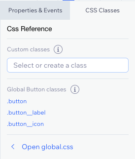

<!-- This article was published using the Doc Push single-sourcing tool. Any changes to this article MUST be made in the source file. Find it at www.github.com/wix-private/velo-docs.-->

# Styling Elements with CSS

> **Note:** This feature is only available to Wix Studio users.

<!-- Outline:

- about the feature
- how to use it (UI)
  - in the styling panel
  - in the code panel
- brief explanation of constructing semantic class names
- ~~list of supported elements~~
- ~~see MDN for full CSS documentation~~ -->

CSS allows you to customize the appearance of your website, from colors and fonts to sizes and positions 
of different elements. For additional information on CSS styling options, refer to the 
[MDN CSS reference docs](https://developer.mozilla.org/en-US/docs/Learn/CSS).

## Add CSS to your site

To get started, <strong>add a global.css</strong> file in the <strong>CSS</strong> section of your Page Code. 
CSS styles added to this file will apply to the selected classes throughout your site. 
To select a class to style, use the name of the component as it's referred to in Velo. 

For example, to change the background color of all buttons to red:
```css
.button {
  background-color: red;
}
```

Use inner classes to style specific elements of a component class. 
For example, use `.button__label` to style only the labels of button elements.

## Available classes

See which classes are already available for any element on your site by selecting the element and 
viewing <strong>CSS Classes</strong> in your code panel:



Or add your own classes in the custom classes field. For more information, see [CustomClasslist](/custom-class-list/introduction).

For reference, here is a list of global classes:
- [Accordion]($w/accordion/css-classes)
- [Anchor menu]($w/menu/css-classes#anchor-menu)
- [Audio player](/audio-player/css-classes)
- [Box]($w/box/css-classes)
- [Breadcrumbs]($w/breadcrumbs/css-classes)
- [Button]($w/button/css-classes)
- [Captcha]($w/captcha/css-classes)
- [Checkbox]($w/checkbox/css-classes)
- [Checkbox group](/checkbox-group/css-classes)
- [Collapsible text](/collapsible-text/css-classes)
- [Column strip](/column-strip/css-classes)
- [Date picker](/date-picker/css-classes)
- [Dropdown input]($w/dropdown/css-classes)
- [Dropdown menu]($w/menu/css-classes#dropdown-menu)
- [Footer]($w/footer/css-classes)
- [Form]($w/form/css-classes)
- [Google map](/google-map/css-classes)
- [Header]($w/header/css-classes)
- [Horizontal line]($w/element/css-classes#horizontal-line)
- [Horizontal menu]($w/menu/css-classes#horizontal-menu)
- [Image]($w/image/css-classes)
- [Image button]($w/element/css-classes#image-button)
- [Language menu]($w/element/css-classes#language-menu)
- [Lightbox]($w/element/css-classes#lightbox)
- [Lottie]($w/lottie/css-classes)
- [Menu]($w/menu/css-classes)
- [Menu container](/menu-container/css-classes)
- [Multi-state box](/multi-state-box/css-classes)
- [Page]($w/page/css-classes)
- [Pagination]($w/pagination/css-classes)
- [Progress bar](/progress-bar/css-classes)
- [Radio button group](/radio-button-group/css-classes)
- [Ratings display](/ratings-display/css-classes)
- [Ratings input](/ratings-input/css-classes)
- [Repeater]($w/repeater/css-classes)
- [Rich text box](/rich-text-box/css-classes)
- [Search bar]($w/element/css-classes#search-bar)
- [Section]($w/section/css-classes)
- [Selection tags](/selection-tags/css-classes)
- [Signature input](/signature-input/css-classes)
- [Slideshow]($w/slideshow/css-classes)
- [Switch]($w/switch/css-classes)
- [Table]($w/table/css-classes)
- [Tabs]($w/tabs/css-classes)
- [Text]($w/text/css-classes)
- [Text box](/text-box/css-classes)
- [Text input](/text-input/css-classes)
- [Time picker](/time-picker/css-classes)
- [Upload button](/upload-button/css-classes)
- [Vector image](/vector-image/css-classes)
- [Vertical line]($w/element/css-classes#vertical-line)
- [Vertical menu]($w/menu/css-classes#vertical-menu)
- [Video box](/video-box/css-classes)
- [Video player](/video-player/css-classes)