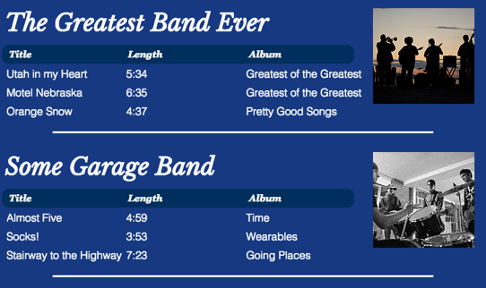
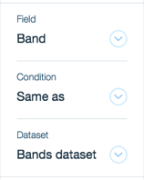

# Using Connected Datasets and Repeaters


Sometimes you need to connect a repeater and its elements to 2 datasets, 1 of which is filtered by the other. If you then want to control the datasets with code, you need to understand how the datasets behave when selected from different [scopes](https://dev.wix.com/docs/velo/velo-only-apis/$w/repeater/selector-scope).




</div>

To create the repeater shown above, you need 2 datasets, 1 for the **Bands** collection and another for the **Songs** collection. The **Bands dataset** is connected to the repeater itself. That causes the repeater to create an item for each band in your collection. 

You can also connect some of the elements contained in the repeater's items to the **Bands dataset**. For example, you can display the band's name and picture in each item. 

The **Songs dataset** is also connected to some of the elements contained in the repeater's items. For example, you can display a list of songs by the band in an item using a table.

The **Bands dataset** and **Songs dataset** need to be connected in some manner. The connection allows you to show the correct songs in each band's repeater item.

### Connect datasets

There are 2 ways you can connect the 2 datasets. The way you choose depends on how your collections are set up. 

If your Songs collection contains a reference field that refers to items in the Bands collection, you can set a filter on the Songs dataset as shown here:

<div style="text-align:center">



</div>

If your Songs collection contains a regular field that matches a field in the Bands collection, you can set a filter on the Songs dataset as shown here:

<div style="text-align:center">


</div>

### Use connected datasets with code

Before discussing each individual case, it is important to understand what is happening behind the scenes when you connect the datasets mentioned above to the elements in a repeater's items. Even though there is only one **Bands dataset** and one **Songs dataset**, you want those datasets to contain different items, depending on the context in which they are being used. 

For example, above you connected a table which appears in each of the repeater's items to the **Songs dataset**. You don't want all of the songs in the **Songs** collection to appear in each repeater item. Instead, you only want to display the songs relevant to a particular item's band. 

In order to make that work, a virtual **Songs dataset** is created for each repeater item. When you select the Songs dataset using a [repeated item scope selector](https://dev.wix.com/docs/velo/velo-only-apis/$w/repeater/selector-scope#velo-only-apis_$w_repeater_repeated_item_scope), you are selecting one of these virtual datasets. However, if you select the Songs dataset using a [global scope selector](https://dev.wix.com/docs/velo/velo-only-apis/$w/repeater/selector-scope#velo-only-apis_$w_repeater_global_scope), you are selecting the regular dataset.  

The following are individual cases of how to use the types of datasets mentioned above with repeaters:

*   [Use the filtered dataset inside the repeater](#use-the-filtered-dataset-inside-the-repeater)
*   [Use the filtered dataset outside the repeater](#use-the-filtered-dataset-outside-the-repeater)
*   [Use the unfiltered dataset inside the repeater](#use-the-unfiltered-dataset-inside-the-repeater)
*   [Use the unfiltered dataset outside the repeater](#use-the-unfiltered-dataset-outside-the-repeater)

#### Use the filtered dataset inside the repeater

When you select a dataset that is filtered using one of the methods mentioned above from a [repeated item scope selector](https://dev.wix.com/docs/velo/velo-only-apis/$w/repeater/selector-scope#velo-only-apis_$w_repeater_repeated_item_scope), you are selecting a virtual dataset. That virtual dataset only contains the items that relate to the current item in the dataset it's connected to via a filter. It also only controls elements that are connected to it in the current repeater item.

For example, in each repeater item you only see the songs that are related to that item's band. If you want to let users sort that list of songs, you could use the dataset `setSort()` function. In the repeater shown above, what looks like the table header is actually a group of three buttons. Each of those buttons has an `onClick` event handler that sorts the songs table based on a field.

```javascript
import { items } from '@wix/data';

$w.onReady(() => {
  $w("#titleSort").onClick(async () => {
    const result = await items.query('songsDataset').ascending('title').find();
    $w("#myRepeater").data = result.items;
  });

  $w("#lengthSort").onClick(async () => {
    const result = await items.query('songsDataset').ascending('length').find();
    $w("#myRepeater").data = result.items;
  });

  $w("#albumSort").onClick(async () => {
    const result = await items.query('songsDataset').ascending('album').find();
    $w("#myRepeater").data = result.items;
  });
});
```

Since the Songs dataset is selected using a repeated item scope selector, the sort is applied to a virtual dataset. So when a user clicks a button to sort the songs in one of the items the songs in all the other items aren't affected. Note that you don't have to write the sorting code for each virtual dataset. You write the code only once and it's applied to the correct item automatically. 

#### Use the filtered dataset outside the repeater

When you select a dataset that's filtered using one of the methods above from a [global scope selector](https://dev.wix.com/docs/velo/velo-only-apis/$w/repeater/selector-scope#velo-only-apis_$w_repeater_global_scope), you are selecting a regular dataset. That regular dataset only controls the elements connected to it that aren't contained in repeater items. The elements inside repeater items aren't affected even though they're connected to the same dataset.

For example, let's say you had a button outside the repeater shown above. If you called the dataset `setSort()` function in the button's `onClick` event handler nothing would happen to any of the songs tables in the repeater's items. If there was a table outside of the repeater connected to the dataset, its items would be sorted.

#### Use the unfiltered dataset inside the repeater

When you select the dataset that the repeater itself is connected to using a [repeated item scope selector](https://dev.wix.com/docs/velo/velo-only-apis/$w/repeater/selector-scope#velo-only-apis_$w_repeater_repeated_item_scope), you are selecting a virtual dataset. That virtual dataset contains only one item, the one that the current repeater item is based on.

For example, each item in the repeater shown above has its own virtual **Bands dataset**. That dataset contains only one band, the band in the current repeater item.

#### Use the unfiltered dataset outside the repeater

When you select the dataset which the repeater itself is connected to using a [global scope selector](https://dev.wix.com/docs/velo/velo-only-apis/$w/repeater/selector-scope#velo-only-apis_$w_repeater_global_scope), you are selecting a regular dataset. That regular dataset controls the number and order of the repeater items and any elements connected to it that aren't contained in repeater items. The elements inside repeater items aren't affected even though they're connected to the same dataset.

For example, let's say you had a button outside the repeater shown above. You could use it to sort the items in the repeater by calling the dataset `setSort()` function in the button's `onClick` event handler. Nothing would happen to any of the elements inside the repeated items, but the items themselves would be sorted.

```javascript
import { items } from '@wix/data';

$w.onReady(() => {
  $w('#repeaterSort').onClick(async (event) => {
    let sortOrder;
    if (event.target.label === 'A-Z') {
      sortOrder = 'ascending';
      event.target.label = 'Z-A';
    } else {
      sortOrder = 'descending';
      event.target.label = 'A-Z';
    }

    const result = await items.query('bandsDataset')[sortOrder]('name').find();
    $w('#myRepeater').data = result.items;
  });
});
```