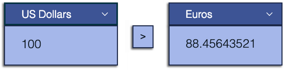
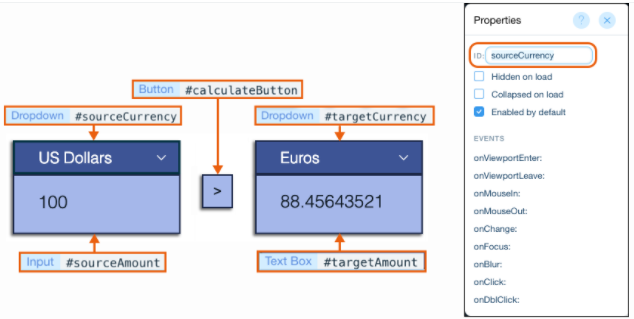

# Currency Converter using the Fetch API

In this tutorial, we create a simple currency converter site that uses the [wix-fetch API](https://www.wix.com/velo/reference/wix-fetch.html) to connect to a 3rd-party service. Site visitors choose source and target currencies from dropdowns and enter an amount to convert. The results are displayed in a text box.



Scroll to the bottom to see the [complete code](#example-code) for this exercise.

## Step 1: Add Elements to the Page

Add page elements in the Wix Editor: 

1.   On the left side of the Editor, click **Add**.
2.   Add the page elements illustrated below to your site.
    *   When you add each element, set its ID in the [Properties](https://support.wix.com/en/article/velo-working-with-the-properties-panel) panel that appears on the right side of the Code panel. Use the name shown below for each element, minus the hashtag. See the table below for a full list of the elements and where to find them in the Add menu.




|Element|Location in Add Menu|Description|ID|
|-------|--------------------|-----------|--|
|Dropdown|Input|For selecting the source currency|sourceCurrency|
|Dropdown|Input|For selecting the target currency|targetCurrency|
|Text Input|Input|For entering the amount to convert|sourceAmount|
|Text Box|Input|To display the converted amount|targetAmount|
|Button|Button|To trigger the currency conversion when clicked|calculateButton|
  
## Step 2: Add Code

> Note:
>
> All the code for this example is added to a single page on the site. In this section we divided the code into short blocks followed by explanations. To see the complete code for this example without comments, [scroll down](#example-code) to the end of the tutorial. 

To add the code:

1.   Double-click **Home Page Code** at the bottom of the Editor to open the [code panel](https://support.wix.com/en/article/velo-working-in-the-code-panel).
2.   Add the following code to the top of the [Page tab](https://support.wix.com/en/article/velo-working-in-the-code-panel#page-and-site-tabs-1) before the [onReady](https://support.wix.com/en/article/velo-working-in-the-code-panel#making-sure-the-element-has-loaded-before-you-reference-it) function:


```javascript
// The getJSON function in wix-fetch lets you retrieve a
// JSON resource from the network using HTTPS.
import {getJSON} from 'wix-fetch';

// Set the URL of the 3rd-party service.
const url = "https://api.exchangerate.host/convert";

// Define the currency option values and text for the dropdowns.
let currencyOptions = [
  { "value": "USD",  "label": "US Dollars"},
  { "value": "EUR",  "label": "Euros"},
  { "value": "JPY",  "label": "Japanese Yen"},
];
```

3.   Add the code below to the [onReady](https://support.wix.com/en/article/velo-working-in-the-code-panel#making-sure-the-element-has-loaded-before-you-reference-it) function. Code inside the onReady function runs when the page loads.

```javascript
$w.onReady(function () {
  // Set the currency options for the dropdowns.
  populateDropdowns();

  // Set the onClick event handler for calculateButton to calculate the target amount.
  $w('#calculateButton').onClick((event) => {
    calculateCurrency();
  })
});
```

The <code>[$w]($w)</code> function can select elements on a page by ID or by type, allowing us to run functions and define the properties of the elements. Use this syntax to select an element by ID, <code>$w("#myElementId")</code>, and this syntax to select by type, <code>$w("ElementType")</code>.

Here we select the button and define an `onClick` [event handler](https://support.wix.com/en/article/velo-reacting-to-user-actions-using-events#about-events-event-handlers-and-wiring) to calculate the target amount.

4.  Add code to define the functions:

**populateDropdowns( )**


```javascript
// Populate the dropdowns.
function populateDropdowns() {
  //Set the dropdown options.
  $w("Dropdown").options = currencyOptions;
  // Set the first dropdown option as the initial option.
  $w("Dropdown").selectedIndex = 0;
}
```

Here we select all the dropdowns by type. By calling <code>[$w]($w)</code> with the element type "Dropdown", we select all dropdowns on the page.

**calculateCurrency( )**

```javascript
// Calculate the target amount.

function calculateCurrency() {
  // Initial amount 
  let initialAmount = $w("#sourceAmount").value;
  // Original currency
  let sourceSymbol = $w("#sourceCurrency").value;
  // Target currency
  let targetSymbol = $w("#targetCurrency").value;
  // Define the full url.
  let fullUrl = `${url}?from=${sourceSymbol}&to=${targetSymbol}`;

  // Call the wix-fetch API function to retrieve the JSON resource.
  getJSON(fullUrl)
    .then(json => {
      // Set the target amount as the initial amount multiplied by
      // the conversion rate.
      $w("#targetAmount").value = initialAmount * json.info.rate;
    })
}
```

We use [template literals](https://developer.mozilla.org/en-US/docs/Web/JavaScript/Reference/Template_literals) to define the full URL, which includes the source and target currencies.

The wix-fetch API <code>[getJSON](wix-fetch/getjson)</code> function retrieves the JSON resource using the full URL. <code>getJSON</code> returns a [promise](https://support.wix.com/en/article/velo-working-with-promises), which resolves to a JSON object.

We multiply the retrieved rate by the initial amount and assign it to the `targetAmount` text box.

## Step 3: See It in Action

Now it's time to test your site:

1.  Click **Preview** at the top right of the Editor.
2.  Enter an amount in the source currency input.
3.  Select a target currency from the dropdown.
3.  Click the calculate button and see the converted currency result in the target amount text box.
4.  [Publish](https://support.wix.com/en/article/publishing-your-site-6980885) your site to make it live and in production. 

## Example Code

Here is the complete code for this example, without comments:

```javascript
import { getJSON } from 'wix-fetch';

const url = "https://api.exchangerate.host/convert";

let currencyOptions = [
  { "value": "USD", "label": "US Dollars" },
  { "value": "EUR", "label": "Euros" },
  { "value": "JPY", "label": "Japanese Yen" },
];

$w.onReady(function () {
  populateDropdowns();

  $w('#calculateButton').onClick((event) => {
    calculateCurrency();
  })
});

function populateDropdowns() {
  $w('Dropdown').options = currencyOptions;
  $w('Dropdown').selectedIndex = 0;
}

function calculateCurrency() {
  let initialAmount = $w("#sourceAmount").value;
  let sourceSymbol = $w("#sourceCurrency").value;
  let targetSymbol = $w("#targetCurrency").value;
  let fullUrl = `${url}?from=${sourceSymbol}&to=${targetSymbol}`;

  getJSON(fullUrl)
    .then(json => {
      $w("#targetAmount").value = initialAmount * json.info.rate;
    })
}
```