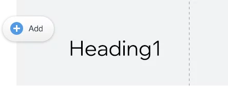
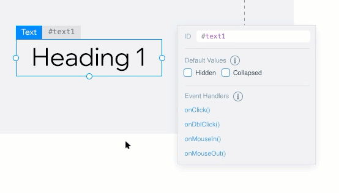

# Hello World

Let's take a quick look at how to get started writing your first Velo code. We'll do that by creating a traditional Hello World app - Velo style.

<iframe src="https://www.wix.com/corvid-pro/code-snippets/snippets/hello-velo-1" width="100%" height="300" scrolling="no">
</iframe>

> **Preview** the page to see the code in action.

### Step 1 | Designing the Page

In Velo applications, design is done with the Wix Editor. So let's start by adding a text element to a page.

Our page now looks something like this:



### Step 2 | Identifying Elements

Since we'll be interacting with the elements using code, we need some way to identify them. We do that using element IDs. You can see an element's ID when you hover over it or select it. When an element is selected you can change its ID using the Properties & Events panel.



Since we'll be using the IDs to refer to our elements in code, the IDs we give our elements need to be unique. It's also a good idea to use descriptive IDs. So let's change our text element's ID to be **message**.

### Step 3 | Interacting With Elements Using $w

To interact with a page element in code, you first need to write code to select it. Now that our element has a unique identifier, selecting it with code is easy.

In Velo, we write code in JavaScript and use Wix APIs. We use the `$w()` selector function to select an element by ID. We simply pass the element's ID, preceded by a hashtag (`#`).

So, to select an element with the ID **elementId**, we write the following code:

```javascript
$w('#elementId')
```

Once an element is selected, we can use its properties and functions to interact with it. So, we can use the text element's `text` property to change the message like this:

```javascript
$w('#message').text = 'Hello World';
```

Let's take this code and stick it in the `onReady` event handler that appears in the Code Panel by default. Code in the `onReady` event handler runs while the page loads.

The finished code, should look like this:

<iframe src="https://www.wix.com/corvid-pro/code-snippets/snippets/hello-velo-2" width="100%" height="300" scrolling="no">
</iframe>

> **Preview** the page to see the code in action.

When previewing the page, you'll see that the contents of the text element has changed.

Great job so far. You've already written your first Velo application. Pat yourself on the back and go take a nap. Or...maybe you want to learn a bit more? If so, keep reading.

### Step 4 | Handle an Event

In Velo, code almost always runs in response to some event. The code we just wrote runs in response to the elements on the page being ready. That's an event.

Another type of event is a button click. Let's see how to run some code in response to a button on our page being clicked.

First, we'll need to add a button to the page. Let's just give it the ID **button**. We might also want to change what the button says, just like we did for the text element. To change the text of a button, make sure to use the `label` property.

**Hint**: The code to change the button's text should look like this together with the previous code:

```javascript
$w.onReady( function() {
    $w('#message').text = 'Hello World';
    $w('#button').label = 'Click Me';
} );
```

To add code that responds to the button being clicked, we again start by using the `$w()` function to select the button. Then we use the `onClick()` function to define what happens when the button is clicked. In this case, let's change the contents of the text element when the button is clicked.

The code to handle the button click looks like this:

```javascript
$w('#button').onClick ( () => {
    $w('#message').text = 'Hello from Velo!';
} );
```

So, the finished code looks like this:

<iframe src="https://www.wix.com/corvid-pro/code-snippets/snippets/hello-velo-1" width="100%" height="300" scrolling="no">
</iframe>

> **Preview** the page to see the code in action.

This time, when previewing the page click the button on the page and see what happens.