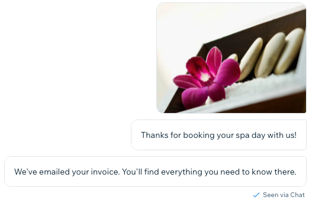
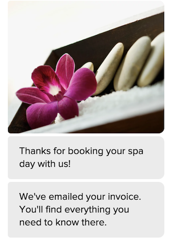
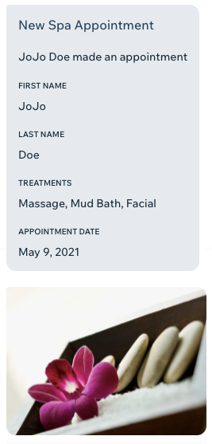
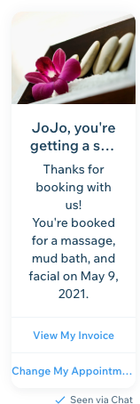
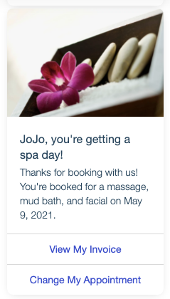

# Message Types

Messages can be sent as different types,
allowing for the display to match the message payload.
You can send messages as `basic`, `template`, `minimal`, or `form` type.
You may see an additional `system` type in some responses.
`system` type is reserved for internal use for sending messages.

This article gives a brief overview of each of the message types
and how to structure the `message` object in your
[`sendMessage()`](#sendmessage) request.

## Basic Messages

`basic` messages contain an array of `text`, `image`, or `file`.
Array items are displayed in Inbox and the visitor's chat widget
as if each item was a separate message.

This example contains an image followed by two text messages:

```json
{
  "message": {
    "direction": "BUSINESS_TO_PARTICIPANT",
    "content": {
      "previewText": "Thanks for booking your spa day with us!",
      "basic": {
        "items": [
          {
            "image": {
              "url": "https://static.wixstatic.com/media/f93e3d633e79921f14330f1911fc1139.jpg/v1/fill/w_1200,h_798,al_c,q_85,usm_0.66_1.00_0.01/f93e3d633e79921f14330f1911fc1139.webp",
              "width": 1200,
              "height": 798
            }
          },
          { "text": "Thanks for booking your spa day with us!" },
          { "text": "We've emailed your invoice. You'll find everything you need to know there." }
        ]
      }
    }
  }
}
```

The above example produces this output:

| Inbox                                                     | Chat Widget                                                           |
| --------------------------------------------------------- | --------------------------------------------------------------------- |
|  |  |

## Form Messages

`form` messages present form data submitted by the participant.
Form messages contain a `title`, an optional `description`,
and an array of `fields`.
Each field in the array has a `name` and submitted `value` property.

Form messages are typically sent with a direction of `PARTICIPANT_TO_BUSINESS`.
To hide the message from the visitor, set `visibility` to `BUSINESS`.

This example contains 4 form fields and an image:

```json
{
  "message": {
    "direction": "PARTICIPANT_TO_BUSINESS",
    "visibility": "BUSINESS",
    "content": {
      "previewText": "JoJo Doe made an appointment",
      "form": {
        "title": "New Spa Appointment",
        "description": "JoJo Doe made an appointment",
        "fields": [
          { "name": "First Name", "value": "JoJo" },
          { "name": "Last Name", "value": "Doe" },
          { "name": "Treatments", "value": "Massage, Mud Bath, Facial" },
          { "name": "Appointment Date", "value": "May 9, 2021" }
        ],
        "media": [
          {
            "image": {
              "url": "https://static.wixstatic.com/media/f93e3d633e79921f14330f1911fc1139.jpg/v1/fill/w_1200,h_798,al_c,q_85,usm_0.66_1.00_0.01/f93e3d633e79921f14330f1911fc1139.webp",
              "width": 1200,
              "height": 798
            }
          }
        ]
      }
    }
  }
}
```

The above example is not displayed in the visitor's chat widget
because `visibility` is set to `BUSINESS`.
It produces this output in Inbox:

| Inbox                                                   |
| ------------------------------------------------------- |
|  |

## Minimal Messages

`minimal` messages contain a single line of text and an optional icon.
They're useful for reporting an activity that took place.
To hide the message from the visitor, set `visibility` to `BUSINESS`.

This example reports that the visitor made a spa appointment:

```json
{
  "message": {
    "direction": "PARTICIPANT_TO_BUSINESS",
    "visibility": "BUSINESS",
    "content": {
      "previewText": "Booked a spa appointment",
      "minimal": {
        "text": "Booked a spa appointment",
        "iconUrl": "https://static.wixstatic.com/media/727514_1a58537f1b6a44a7b09956cdbc5ac774~mv2.png/v1/fill/w_297,h_324,al_c,lg_1,q_85/727514_1a58537f1b6a44a7b09956cdbc5ac774~mv2.webp"
      }
    }
  }
}
```

The above example is not displayed in the visitor's chat widget
because `visibility` is set to `BUSINESS`.
It produces this output in Inbox:

| Inbox                                                         |
| ------------------------------------------------------------- |
|  |

## Template Messages

`template` messages use buttons to allow the visitor to perform actions.
Buttons can be either `ACTION` or `POSTBACK` type.
Action buttons open a specified `url` in the visitor's browser,
and postback buttons pass a `buttonPayload` to the
[Button Interacted Webhook](https://dev.wix.com/api/rest/drafts/inbox/button-interacted-webhook).

This example tells the visitor their spa appointment has been booked
and offers two buttons.
The first is an action button, and the second is a postback button:

```json
{
  "message": {
    "direction": "BUSINESS_TO_PARTICIPANT",
    "content": {
      "previewText": "JoJo, you're getting a spa day!",
      "template": {
        "title": "JoJo, you're getting a spa day!",
        "imageUrl": "https://static.wixstatic.com/media/f93e3d633e79921f14330f1911fc1139.jpg/v1/fill/w_1200,h_798,al_c,q_85,usm_0.66_1.00_0.01/f93e3d633e79921f14330f1911fc1139.webp",
        "textLines": [
          "Thanks for booking with us!",
          "You're booked for a massage, mud bath, and facial on May 9, 2021."
        ],
        "buttons": [
          {
            "label": "View My Invoice",
            "launchUrl": "https://www.example.com/customer_12345/spa_day_54321/invoice.pdf"
          },
          {
            "label": "Change My Appointment",
            "postbackProperties": { "interactionId": "spa_day_54321__change_appointment" }
          }
        ]
      }
    }
  }
}
```

The above example produces this output:

| Inbox                                                           | Chat Widget                                                                 |
| --------------------------------------------------------------- | --------------------------------------------------------------------------- |
|  |  |

## System Messages

`system` messages convey system information from an integrated service
such as Facebook or Instagram.

System messages cannot be sent through the API.
However, you may still need to consume system messages.

This example payload contains text and a "Learn More" link:

```json
{
  "message": {
    "direction": "PARTICIPANT_TO_BUSINESS",
    "visibility": "BUSINESS",
    "sourceChannel": "FACEBOOK",
    "content": {
      "previewText": "Facebook policy requires you to respond to\nvisitors' messages within 7 days.",
      "system": {
        "text": "Facebook policy requires you to respond to\nvisitors' messages within 7 days.",
        "buttons": [
          {
            "label": "Learn More",
            "launchUrl": "https://support.wix.com/en/article/wix-inbox-connecting-your-facebook-page"
          }
        ]
      }
    }
  }
}
```

The above example produces this output:

| Inbox                                                       |
| ----------------------------------------------------------- |
|  |