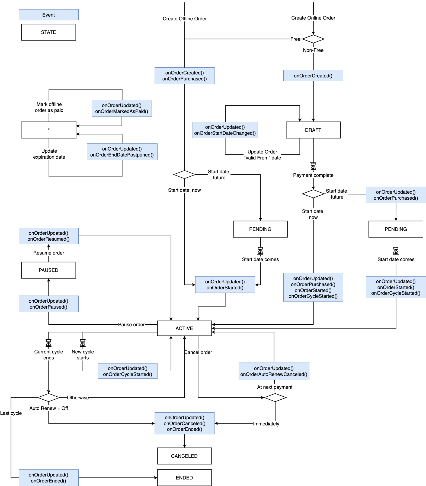

# Introduction

&nbsp;

<div style="background-color: #FEF1D1; padding: 18px 24px; border-radius: 6px; border: 1px solid #FDB10C; box-sizing: border-box; display: inline-block">
    <b>Developer Preview</b>
    <br/>
    <span>APIs in <a href="https://www.wix.com/velo/reference/api-overview/developer-preview">Developer Preview</a> are subject to change and are not intended for use in production.<br/><a href="mailto:velo-preview-feedback@wix.com">Send us</a> your suggestions for improving this API. Your feedback is valuable to us.</span>
</div>

&nbsp;

Wix Pricing Plans events are fired in your site's backend when certain events occur with plans. You can write event handlers that react to these events. Event handler functions receive data that corresponds to the event that has occurred. Use event handlers to create custom responses to pricing plan events.

> **Note:** Backend events don't work when previewing your site.

To add a pricing plans event handler, add an **events.js** file to the **Backend** section of your site if one does not already exist. All event handler functions for your
site are defined in this file.

Event handler functions are defined using the following pattern:
```javascript
export function <wixAppName>_<eventName>(event) { }
```

For example, an event handler that handles pricing plan updates looks like this:
```javascript
export function wixPricingPlans_onPlanUpdated(event) { }
```

### Order Events and Corresponding Statuses

As an order progresses through its lifecycle from order creation until
order completion, various events get triggered. The order's status is
updated accordingly. 

For example, the following describes the events and statuses for 
an online, recurring order:

| Timeline of Events                     | Events Triggered                    | Order Status |
|----------------------------------------|-------------------------------------|--------------|
| 1) Online, recurring order created     | orderCreated                        | DRAFT        |
| 2) Payment arranged, start date later  | orderPurchased                      | PENDING      |
| 3) Start date arrives                  | orderStarted, orderCycleStarted     | ACTIVE       |
| 4) Next cycle arrives                  | orderCycleStarted                   | ACTIVE       |
| 5) Last cycle finishes                 | orderEnded                          | ENDED        |

The following flowchart details order events and statuses. 

