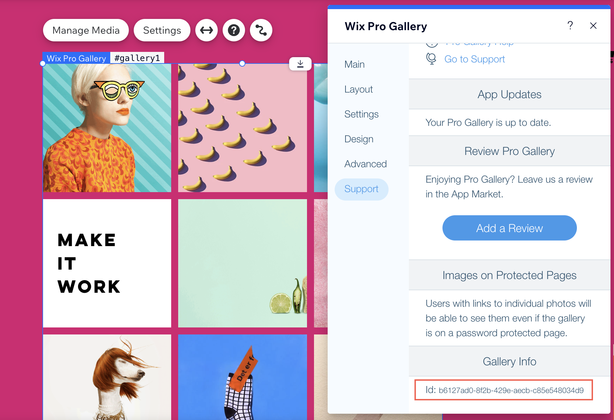

# Introduction

Use the Pro Gallery backend API to create and manage pro galleries on your site's backend. To enable pro gallery backend API functionality for your site, [add a Pro Gallery to your site](https://support.wix.com/en/article/wix-pro-gallery-adding-and-setting-up-your-gallery). 

With the Pro Gallery backend API, you can:

* Create a pro gallery from scratch or clone an existing pro gallery on your site's backend.
* Get, update, and delete an existing pro gallery on your site's backend.
* Create, get, update, and delete a pro gallery item on your site's backend. 
* List pro galleries and list media items in a specific pro gallery on your site's backend. 

### Getting a Pro Gallery ID

You can get a pro gallery's ID in 2 ways:

1. Call the [`listGalleries()`](#listGalleries) function to get a list of all your site's pro galleries and their IDs, and search for the one you want. 
2. Get a pro gallery element's ID by clicking the element in the Editor. Click **Settings > Support**. Scroll down to **Gallery Info** to see the ID. 

### Creating a Pro Gallery
There are [2 ways to create a pro gallery](#scenarios):
1. Creating a Pro Gallery using the Editor (recommended).
2. Creating a Pro Gallery using the Pro Gallery Backend API(not recommended). 

### Before you begin
It's important to note these points regarding before coding:

* To work with the Pro Gallery Backend API, you need to first publish your site. 
* Only site collaborators with 'pro-gallery.manage' [permissions](https://support.wix.com/en/article/roles-permissions-accessing-roles-permissions) can create, delete, and update a gallery or gallery items. You can override the permissions with the `wix-auth` [`elevate()`](https://www.wix.com/velo/reference/wix-auth/elevate) function.

