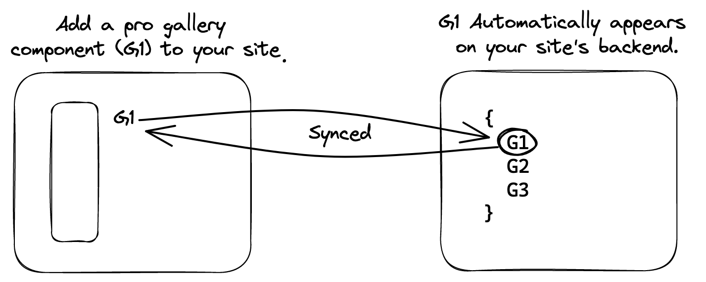
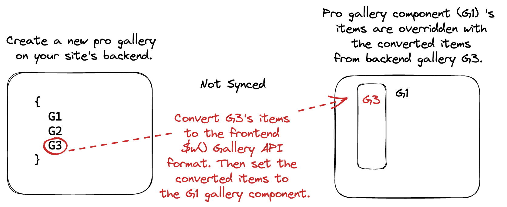

# Creating a Gallery

There are 2 ways to create a pro gallery:

### Scenario 1: Creating a Pro Gallery using the Editor (Recommended)

When you add a pro gallery element to your site using the **Add Panel** in the Editor, a corresponding pro gallery is automatically created on your site's backend. These 2 galleries are synced, and have the same gallery ID. Changes to the pro gallery element in the UI affect the corresponding pro gallery on your site's backend, and changes to the pro gallery on your site's backend affect the corresponding pro gallery element on your site. 

### Scenario 2: Creating a Pro Gallery using the Pro Gallery Backend API (Not recommended)

<blockquote class="important">

__Important:__
 This scenario is not recommended because it has limitations and requires extra steps.
 
</blockquote>  

When you create a pro gallery on your site's backend, it is a standalone gallery as there isn't a corresponding frontend pro gallery element. However, you may want to display a pro gallery from your site's backend on your site. 

For example, let's say you have a site with a pro gallery element and you want to display different galleries for each site member who logs in to your site. You can use the Pro Gallery Backend API to store the pro galleries in the backend instead of overloading the frontend. You can then display the relevant pro gallery from your site's backend on your live site for each site member who logs in. 

Doing this requires a few steps. Currently the pro gallery backend API and the frontend [$w() Gallery API]($w/gallery/currentitem) have different formats, so you need to convert the backend gallery items to the frontend gallery items format. You can then import the converted items to your page code, and set the converted items to the items of a particular gallery element on your site. This temporarily overrides the frontend gallery element's items with the converted backend gallery items. However, the pro gallery element's ID remains the same. For example, if you call the [`getGallery()`](wix-pro-gallery-backend/progallery/getGallery) function with the gallery element's ID, the original gallery element's items are returned, and not the converted backend gallery items. To learn more, see [Displaying a Pro Gallery on Your Site Using the Pro Gallery Backend API](wix-pro-gallery-backend/tutorial:-display-a-pro-gallery-on-your-site). 

#### Limitations

Note the following limitations when converting backend gallery items to the frontend $w() Gallery items format. To avoid these limitations, use scenario 1 instead.
+ `text` items in your backend gallery won't appear on your site. This is because `text` items can't be converted to the frontend [$w.Gallery()](https://www.wix.com/velo/reference/$w/gallery/currentitem) items format. 
+ Items in your backend gallery that contain a link with text won't appear on your site. This is because the `text` property in the item's `link` object can't be converted to the frontend $w.Gallery() items format. 

